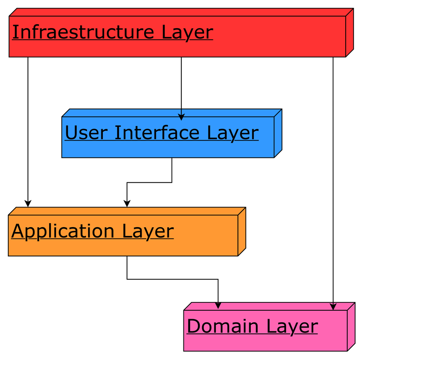
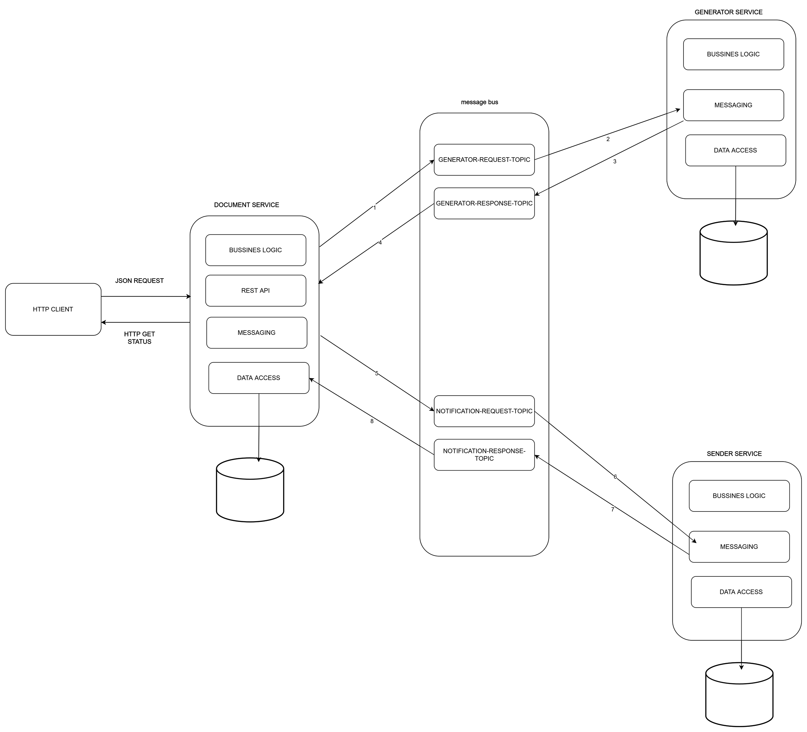
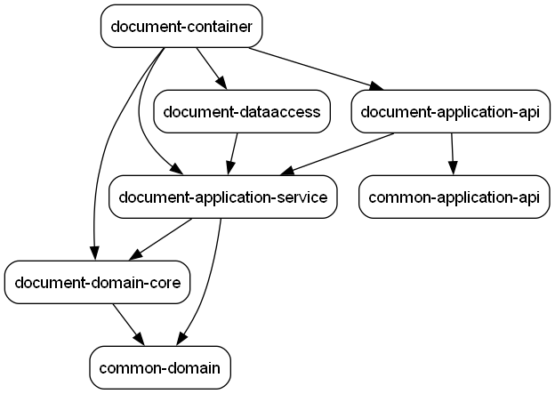

# DOCUMENT-NOTIFICATION-SYSTEM

Un sistema de notificaciones distribuido orientado a documentos, diseñado con principios de arquitecturas limpias (Clean Architecture) y prácticas de diseño como Hexagonal Architecture y Domain-Driven Design (DDD). El objetivo es servir como base sólida y extensible para ejecutar notificaciones en entornos distribuidos con buena separación de responsabilidades, alta testabilidad y capacidad de evolución.

## Visión general
Este repositorio contiene el código fuente y la estructura para un sistema que produce, enruta y entrega notificaciones relacionadas con documentos (por ejemplo: creación, actualización, expiración, aprobaciones). Está pensado para ser desplegado de forma distribuida, integrándose con brokers de mensajería, colas y/o eventos y exponiendo adaptadores (API, webhook, colas) según las necesidades.

### Arquitectura basada en Domain-Driven Design
El siguiente diagrama ilustra la aplicación de los principios de Domain-Driven Design (DDD) en el sistema, mostrando cómo se organizan las capas, bounded contexts, entidades, agregados y value objects. Esta estructura garantiza que el dominio permanezca en el centro de la arquitectura, con las dependencias apuntando hacia el núcleo del negocio.




## Estructura típica del repositorio
(La estructura concreta puede diferir según la implementación; aquí se muestran capas conceptuales)

- domain/            -> Entidades, agregados, value objects, eventos de dominio
- application/       -> Casos de uso, orquestadores de flujos de negocio
- adapters/          -> Adaptadores entrantes (HTTP, gRPC) y salientes (DB, Broker)
- infrastructure/    -> 
- config/            -> 
- tests/             -> Pruebas unitarias, de integración y contract tests
- docs/              -> Diagramas, decisiones arquitectónicas (ADR)

## Arquitectura general del sistema
El siguiente diagrama muestra el flujo general de la arquitectura del sistema, ilustrando cómo los diferentes componentes interactúan entre sí en un entorno distribuido. Se puede observar la separación de responsabilidades, la comunicación entre servicios, y cómo fluyen los datos desde la entrada hasta la entrega de notificaciones.




### Arquitectura de dependencias

Una característica fundamental de **Domain-Driven Design (DDD)** y **Clean Architecture** es la **Regla de Dependencia**: las dependencias del código fuente deben apuntar únicamente hacia adentro, hacia las capas de más alto nivel (el dominio). Esto significa que:

- El **dominio (domain-core)** no conoce ni depende de ninguna otra capa
- La **capa de aplicación (application-service)** depende únicamente del dominio
- Los **adaptadores (dataaccess, application-api, messaging)** dependen de las capas internas, nunca al revés
- El **contenedor (container)** orquesta todas las dependencias pero el dominio permanece agnóstico de infraestructura

#### Estructura de módulos y aplicación de DDD

El proyecto está organizado en **Bounded Contexts** independientes (document-service, customer-service, generator-service), cada uno siguiendo la misma estructura de capas:

```
bounded-context/
├── domain/
│   ├── domain-core/        → Entidades, Agregados, Value Objects, Eventos de Dominio
│   └── application-service/ → Casos de Uso, Puertos (Interfaces), DTOs, Command Handlers
├── dataaccess/             → Adaptadores de salida (Repositorios JPA, Mappers de persistencia)
├── application-api/        → Adaptadores de entrada (Controllers REST, Exception Handlers)
├── messaging/              → Adaptadores de mensajería (Kafka producers/consumers)
└── container/              → Configuración Spring Boot, composición de dependencias
```

Esta estructura garantiza que:
- Las **reglas de negocio** están encapsuladas en `domain-core` sin dependencias externas
- Los **casos de uso** en `application-service` orquestan el dominio y definen puertos abstractos
- Los **adaptadores** implementan los puertos sin contaminar la lógica de negocio
- El **principio de inversión de dependencias** se cumple: las capas externas dependen de abstracciones definidas por las capas internas

#### Validación del grafo de dependencias

Para verificar que la arquitectura respeta estas reglas y que las dependencias fluyen correctamente hacia el dominio, utilizamos el [depgraph-maven-plugin](https://github.com/ferstl/depgraph-maven-plugin).

**Requisitos:**
- [Graphviz](https://graphviz.org/download/) instalado en el sistema

**Comandos para generar el grafo:**

```bash
# Genera un grafo individual por módulo
mvn com.github.ferstl:depgraph-maven-plugin:graph
```

```bash
# Genera un grafo agregado de todo el proyecto
mvn com.github.ferstl:depgraph-maven-plugin:aggregate -DcreateImage=true -DreduceEdges=false -Dscope=compile "-Dincludes=com.document.notification.system*:*"
```

El grafo resultante (ubicado en la carpeta `target/`) debe mostrar que:
- `domain-core` no tiene flechas salientes hacia otros módulos del sistema
- `application-service` solo depende de `domain-core` y `common-domain`
- Los módulos de infraestructura (`dataaccess`, `application-api`) dependen de las capas internas



> **Nota:** Si el grafo muestra dependencias incorrectas (por ejemplo, `domain-core` dependiendo de `dataaccess`), es señal de una violación arquitectónica que debe corregirse para mantener la integridad del diseño DDD.


## Arquitectura del componente Document Service
El componente Document Service representa el núcleo del sistema de gestión de documentos, implementando una arquitectura hexagonal (Ports & Adapters) que garantiza la separación clara entre la lógica de negocio y los detalles de infraestructura.

El diagrama a continuación ilustra la arquitectura de alto nivel del componente, destacando:

- **Capa de Dominio (Core)**: Entidades, agregados, value objects y reglas de negocio puras relacionadas con la gestión de documentos. Esta capa es independiente de frameworks y tecnologías externas.

- **Capa de Aplicación**: Casos de uso y servicios de aplicación que orquestan las operaciones del dominio, coordinando el flujo de datos entre adaptadores y el dominio.

- **Puertos (Interfaces)**: Contratos abstractos que definen cómo el núcleo se comunica con el exterior, tanto para entradas (puertos primarios) como para salidas (puertos secundarios).

- **Adaptadores**: Implementaciones concretas de los puertos que conectan con tecnologías específicas:
  - *Adaptadores de entrada*: API REST, controladores, listeners de eventos
  - *Adaptadores de salida*: Repositorios de base de datos, clientes de mensajería, servicios externos

- **Flujos de comunicación**: Muestra cómo las peticiones fluyen desde los adaptadores de entrada, atraviesan los casos de uso, interactúan con el dominio y se comunican con sistemas externos mediante adaptadores de salida.

Esta organización permite sustituir cualquier tecnología de infraestructura sin afectar la lógica de negocio, facilitando la mantenibilidad, testabilidad y evolución del sistema.


## Principios arquitectónicos aplicados
El proyecto está guiado por varias prácticas y patrones de arquitectura limpia, entre los que destacan:

- Hexagonal Architecture (Ports & Adapters)
  - Los detalles de infraestructura (bases de datos, brokers, frameworks web) están aislados detrás de puertos (interfaces) y conectados mediante adaptadores.
  - Permite sustituir implementaciones (p. ej. cambiar RabbitMQ por Kafka) sin afectar la lógica de dominio.

- Domain-Driven Design (DDD)
  - El dominio de notificaciones está modelado con entidades, agregados, value objects y bounded contexts claros.
  - Se enfatiza el lenguaje ubicuo para las reglas de negocio y los eventos de dominio.

- Clean Architecture / Onion
  - Capas concéntricas: dominio (centro) → casos de uso / aplicación → interfaces/exposición → infra.
  - Dependencias dirigidas hacia el dominio; la infraestructura depende de abstracciones del dominio.

- CQRS & Event-Driven
  - Separación entre comandos (acciones que cambian estado) y consultas (lecturas) cuando aplica.
  - Uso de eventos de dominio para propagar cambios y para sincronizar componentes distribuidos (event sourcing opcional).

- Resiliencia y distribución
  - Diseño para eventual consistency, idempotencia y manejo de fallos transitorios.
  - Estrategias de reintento, circuit breaking y compensaciones cuando aplica.


## Flujo de notificación (alto nivel)
1. Un comando o evento (p. ej. "DocumentoCreado") entra por un adaptador (API, webhook).
2. El caso de uso correspondiente procesa la lógica y delega al dominio.
3. El dominio publica eventos de dominio que son manejados por handlers que encolan mensajes o llaman adaptadores.
4. Los adaptadores de mensajería entregan las notificaciones a los consumidores interesados (colas, servicios, push, correo).
5. Mecanismos de reintento y idempotencia aseguran entrega segura en un entorno distribuido.

## Tecnologías y patterns recomendados
- Brokers/Streams: Kafka, RabbitMQ, Redis Streams o AWS SNS/SQS (según el entorno).
- Bases de datos: PostgreSQL (como fuente de verdad) + almacenes de consulta (Redis, Elastic) para lecturas rápidas.
- Observabilidad: Tracing (OpenTelemetry), métricas (Prometheus), logs estructurados.
- Pruebas: Unitarias en el dominio y tests de contratos entre adaptadores e infra.
- Contenerización: Docker + orquestación (Kubernetes) para despliegue distribuido.

## Cómo empezar (resumen)
1. Clona el repositorio:
```
   git clone https://github.com/Rincon10/DOCUMENT-NOTIFICATION-SYSTEM.git
```
3.
## Buenas prácticas y recomendaciones
- Mantiene la lógica de negocio en el dominio y los casos de uso; evita lógica de negocio en controladores o adaptadores.
- Prefiere pruebas unitarias en el dominio y pruebas de integración atómicas para adaptadores.
- Define contratos claros entre bounded contexts vía eventos de dominio documentados.
- Implementa idempotencia en consumidores de eventos y en endpoints expuestos públicamente.
- Gestiona versiones de eventos y migraciones del esquema de mensajes con cuidado.

## Contribuir
Si quieres contribuir:
- Lee los ADRs y la documentación en docs/ para entender las decisiones de diseño.
- Abre issues para discusiones de diseño antes de cambios grandes.
- Las PRs deben incluir tests relevantes y actualizar la documentación si cambian APIs o contratos.
