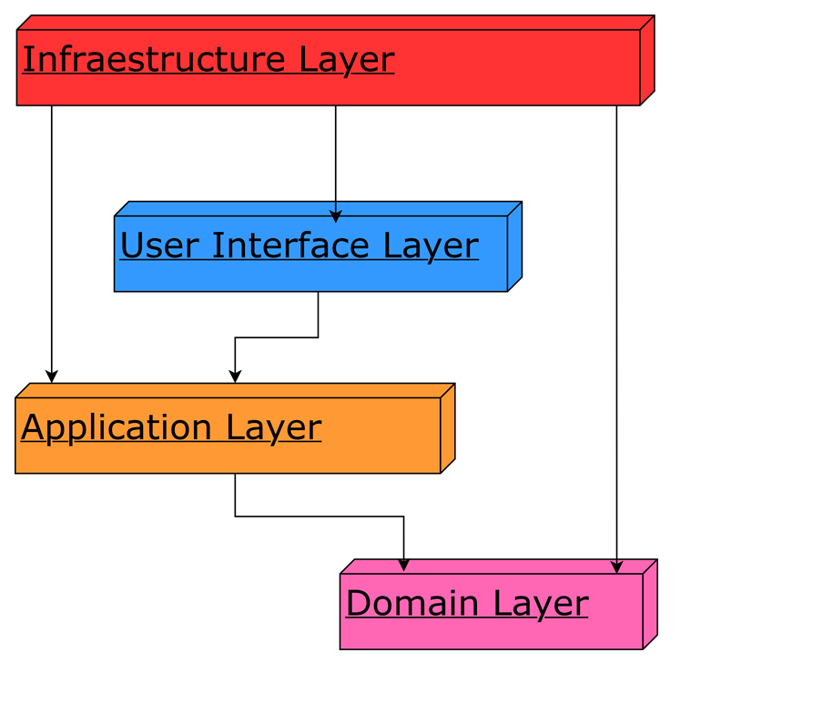
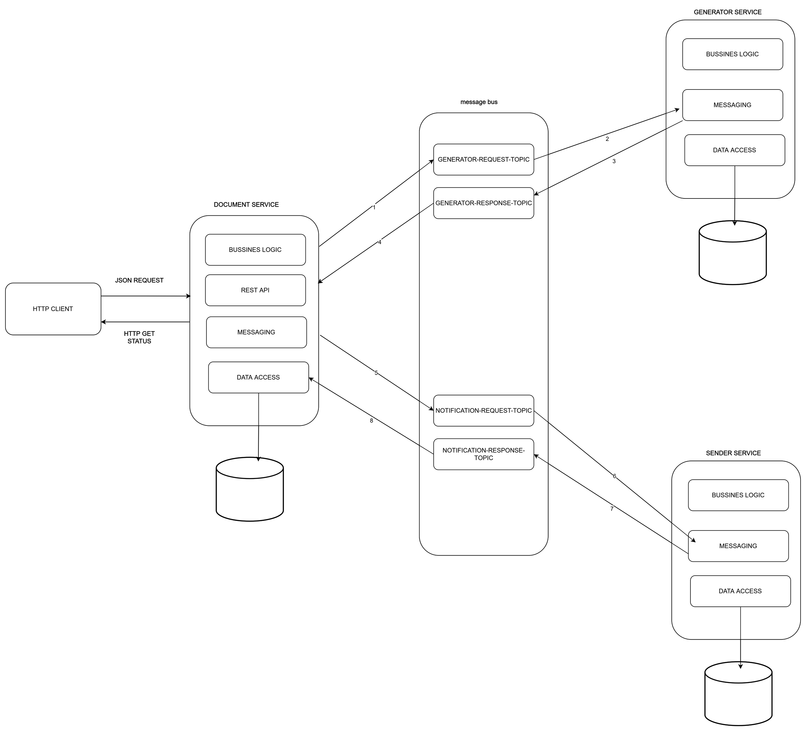
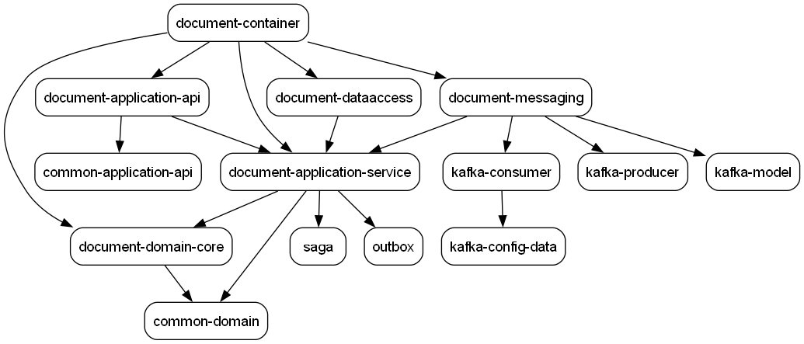
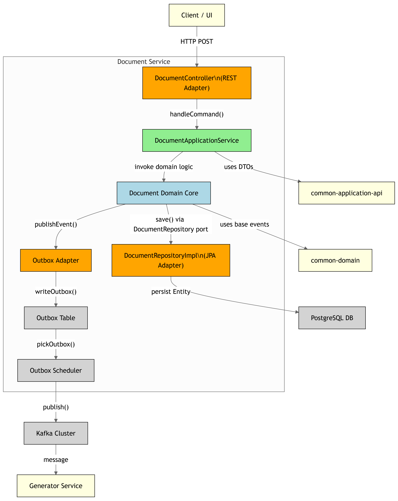
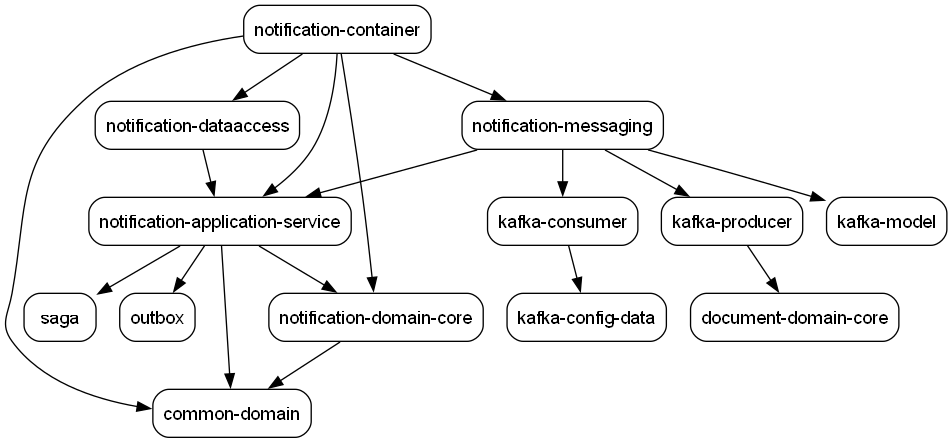
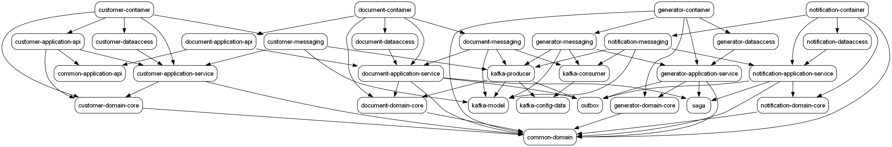

# DOCUMENT-NOTIFICATION-SYSTEM

[](https://openjdk.org/projects/jdk/17/)
[](https://maven.apache.org/)
[](https://spring.io/projects/spring-boot)
[]()
[]()

Un sistema de notificaciones distribuido orientado a documentos, diseñado con principios de arquitecturas limpias (Clean Architecture) y prácticas de diseño como Hexagonal Architecture y Domain-Driven Design (DDD). El objetivo es servir como base sólida y extensible para ejecutar notificaciones en entornos distribuidos con buena separación de responsabilidades, alta testabilidad y capacidad de evolución.

## Tabla de contenidos

- [Visión general](#visión-general)
- [Arquitectura basada en Domain-Driven Design](#arquitectura-basada-en-domain-driven-design)
- [Estructura del repositorio](#estructura-del-repositorio)
- [Arquitectura general del sistema](#arquitectura-general-del-sistema)
- [Arquitectura del componente Document Service](#arquitectura-del-componente-document-service)
- [Arquitectura del componente Generator Service](#arquitectura-del-componente-generator-service)
- [Arquitectura del componente Notification Service](#arquitectura-del-componente-notification-service)
- [Grafo de dependencias completo del sistema](#grafo-de-dependencias-completo-del-sistema)
- [Principios arquitectónicos aplicados](#principios-arquitectónicos-aplicados)
- [Flujo de notificación (alto nivel)](#flujo-de-notificación-alto-nivel)
- [Tecnologías y patterns recomendados](#tecnologías-y-patterns-recomendados)
- [Cómo empezar](#cómo-empezar-resumen)
- [Buenas prácticas y recomendaciones](#buenas-prácticas-y-recomendaciones)
- [Contribuir](#contribuir)

## Visión general
Este repositorio contiene el código fuente y la estructura para un sistema que produce, enruta y entrega notificaciones relacionadas con documentos (por ejemplo: creación, actualización, expiración, aprobaciones). Está pensado para ser desplegado de forma distribuida, integrándose con brokers de mensajería, colas y/o eventos y exponiendo adaptadores (API, webhook, colas) según las necesidades.

### Arquitectura basada en Domain-Driven Design
El siguiente diagrama ilustra la aplicación de los principios de Domain-Driven Design (DDD) en el sistema, mostrando cómo se organizan las capas, bounded contexts, entidades, agregados y value objects. Esta estructura garantiza que el dominio permanezca en el centro de la arquitectura, con las dependencias apuntando hacia el núcleo del negocio.




## Estructura del repositorio

```
DOCUMENT-NOTIFICATION-SYSTEM/
├── docs/                                    # Diagramas de arquitectura y documentación
│   ├── 00-arquitectura-DDD.png
│   ├── 00-flujo-generarl-arquitectura.png
│   ├── 01-arquitectura-componente-document.png
│   ├── 02-dependency-graph-document.png
│   ├── 03-dependency-graph-generator.png
│   ├── 04-dependency-graph-notification.png
│   └── 05-dependency-graph-all.png
│
├── document-notification-system/            # Proyecto principal Maven multi-módulo
│   ├── document-service/                    # Bounded Context: Gestión de documentos
│   │   ├── document-domain/
│   │   │   ├── document-domain-core/        # Entidades, agregados, value objects
│   │   │   └── document-application-service/ # Casos de uso, puertos, DTOs
│   │   ├── document-dataaccess/             # Adaptadores de persistencia (JPA)
│   │   ├── document-application-api/        # Adaptadores de entrada (REST Controllers)
│   │   ├── document-messaging/              # Adaptadores de mensajería (Kafka)
│   │   └── document-container/              # Configuración Spring Boot, composición
│   │
│   ├── generator-service/                   # Bounded Context: Generación de documentos
│   │   └── [misma estructura hexagonal]
│   │
│   ├── notification-service/                # Bounded Context: Envío de notificaciones
│   │   └── [misma estructura hexagonal]
│   │
│   └── docker-compose.yml                   # Infraestructura (PostgreSQL, Kafka, etc.)
│
├── .github/                                 # GitHub Actions y templates
├── .claude/                                 # Configuración de Claude Code
├── README.md
└── .gitignore
```

### Convenciones de nomenclatura

Cada bounded context sigue la misma estructura de capas:

| Capa | Módulo | Responsabilidad |
|------|--------|-----------------|
| **Domain** | `domain-core` | Entidades, agregados, value objects, eventos de dominio |
| **Application** | `application-service` | Casos de uso, puertos (interfaces), DTOs, command handlers |
| **Infrastructure** | `dataaccess` | Adaptadores de salida: repositorios JPA, mappers |
| **Infrastructure** | `application-api` | Adaptadores de entrada: controllers REST, exception handlers |
| **Infrastructure** | `messaging` | Adaptadores de mensajería: Kafka producers/consumers |
| **Bootstrap** | `container` | Configuración Spring Boot, inyección de dependencias |

## Arquitectura general del sistema
El siguiente diagrama muestra el flujo general de la arquitectura del sistema, ilustrando cómo los diferentes componentes interactúan entre sí en un entorno distribuido. Se puede observar la separación de responsabilidades, la comunicación entre servicios, y cómo fluyen los datos desde la entrada hasta la entrega de notificaciones.




### Arquitectura de dependencias

Una característica fundamental de **Domain-Driven Design (DDD)** y **Clean Architecture** es la **Regla de Dependencia**: las dependencias del código fuente deben apuntar únicamente hacia adentro, hacia las capas de más alto nivel (el dominio). Esto significa que:

- El **dominio (domain-core)** no conoce ni depende de ninguna otra capa
- La **capa de aplicación (application-service)** depende únicamente del dominio
- Los **adaptadores (dataaccess, application-api, messaging)** dependen de las capas internas, nunca al revés
- El **contenedor (container)** orquesta todas las dependencias pero el dominio permanece agnóstico de infraestructura

#### Estructura de módulos y aplicación de DDD

El proyecto está organizado en **Bounded Contexts** independientes (document-service, customer-service, generator-service), cada uno siguiendo la misma estructura de capas:

```
bounded-context/
├── domain/
│   ├── domain-core/        → Entidades, Agregados, Value Objects, Eventos de Dominio
│   └── application-service/ → Casos de Uso, Puertos (Interfaces), DTOs, Command Handlers
├── dataaccess/             → Adaptadores de salida (Repositorios JPA, Mappers de persistencia)
├── application-api/        → Adaptadores de entrada (Controllers REST, Exception Handlers)
├── messaging/              → Adaptadores de mensajería (Kafka producers/consumers)
└── container/              → Configuración Spring Boot, composición de dependencias
```

Esta estructura garantiza que:
- Las **reglas de negocio** están encapsuladas en `domain-core` sin dependencias externas
- Los **casos de uso** en `application-service` orquestan el dominio y definen puertos abstractos
- Los **adaptadores** implementan los puertos sin contaminar la lógica de negocio
- El **principio de inversión de dependencias** se cumple: las capas externas dependen de abstracciones definidas por las capas internas

#### Validación del grafo de dependencias

Para verificar que la arquitectura respeta estas reglas y que las dependencias fluyen correctamente hacia el dominio, utilizamos el [depgraph-maven-plugin](https://github.com/ferstl/depgraph-maven-plugin).

**Requisitos:**
- [Graphviz](https://graphviz.org/download/) instalado en el sistema

**Comandos para generar el grafo:**

```bash
# Genera un grafo individual por módulo
mvn com.github.ferstl:depgraph-maven-plugin:graph
```

```bash
# Genera un grafo agregado de todo el proyecto
mvn com.github.ferstl:depgraph-maven-plugin:aggregate -DcreateImage=true -DreduceEdges=false -Dscope=compile "-Dincludes=com.document.notification.system*:*"
```

El grafo resultante (ubicado en la carpeta `target/`) debe mostrar que:
- `domain-core` no tiene flechas salientes hacia otros módulos del sistema
- `application-service` solo depende de `domain-core` y `common-domain`
- Los módulos de infraestructura (`dataaccess`, `application-api`) dependen de las capas internas



> **Nota:** Si el grafo muestra dependencias incorrectas (por ejemplo, `domain-core` dependiendo de `dataaccess`), es señal de una violación arquitectónica que debe corregirse para mantener la integridad del diseño DDD.


## Arquitectura del componente Document Service
El componente Document Service representa el núcleo del sistema de gestión de documentos, implementando una arquitectura hexagonal (Ports & Adapters) que garantiza la separación clara entre la lógica de negocio y los detalles de infraestructura.

El diagrama a continuación ilustra la arquitectura de alto nivel del componente, destacando:

- **Capa de Dominio (Core)**: Entidades, agregados, value objects y reglas de negocio puras relacionadas con la gestión de documentos. Esta capa es independiente de frameworks y tecnologías externas.

- **Capa de Aplicación**: Casos de uso y servicios de aplicación que orquestan las operaciones del dominio, coordinando el flujo de datos entre adaptadores y el dominio.

- **Puertos (Interfaces)**: Contratos abstractos que definen cómo el núcleo se comunica con el exterior, tanto para entradas (puertos primarios) como para salidas (puertos secundarios).

- **Adaptadores**: Implementaciones concretas de los puertos que conectan con tecnologías específicas:
  - *Adaptadores de entrada*: API REST, controladores, listeners de eventos
  - *Adaptadores de salida*: Repositorios de base de datos, clientes de mensajería, servicios externos

- **Flujos de comunicación**: Muestra cómo las peticiones fluyen desde los adaptadores de entrada, atraviesan los casos de uso, interactúan con el dominio y se comunican con sistemas externos mediante adaptadores de salida.

Esta organización permite sustituir cualquier tecnología de infraestructura sin afectar la lógica de negocio, facilitando la mantenibilidad, testabilidad y evolución del sistema.



## Arquitectura del componente Generator Service

El componente **Generator Service** es responsable de la generación de documentos y reportes, siguiendo la misma estructura hexagonal que el Document Service. Este servicio procesa solicitudes de generación de documentos, aplicando plantillas y transformando datos en formatos específicos (PDF, Word, Excel, etc.).

El diagrama de dependencias muestra cómo se organizan las capas internas del servicio:


### Responsabilidades principales
- Generación de documentos a partir de plantillas
- Conversión entre formatos de archivo
- Procesamiento batch de reportes
- Gestión de metadatos de documentos generados

## Arquitectura del componente Notification Service

El componente **Notification Service** gestiona el envío de notificaciones a través de múltiples canales (email, SMS, push notifications, webhooks). Implementa el patrón Strategy para soportar diferentes proveedores de notificaciones y garantiza la entrega confiable mediante colas de mensajes.

El grafo de dependencias ilustra la estructura interna del servicio:



### Responsabilidades principales
- Envío de notificaciones por múltiples canales
- Gestión de preferencias de notificación de usuarios
- Plantillas de notificaciones personalizables
- Tracking de estado de entrega y reintentos

## Grafo de dependencias completo del sistema

El siguiente diagrama muestra el grafo de dependencias agregado de todo el proyecto, incluyendo las relaciones entre los tres bounded contexts (Document, Generator y Notification) y sus módulos internos:



Este grafo permite visualizar:
- La independencia entre los diferentes bounded contexts
- Las dependencias internas de cada servicio siguiendo DDD
- La relación entre los módulos de dominio, aplicación e infraestructura
- Posibles acoplamientos que deban refactorizarse

## Principios arquitectónicos aplicados

El proyecto está guiado por varias prácticas y patrones de arquitectura limpia, entre los que destacan:

- Hexagonal Architecture (Ports & Adapters)
  - Los detalles de infraestructura (bases de datos, brokers, frameworks web) están aislados detrás de puertos (interfaces) y conectados mediante adaptadores.
  - Permite sustituir implementaciones (p. ej. cambiar RabbitMQ por Kafka) sin afectar la lógica de dominio.

- Domain-Driven Design (DDD)
  - El dominio de notificaciones está modelado con entidades, agregados, value objects y bounded contexts claros.
  - Se enfatiza el lenguaje ubicuo para las reglas de negocio y los eventos de dominio.

- Clean Architecture / Onion
  - Capas concéntricas: dominio (centro) → casos de uso / aplicación → interfaces/exposición → infra.
  - Dependencias dirigidas hacia el dominio; la infraestructura depende de abstracciones del dominio.

- CQRS & Event-Driven
  - Separación entre comandos (acciones que cambian estado) y consultas (lecturas) cuando aplica.
  - Uso de eventos de dominio para propagar cambios y para sincronizar componentes distribuidos (event sourcing opcional).

- Resiliencia y distribución
  - Diseño para eventual consistency, idempotencia y manejo de fallos transitorios.
  - Estrategias de reintento, circuit breaking y compensaciones cuando aplica.


## Flujo de notificación (alto nivel)
1. Un comando o evento (p. ej. "DocumentoCreado") entra por un adaptador (API, webhook).
2. El caso de uso correspondiente procesa la lógica y delega al dominio.
3. El dominio publica eventos de dominio que son manejados por handlers que encolan mensajes o llaman adaptadores.
4. Los adaptadores de mensajería entregan las notificaciones a los consumidores interesados (colas, servicios, push, correo).
5. Mecanismos de reintento y idempotencia aseguran entrega segura en un entorno distribuido.

## Tecnologías y patterns recomendados

### Stack tecnológico actual

| Categoría | Tecnología | Uso |
|-----------|------------|-----|
| **Lenguaje** | Java 17+ | Desarrollo de servicios |
| **Framework** | Spring Boot 3.x | Contenedor de aplicación |
| **Build** | Maven | Gestión de dependencias y build |
| **Persistencia** | PostgreSQL | Base de datos relacional |
| **Mensajería** | Apache Kafka | Comunicación asíncrona entre servicios |
| **Mailing** | Java Mail / SMTP | Envío de notificaciones por email |
| **Contenerización** | Docker | Despliegue de infraestructura |
| **Testing** | JUnit 5, Mockito, TestContainers | Pruebas unitarias e integración |

### Patterns aplicados

| Pattern | Descripción | Implementación |
|---------|-------------|----------------|
| **Hexagonal Architecture** | Separación entre lógica de negocio e infraestructura | Ports & Adapters en cada servicio |
| **Domain-Driven Design** | Modelado del negocio centrado en el dominio | Bounded contexts, entidades, agregados |
| **CQRS** | Separación de comandos y consultas | Diferentes modelos para lectura/escritura |
| **Event-Driven** | Comunicación mediante eventos | Kafka producers/consumers |
| **Outbox Pattern** | Garantía de entrega de eventos | Tabla outbox para eventos pendientes |
| **Saga Pattern** | Gestión de transacciones distribuidas | Orquestación de procesos entre servicios |

### Infraestructura recomendada para producción

- **Brokers/Streams**: Apache Kafka, RabbitMQ, Redis Streams o AWS SNS/SQS
- **Bases de datos**: PostgreSQL (fuente de verdad) + Redis/Elasticsearch (lecturas rápidas)
- **Observabilidad**: OpenTelemetry (tracing), Prometheus (métricas), Grafana (visualización), ELK (logs)
- **Orquestación**: Kubernetes con Helm charts
- **CI/CD**: GitHub Actions, Jenkins o GitLab CI

## Cómo empezar (resumen)

### Prerrequisitos
- Java 17 o superior
- Maven 3.8+
- Docker y Docker Compose (para infraestructura)
- Git

### Instalación y ejecución

1. Clona el repositorio:
```bash
git clone https://github.com/Rincon10/DOCUMENT-NOTIFICATION-SYSTEM.git
cd DOCUMENT-NOTIFICATION-SYSTEM
```

2. Inicia la infraestructura (bases de datos, Kafka, etc.):
```bash
cd document-notification-system
 docker-compose up -d
```

3. Compila el proyecto:
```bash
mvn clean install
```

4. Ejecuta los servicios individualmente:
```bash
# Document Service
mvn -pl document-service/document-container spring-boot:run

# Generator Service
mvn -pl generator-service/generator-container spring-boot:run

# Notification Service
mvn -pl notification-service/notification-container spring-boot:run
```

### Verificación de la arquitectura

Para validar que las dependencias siguen las reglas de DDD, genera los grafos de dependencias:

```bash
# Grafo individual de cada módulo
mvn com.github.ferstl:depgraph-maven-plugin:graph

# Grafo agregado completo
mvn com.github.ferstl:depgraph-maven-plugin:aggregate -DcreateImage=true -DreduceEdges=false -Dscope=compile "-Dincludes=com.document.notification.system*:*"
```

Los grafos generados se encuentran en `target/dependency-graph.png` de cada módulo.
## Buenas prácticas y recomendaciones

### Desarrollo

- **Mantén la lógica de negocio en el dominio**: Los casos de uso orquestan, pero las reglas de negocio viven en `domain-core`. Evita lógica de negocio en controladores o adaptadores.
- **Dependencias unidireccionales**: Las capas externas dependen de las internas, nunca al revés. El dominio no conoce frameworks ni infraestructura.
- **Inmutabilidad**: Prefiere value objects inmutables para garantizar consistencia y thread-safety.
- **Lenguaje ubicuo**: Usa el mismo vocabulario del negocio en código, eventos y documentación.

### Testing

- **Pirámide de tests**: Mayoría de tests unitarios en el dominio, menos tests de integración, pocos tests E2E.
- **Tests de contratos**: Verifica que los eventos publicados cumplen el esquema esperado por los consumidores.
- **TestContainers**: Usa contenedores reales para tests de integración con bases de datos y brokers.

### Arquitectura distribuida

- **Idempotencia**: Implementa idempotencia en consumidores de eventos y endpoints públicos para manejar reintentos.
- **Eventos de dominio versionados**: Gestiona versiones de eventos y migraciones de esquema con cuidado.
- **Contratos claros**: Documenta los eventos de dominio que cruzan bounded contexts (payload, version, semántica).
- **Circuit Breaker**: Implementa circuit breakers para llamadas a servicios externos.
- **Dead Letter Queues**: Configura DLQ para mensajes que fallan procesamiento repetidamente.

### Seguridad

- **Validación en boundaries**: Valida todas las entradas en los adaptadores de entrada (controllers, listeners).
- **Sanitización**: Limpia datos antes de persistir o renderizar.
- **Autenticación/Autorización**: Implementa JWT/OAuth2 en los adaptadores de entrada.

## Contribuir

¡Las contribuciones son bienvenidas! Este proyecto busca ser una referencia de arquitectura limpia en Java.

### Proceso de contribución

1. **Lee la documentación**: Revisa los ADRs y diagramas en `docs/` para entender las decisiones de diseño.
2. **Discute antes de implementar**: Abre un issue para discusiones de diseño antes de cambios grandes.
3. **Fork y branch**: Crea un fork y trabaja en una feature branch (`git checkout -b feature/nueva-funcionalidad`).
4. **Commits convencionales**: Usa [Conventional Commits](https://www.conventionalcommits.org/):
   - `feat:` nueva funcionalidad
   - `fix:` corrección de bug
   - `docs:` cambios en documentación
   - `refactor:` refactorización de código
   - `test:` cambios en tests
5. **Pull Request**: Las PRs deben incluir:
   - Tests relevantes (unitarios y/o de integración)
   - Documentación actualizada si cambian APIs o contratos
   - Descripción clara del cambio y motivación
   - Verificación de que no viola las reglas de arquitectura (`mvn com.github.ferstl:depgraph-maven-plugin:graph`)

### Verificación de calidad

Antes de enviar tu PR, asegúrate de:

```bash
# Compilar sin errores
mvn clean compile

# Tests pasando
mvn test

# Verificar reglas de arquitectura (no debe haber dependencias de dominio hacia infraestructura)
mvn com.github.ferstl:depgraph-maven-plugin:graph
```

### Código de conducta

- Sé respetuoso y constructivo en las discusiones
- Prioriza la claridad sobre la complejidad
- Documenta las decisiones arquitectónicas importantes
- Ayuda a mantener la calidad del código

## Autores

- **Rincon10** - *Trabajo inicial* - [GitHub](https://github.com/Rincon10)

## Licencia

Este proyecto está licenciado bajo la Licencia MIT - ver el archivo [LICENSE](LICENSE) para detalles.

---

<p align="center">
  <i>Construido con ❤️ siguiendo principios de Domain-Driven Design y Clean Architecture</i>
</p>
