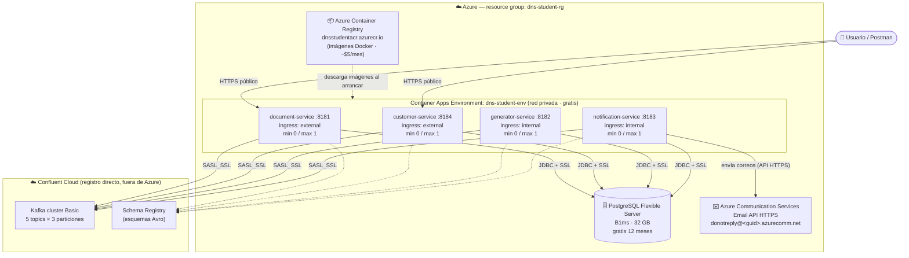
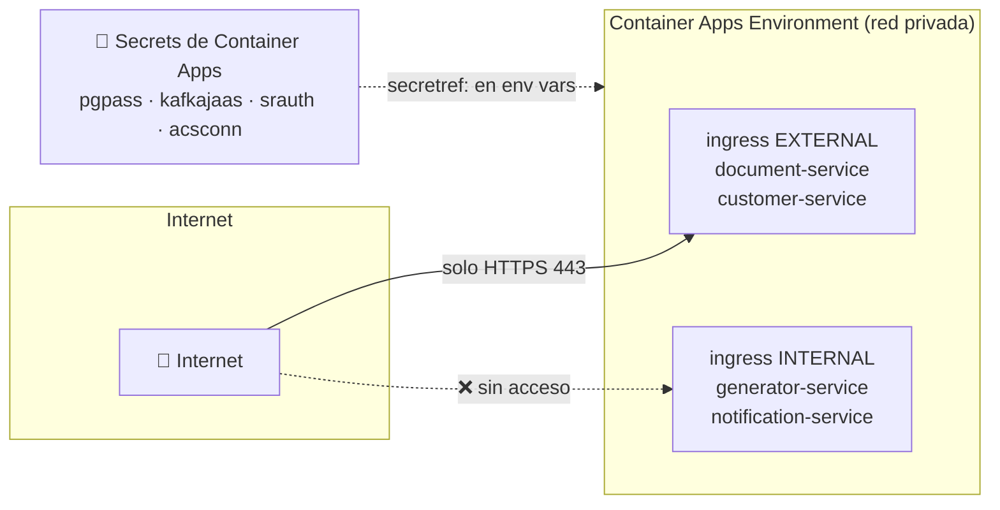
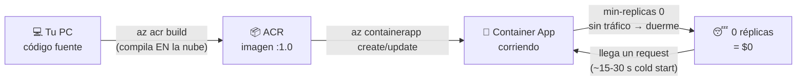
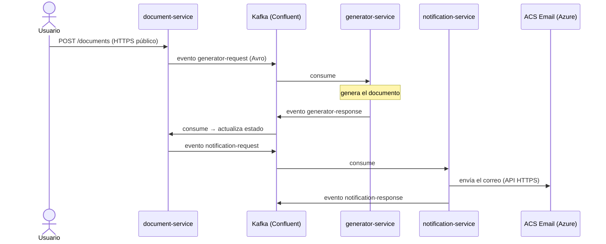
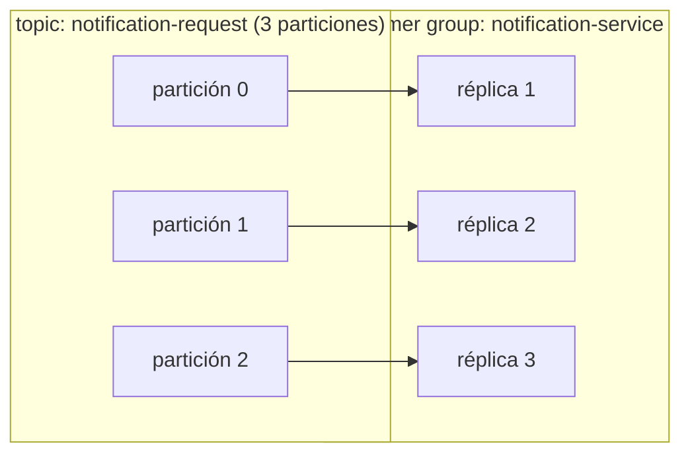

# Diagramas del despliegue en Azure

Las cinco vistas de la arquitectura del **Document Notification System** desplegado en **Azure Container Apps** con cuenta de estudiante. Los comandos para construir cada pieza están en [`03-AZURE-ESTUDIANTE-PASO-A-PASO.md`](03-AZURE-ESTUDIANTE-PASO-A-PASO.md); las variables de entorno completas en [`02-VARIABLES-DEPLOYMENT.md`](02-VARIABLES-DEPLOYMENT.md).

---

## 1. Vista general del despliegue

Todo vive en el resource group `dns-student-rg`, salvo Kafka: la cuenta de estudiante no permite compras de Marketplace, así que Confluent Cloud se contrata directo, fuera de Azure. El correo sale por **Azure Communication Services** (API HTTPS, sin SMTP).

> 💰 **Costo:** con scale-to-zero y la capa gratuita, un semestre de demos cuesta entre $0 y $10 de los $100 de crédito. Lo único que cobra por existir es el ACR (~$5/mes).

## 2. Topología de red y seguridad

Solo los dos servicios con API pública son alcanzables desde internet; los consumidores de Kafka quedan en la red privada del environment. Toda credencial vive como secreto y las variables solo la referencian (`secretref:`).

> 🔒 **Cifrado en tránsito:** JDBC con `sslmode=require`, Kafka con `SASL_SSL`, correo por HTTPS hacia ACS.

## 3. Del código a la nube

`az acr build` compila la imagen en Azure (no hace falta Docker local). Con `min-replicas 0`, un servicio sin tráfico se apaga solo y no cobra nada mientras duerme.

## 4. Flujo de negocio sobre esta infraestructura

El mismo flujo de eventos que en local, con ACS como transporte del correo. Si `generator` o `notification` están dormidos, los eventos esperan en Kafka sin perderse: el flujo se pausa, no se rompe.

## 5. Escalado: particiones y réplicas

La regla de oro: **réplicas útiles ≤ particiones del topic**. Con 3 particiones, hasta 3 réplicas por consumidor reparten el trabajo — de forma manual (`--min/max-replicas`) o automática con reglas KEDA (concurrencia HTTP en las APIs, lag de Kafka en los consumidores). Detalle completo en la [sección de escalado de la guía](03-AZURE-ESTUDIANTE-PASO-A-PASO.md#escalado-múltiples-instancias-manual-y-automático).

> ⚠️ **Antes de escalar:** `SQL_INIT_MODE=never` en los 4 servicios y ojo con la BD — el B1ms trae `max_connections = 50` y cada réplica abre un pool de 5, así que con los consumidores en 3 réplicas ya estás en el tope (y un rolling restart lo duplica). Para pruebas, subir a `D2s_v3` unas horas y volver a B1ms el mismo día.