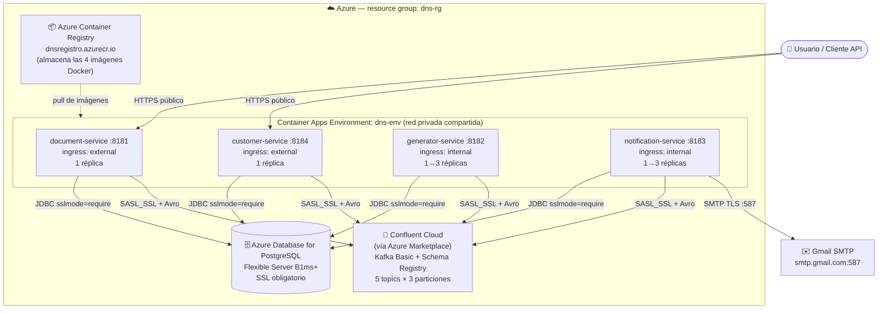
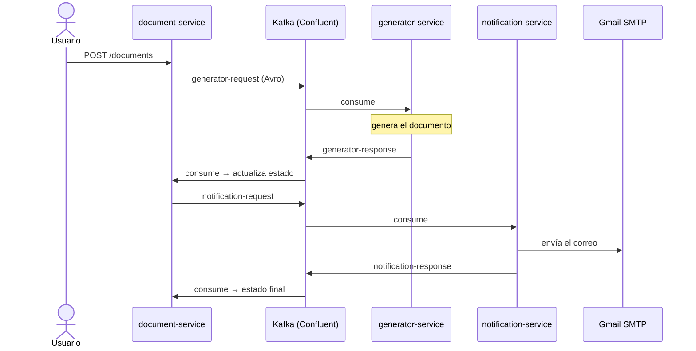
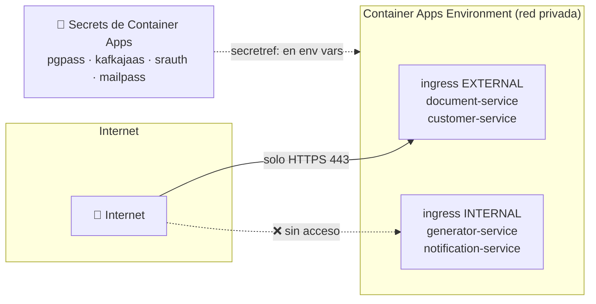
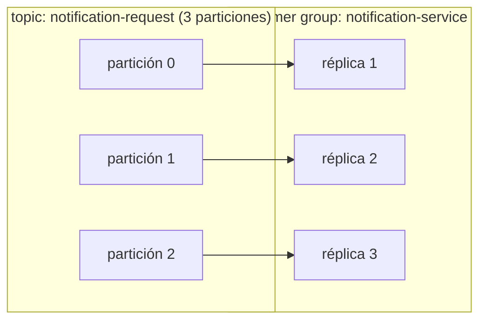

# Despliegue en Azure — Guía completa con cualquier tipo de cuenta

Guía paso a paso para desplegar el **Document Notification System** en Azure con una suscripción estándar (pay-as-you-go, empresa, o cualquier cuenta con facturación habilitada). Explica cada paso desde cero: qué es cada servicio, por qué se usa y qué hace cada comando.

> Si tienes una cuenta **Azure for Students** y quieres gastar lo mínimo, usa primero la variante [`AZURE-ESTUDIANTE-PASO-A-PASO.md`](AZURE-ESTUDIANTE-PASO-A-PASO.md). Esta guía es el escenario "sin restricciones": disponibilidad continua, Confluent vía Marketplace y escalado real.

---

## Arquitectura cloud

### Vista general del despliegue



**Piezas y su rol:**

| Pieza | Rol | Por qué este servicio |
|---|---|---|
| **Container Registry (ACR)** | Biblioteca de imágenes Docker | `az acr build` compila en la nube, sin Docker local |
| **Container Apps** | Ejecuta los 4 microservicios | Serverless: sin VMs que administrar, escala solo, HTTPS incluido |
| **PostgreSQL Flexible Server** | Base de datos (un schema por servicio) | Gestionado: backups, parches y SSL los pone Azure |
| **Confluent Cloud (Marketplace)** | Kafka + Schema Registry (Avro) | El proyecto usa el serializador de Confluent; Marketplace lo factura junto con Azure |
| **Gmail SMTP** | Envío real de correos | Ya configurado en el proyecto (App Password) |

### Flujo de eventos entre servicios



### Topología de red y seguridad



- Solo los dos servicios con API pública son accesibles desde internet; los consumidores de Kafka quedan en la red interna.
- Toda credencial (BD, Kafka, Schema Registry, correo) vive como **secret** y las variables de entorno solo la referencian (`secretref:`).
- Todas las conexiones salientes van cifradas: JDBC con `sslmode=require`, Kafka con `SASL_SSL`, SMTP con STARTTLS.

### Estimación de costos (encendido 24/7, región eastus)

| Recurso | Configuración | Costo aproximado/mes |
|---|---|---|
| Container Apps ×4 | 0.5 vCPU / 1 GiB c/u, 1 réplica | ~$35–50 (menos la capa gratuita mensual) |
| PostgreSQL Flexible B1ms | Burstable, 32 GB | ~$15–20 |
| ACR Basic | — | ~$5 |
| Confluent Cloud Basic | tráfico bajo | ~$0–10 según uso |
| **Total** | | **~$55–85/mes** |

> Cifras de referencia, verifícalas en la [calculadora de precios de Azure](https://azure.microsoft.com/pricing/calculator/). Para entornos de prueba puedes bajar a `--min-replicas 0` y pagar solo por uso.

---

## Prerrequisitos

- Una suscripción de Azure activa con facturación (pay-as-you-go o superior).
- [Azure CLI](https://learn.microsoft.com/cli/azure/install-azure-cli) instalado: verifica con `az version`.
- Sesión iniciada: `az login` (y `az account show` para confirmar la suscripción correcta).
- Docker local **no** es necesario: las imágenes se compilan en la nube.

## Paso 1 — Grupo de recursos y registro de contenedores

Un **resource group** es la carpeta lógica que agrupa todos los recursos del proyecto; permite verlos juntos, etiquetarlos y borrarlos de un solo golpe al final.

```bash
az group create --name dns-rg --location eastus
```

El **Azure Container Registry** es el repositorio donde vivirán las imágenes Docker de tus 4 microservicios (piensa en "GitHub, pero para contenedores"):

```bash
az acr create --resource-group dns-rg --name dnsregistro --sku Basic --admin-enabled true
```

- `--name` debe ser único en todo Azure (solo minúsculas y números).
- `--sku Basic` es suficiente para este proyecto.
- `--admin-enabled true` habilita usuario/contraseña para que Container Apps descargue imágenes.

## Paso 2 — Construir y subir las 4 imágenes

`az acr build` sube tu código y **compila la imagen en la nube** ejecutando el `Dockerfile` de cada servicio (Maven multi-módulo — cada build tarda varios minutos):

```bash
cd document-notification-system
az acr build --registry dnsregistro --image document-service:1.0     --file document-service/Dockerfile .
az acr build --registry dnsregistro --image customer-service:1.0     --file customer-service/Dockerfile .
az acr build --registry dnsregistro --image generator-service:1.0    --file generator-service/Dockerfile .
az acr build --registry dnsregistro --image notification-service:1.0 --file notification-service/Dockerfile .
```

El `.` final (contexto de build) da acceso a toda la carpeta, necesario porque los servicios comparten los módulos `common` e `infraestructure`.

> **Alternativa CI/CD:** configura en GitHub los secrets `REGISTRY_URL`, `REGISTRY_USERNAME` y `REGISTRY_PASSWORD` (credenciales del ACR: `az acr credential show -n dnsregistro`) y el workflow `.github/workflows/docker-publish.yml` publicará las imágenes automáticamente en cada push a `master`.

Verifica: `az acr repository list --name dnsregistro -o table` debe mostrar los 4 repositorios.

## Paso 3 — PostgreSQL gestionado

**Azure Database for PostgreSQL Flexible Server** te da el motor administrado (backups, parches, SSL). Cada microservicio usa su propio schema dentro de la misma base:

```bash
az postgres flexible-server create \
  --resource-group dns-rg \
  --name dns-postgres \
  --admin-user dnsadmin \
  --admin-password '<PASSWORD-FUERTE>' \
  --sku-name Standard_B1ms --tier Burstable \
  --storage-size 32 \
  --version 15 \
  --public-access 0.0.0.0
```

- `Standard_B1ms / Burstable`: el tamaño más económico; sube a `Standard_B2s` o General Purpose si necesitas más rendimiento.
- `--public-access 0.0.0.0`: regla que permite conexiones **desde servicios de Azure** (tus contenedores). Para conectarte desde tu PC añade tu IP: `az postgres flexible-server firewall-rule create -g dns-rg -n dns-postgres --rule-name mi-pc --start-ip-address <TU-IP> --end-ip-address <TU-IP>`.

**Crear los schemas** (una sola vez, el mismo script que usa docker-compose en local):

```bash
psql "host=dns-postgres.postgres.database.azure.com port=5432 dbname=postgres user=dnsadmin sslmode=require" \
  -f infraestructure/docker-compose/init-db.sql
```

## Paso 4 — Kafka + Schema Registry: Confluent Cloud vía Marketplace

El sistema publica eventos **Avro** validados contra un **Confluent Schema Registry**, así que el camino directo es Confluent Cloud. Con una suscripción estándar puedes contratarlo desde el **Azure Marketplace** y se factura junto con tu cuenta de Azure:

1. Portal de Azure → **Marketplace** → busca **"Apache Kafka on Confluent Cloud"** → crea la organización Confluent y un cluster **Basic** en la misma región (`eastus`).
2. En la consola de Confluent, crea los **5 topics con 3 particiones** cada uno: `customer`, `generator-request`, `generator-response`, `notification-request`, `notification-response`.
3. Habilita **Schema Registry** (paquete Essentials) en la misma región.
4. Genera credenciales: un **API key/secret del cluster** y otro **del Schema Registry**.

Guarda estos 4 valores para el paso 6:

| Dato | Formato |
|---|---|
| Bootstrap server | `pkc-xxxxx.eastus.azure.confluent.cloud:9092` |
| API key/secret del cluster | par key/secret |
| URL del Schema Registry | `https://psrc-xxxxx.eastus.azure.confluent.cloud` |
| Key/secret del Schema Registry | par key/secret |

> **Alternativa:** Azure Event Hubs expone un endpoint compatible con Kafka (mismo `SASL_SSL`/`PLAIN`), pero su registro de esquemas **no** es compatible con el serializador de Confluent que usa este proyecto — tendrías que desplegar un contenedor `cp-schema-registry` propio. Recomendado solo si ya conoces Event Hubs.

## Paso 5 — Entorno de Container Apps

El **environment** es la red privada compartida donde vivirán las 4 apps (el environment en sí no cuesta; pagas por los contenedores):

```bash
az containerapp env create --resource-group dns-rg --name dns-env --location eastus
```

## Paso 6 — Desplegar los 4 microservicios

Desplegar primero `customer-service` (inicializa la base de datos), luego el resto. Comando completo de ejemplo — los demás cambian nombre, imagen, puerto e ingress según la tabla:

```bash
az containerapp create \
  --resource-group dns-rg \
  --name customer-service \
  --environment dns-env \
  --image dnsregistro.azurecr.io/customer-service:1.0 \
  --registry-server dnsregistro.azurecr.io \
  --cpu 0.5 --memory 1.0Gi \
  --target-port 8184 --ingress external \
  --min-replicas 1 --max-replicas 1 \
  --secrets pgpass='<PASSWORD-FUERTE>' \
            kafkajaas='org.apache.kafka.common.security.plain.PlainLoginModule required username="<API_KEY>" password="<API_SECRET>";' \
            srauth='<SR_KEY>:<SR_SECRET>' \
  --env-vars \
    DB_HOST=dns-postgres.postgres.database.azure.com \
    DB_PORT=5432 DB_NAME=postgres \
    'DB_EXTRA_PARAMS=&sslmode=require' \
    POSTGRES_USER=dnsadmin POSTGRES_PASSWORD=secretref:pgpass \
    SQL_INIT_MODE=always \
    KAFKA_BOOTSTRAP_SERVERS='pkc-xxxxx.eastus.azure.confluent.cloud:9092' \
    KAFKA_SECURITY_PROTOCOL=SASL_SSL \
    KAFKA_SASL_MECHANISM=PLAIN \
    KAFKA_SASL_JAAS_CONFIG=secretref:kafkajaas \
    SCHEMA_REGISTRY_URL='https://psrc-xxxxx.eastus.azure.confluent.cloud' \
    SCHEMA_REGISTRY_AUTH_USER_INFO=secretref:srauth \
    APP_LOG_LEVEL=INFO
```

**Explicación de los bloques clave:**

- `--cpu / --memory`: recursos por contenedor; 0.5 vCPU / 1 GiB alcanza para un servicio Spring Boot.
- `--ingress external` = URL pública HTTPS automática; `internal` = solo visible dentro del environment.
- `--min-replicas 1`: siempre una instancia encendida (disponibilidad continua; los consumidores de Kafka nunca se pierden mensajes en vivo).
- `--secrets` + `secretref:`: las credenciales se guardan cifradas y las env vars solo las referencian.
- `SQL_INIT_MODE=always`: **solo en el primer arranque de `customer-service`** (ejecuta `init-schema.sql` + `init-data.sql`). Después: `az containerapp update -g dns-rg -n customer-service --set-env-vars SQL_INIT_MODE=never`.

Diferencias por servicio:

| Servicio | `--target-port` | `--ingress` | Extras |
|---|---|---|---|
| `customer-service` | 8184 | `external` | `SQL_INIT_MODE=always` solo la primera vez |
| `document-service` | 8181 | `external` | API principal del sistema |
| `generator-service` | 8182 | `internal` | — |
| `notification-service` | 8183 | `internal` | **Por defecto** envía con Azure Communication Services (`MAIL_PROVIDER=azure`): secret `acsconn` + env vars `ACS_CONNECTION_STRING=secretref:acsconn` y `MAIL_FROM=donotreply@<guid>.azurecomm.net` — la creación del recurso ACS está en [`AZURE-ESCALADO-PRUEBAS-MASIVAS.md`](AZURE-ESCALADO-PRUEBAS-MASIVAS.md) sección 0.2. Alternativa Gmail/SMTP: `MAIL_PROVIDER=smtp` + secret `mailpass` + env vars `MAIL_FROM`, `MAIL_HOST=smtp.gmail.com`, `MAIL_PORT=587`, `MAIL_USERNAME`, `MAIL_PASSWORD=secretref:mailpass` (App Password de Gmail) |

> `NOTIFICATION_INSTANCE_ID` no hace falta fijarlo: si se omite usa el default; al escalar conviene un valor distinto por réplica (en AKS se inyecta el nombre del pod automáticamente).

## Paso 7 — Health probes

Spring Boot Actuator ya expone los endpoints; configúralos en el portal (Container App → *Containers* → *Health probes*) o vía YAML:

- **Readiness:** HTTP GET `/actuator/health/readiness` en el puerto del servicio (¿puedo recibir tráfico?).
- **Liveness:** HTTP GET `/actuator/health/liveness` (¿sigo vivo o hay que reiniciarme?).

## Paso 8 — Verificar

```bash
# URL pública del API principal
az containerapp show -g dns-rg -n document-service \
  --query properties.configuration.ingress.fqdn -o tsv

curl https://<fqdn>/actuator/health   # espera {"status":"UP"}

# Logs en vivo
az containerapp logs show -g dns-rg -n notification-service --follow
```

Prueba el flujo de negocio completo (crear cliente → crear documento → correo recibido) apuntando a las URLs públicas.

## Paso 9 — Escalar

> Para escalar de cara a **pruebas masivas / de carga** (autoescalado HTTP, límites de PostgreSQL, servidor de correo de pruebas, scripts de subida y reversión), sigue la guía dedicada [`AZURE-ESCALADO-PRUEBAS-MASIVAS.md`](AZURE-ESCALADO-PRUEBAS-MASIVAS.md).

Los consumidores de Kafka pueden escalar hasta **3 réplicas** (los topics tienen 3 particiones; más réplicas quedarían ociosas). El patrón outbox con locking optimista ya tolera múltiples instancias:

```bash
az containerapp update -g dns-rg -n notification-service --min-replicas 2 --max-replicas 3
az containerapp update -g dns-rg -n generator-service    --min-replicas 2 --max-replicas 3
```



## Alternativa: AKS (Kubernetes)

Si prefieres Kubernetes (más control, más complejidad), los pasos 1–4 son idénticos y luego:

```bash
az aks create -g dns-rg -n dns-aks --node-count 2 --attach-acr dnsregistro
az aks get-credentials -g dns-rg -n dns-aks

kubectl apply -f document-notification-system/k8s/namespace.yaml
kubectl -n document-notification-system create secret generic dns-secrets \
  --from-literal=POSTGRES_USER=dnsadmin \
  --from-literal=POSTGRES_PASSWORD='<PASSWORD-FUERTE>' \
  --from-literal=MAIL_USERNAME=... --from-literal=MAIL_PASSWORD=... \
  --from-literal=KAFKA_SECURITY_PROTOCOL=SASL_SSL \
  --from-literal=KAFKA_SASL_MECHANISM=PLAIN \
  --from-literal=KAFKA_SASL_JAAS_CONFIG='...' \
  --from-literal=SCHEMA_REGISTRY_AUTH_USER_INFO='<SR_KEY>:<SR_SECRET>'

cd document-notification-system/k8s
kustomize edit set image document-notification-system/document-service=dnsregistro.azurecr.io/document-service:1.0
# ... repetir para los otros 3 servicios
kubectl apply -k .
```

Los manifiestos ya incluyen probes, límites de recursos e instance-id único por pod para `notification-service`. Ten en cuenta que AKS cobra por los nodos (VMs) 24/7 — es notablemente más caro que Container Apps para esta escala.

## Limpieza

Para eliminar **todo** el despliegue de un solo golpe (registry, BD, environment y las 4 apps):

```bash
az group delete --name dns-rg --yes
```

Si Confluent fue por Marketplace, cancela también la organización Confluent (Portal → el recurso de Confluent → *Delete*).

## Checklist final

- [ ] `SQL_INIT_MODE=never` en todos los servicios tras la primera inicialización.
- [ ] `APP_LOG_LEVEL=INFO`, `JPA_SHOW_SQL=false`.
- [ ] Contraseñas siempre como secrets (`secretref:` / K8s Secret), nunca en texto plano.
- [ ] TLS en todo: `DB_EXTRA_PARAMS=&sslmode=require`, `KAFKA_SECURITY_PROTOCOL=SASL_SSL`, SMTP 587.
- [ ] Topics creados con 3 particiones (factor de replicación lo gestiona Confluent).
- [ ] Health probes configurados (readiness + liveness).
- [ ] Alerta de presupuesto en *Cost Management* para detectar gastos inesperados.
