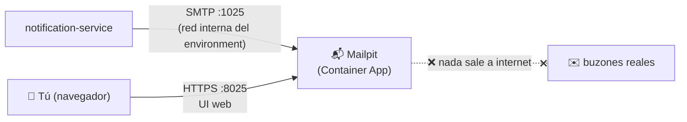
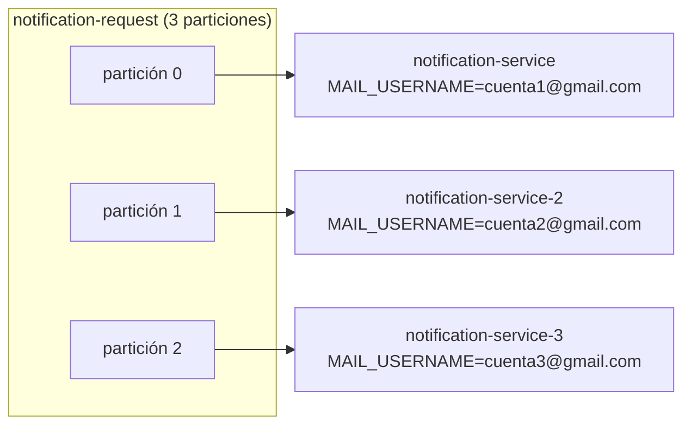
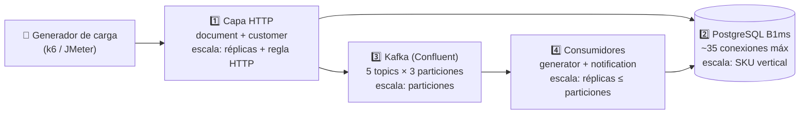

# Escalar los servicios en Azure para pruebas masivas (carga / estrés)

Esta guía explica **cómo escalar temporalmente** el Document Notification System en Azure Container Apps para ejecutar **pruebas masivas**, y cómo volver a la configuración normal al terminar. Sirve para **los dos despliegues documentados** del proyecto:

| Despliegue | Guía base | Resource group | PostgreSQL | Environment |
|---|---|---|---|---|
| **Estudiante** | [`AZURE-ESTUDIANTE-PASO-A-PASO.md`](AZURE-ESTUDIANTE-PASO-A-PASO.md) | `dns-student-rg` | `dns-student-pg` | `dns-student-env` |
| **Cloud (pay-as-you-go)** | [`AZURE-DESPLIEGUE-CLOUD.md`](AZURE-DESPLIEGUE-CLOUD.md) | `dns-rg` | `dns-postgres` | `dns-env` |

Todos los comandos usan variables para que apliquen a cualquiera de los dos. **Define las tuyas una vez al abrir la terminal** (copia la línea de tu despliegue):

```bash
# Despliegue estudiante:
RG=dns-student-rg; PG=dns-student-pg; ENV=dns-student-env

# Despliegue cloud (pay-as-you-go):
RG=dns-rg; PG=dns-postgres; ENV=dns-env
```

La idea central es la misma en ambos casos: la configuración base (pocas réplicas, PostgreSQL B1ms) está pensada para costo mínimo, no para soportar carga. Para una prueba masiva se sube capacidad **solo durante la ventana de prueba** (horas, no días) y se revierte inmediatamente después. La única diferencia entre despliegues está en el "estado de reposo" al que vuelves: el estudiante regresa a `min-replicas 0` (scale-to-zero) y el cloud a `min-replicas 1` (disponibilidad continua).

---

## 0. Antes de empezar: 3 advertencias que evitan sorpresas

### ⚠️ 1. El correo real (Gmail) NO sobrevive una prueba masiva

Hay **dos frenos** al envío de correo en el sistema, y ambos importan:

1. **Gmail**: limita ~**500 correos/día** por cuenta y bloquea temporalmente cuentas que envían en ráfaga. Una prueba masiva bloquearía el App Password y enviaría spam real a los correos de los clientes de prueba.
2. **El propio código**: `notification-service` trae un rate limiter interno configurable — por defecto `MAIL_RATE_LIMIT_TOKENS=5` cada `MAIL_RATE_LIMIT_REFILL_MS=20000` (5 correos por 20 s ≈ **15 correos/minuto**). Aunque el SMTP aguantara, el throughput de notificaciones está limitado por diseño para proteger la cuenta de Gmail. En una prueba masiva hay que subirlo (solo con SMTP de pruebas, nunca con Gmail).

**Opciones para el correo en pruebas masivas:**

| Opción | Capacidad | Costo | Veredicto |
|---|---|---|---|
| **A. Contenedor Mailpit en el mismo environment** | Ilimitada, cualquier destinatario | ~$0 | ✅ **Recomendada** — paso a paso en la sección 0.1 |
| B. Sandbox SaaS (Mailtrap) | ~100 correos/mes en plan gratis | $0 / de pago | Solo para pruebas pequeñas: una prueba masiva agota el plan gratis en segundos |
| C. Varias cuentas Gmail reales "rotando" | ~500/día por cuenta | $0 | ❌ No recomendada: el código usa **una sola** configuración SMTP (no hay rotación de remitentes), seguirías topando el límite por cuenta y el envío en ráfaga hace que Google marque las cuentas como spam |
| D. Apagar `notification-service` | 0 correos | $0 | Válida si solo quieres medir document/generator — los eventos `notification-request` quedan en Kafka sin perderse |

### 0.1 Opción A paso a paso: desplegar Mailpit (tu propio servidor de correo de pruebas)

**¿Qué es?** [Mailpit](https://mailpit.axllent.org/) es un servidor SMTP falso en un contenedor: **acepta cualquier correo, hacia cualquier destinatario** (`cliente1@loquesea.com`, `test999@example.com`...), no entrega ninguno a un buzón real, y los guarda en una **interfaz web** donde puedes verlos y contarlos. Es exactamente "subir un contenedor de correo": el sistema envía correos de verdad por SMTP, solo que el servidor que los recibe es tuyo.



**Paso 1 — Crear el archivo `mailpit.yaml`** (Container Apps necesita YAML porque el SMTP usa un puerto TCP adicional al de la UI):

```yaml
# mailpit.yaml
properties:
  environmentId: <ENVIRONMENT_ID>   # se obtiene en el paso 2
  configuration:
    ingress:
      external: true            # UI web pública para inspeccionar los correos
      targetPort: 8025
      transport: http
      additionalPortMappings:
        - external: false       # SMTP solo visible DENTRO del environment
          targetPort: 1025
          exposedPort: 1025
  template:
    containers:
      - name: mailpit
        image: docker.io/axllent/mailpit:latest
        env:
          - name: MP_MAX_MESSAGES
            value: "10000"      # por defecto solo retiene 500; súbelo al volumen de tu prueba
        resources:
          cpu: 0.25
          memory: 0.5Gi
    scale:
      minReplicas: 1
      maxReplicas: 1
```

**Paso 2 — Desplegarlo** (usa las variables `RG`/`ENV` definidas al inicio de la guía):

```bash
# Obtener el ID del environment y ponerlo en el yaml:
az containerapp env show -g $RG -n $ENV --query id -o tsv
# → copia el resultado en <ENVIRONMENT_ID> del mailpit.yaml

az containerapp create -g $RG -n mailpit --yaml mailpit.yaml
```

**Paso 3 (recomendado) — Restringir la UI a tu IP.** La interfaz web queda pública; aunque solo contiene correos de prueba, mejor que solo tú la veas:

```bash
az containerapp ingress access-restriction set -g $RG -n mailpit \
  --rule-name solo-mi-pc --ip-address <TU-IP>/32 --action Allow
```

**Paso 4 — Apuntar `notification-service` a Mailpit y liberar el rate limiter.** Todos los parámetros SMTP del servicio son variables de entorno (ver `application.yml`), así que no hay que tocar código. Mailpit no usa autenticación ni STARTTLS:

```bash
az containerapp update -g $RG -n notification-service \
  --set-env-vars \
    MAIL_PROVIDER=smtp \
    MAIL_HOST=mailpit \
    MAIL_PORT=1025 \
    MAIL_SMTP_AUTH=false \
    MAIL_SMTP_STARTTLS_ENABLE=false \
    MAIL_SMTP_STARTTLS_REQUIRED=false \
    MAIL_RATE_LIMIT_TOKENS=100 \
    MAIL_RATE_LIMIT_REFILL_MS=1000
```

- `MAIL_PROVIDER=smtp`: **imprescindible** — el proveedor por defecto de la aplicación es `azure` (Azure Communication Services), y Mailpit habla SMTP.
- `MAIL_HOST=mailpit`: dentro del mismo environment las apps se resuelven por nombre.
- `MAIL_RATE_LIMIT_TOKENS=100` / `REFILL_MS=1000`: hasta ~100 correos/segundo. Contra Mailpit es seguro; ajusta según el throughput que quieras medir.

**Paso 5 — Verificar.** Abre `https://<fqdn-de-mailpit>` en el navegador (el FQDN lo da `az containerapp show -g $RG -n mailpit --query properties.configuration.ingress.fqdn -o tsv`). Crea un documento de prueba y el correo debe aparecer en la UI en segundos. Durante la prueba masiva, la API de Mailpit te da el conteo exacto de correos recibidos (campo `total`) — útil para validar que no se perdió ninguna notificación:

```bash
curl "https://<fqdn-de-mailpit>/api/v1/messages?limit=1"
```

**Paso 6 — Revertir al terminar las pruebas:**

```bash
# Volver al proveedor que uses en producción y al rate limit conservador.
# Si usas el proveedor por defecto (azure/ACS), basta con:
#   az containerapp update -g $RG -n notification-service --set-env-vars MAIL_PROVIDER=azure \
#     MAIL_FROM='donotreply@<guid>.azurecomm.net' MAIL_RATE_LIMIT_TOKENS=5 MAIL_RATE_LIMIT_REFILL_MS=20000
# Si usas Gmail:
az containerapp update -g $RG -n notification-service \
  --set-env-vars \
    MAIL_PROVIDER=smtp \
    MAIL_HOST=smtp.gmail.com MAIL_PORT=587 \
    MAIL_SMTP_AUTH=true \
    MAIL_SMTP_STARTTLS_ENABLE=true MAIL_SMTP_STARTTLS_REQUIRED=true \
    MAIL_RATE_LIMIT_TOKENS=5 MAIL_RATE_LIMIT_REFILL_MS=20000

# Borrar Mailpit (los correos capturados se pierden — es lo esperado):
az containerapp delete -g $RG -n mailpit --yes
```

> Costo de Mailpit: 0.25 vCPU × las horas de la prueba ≈ centavos (o $0 dentro de la capa gratuita). Como todo en esta guía: bórralo al terminar.

### 0.2 ¿Y si los correos deben llegar DE VERDAD en masa? (SMTP transaccional o rotación de instancias)

Mailpit cubre la prueba de carga, pero no entrega nada a buzones reales. Si tu escenario exige que los correos **sí lleguen** (por ejemplo, validar la recepción de punta a punta con volumen), hay dos caminos:

#### Opción 1 (recomendada): Azure Communication Services Email — soporte nativo en el código

`notification-service` trae **dos implementaciones de envío** detrás del mismo puerto de dominio (`INotificationSender`), seleccionables con la variable `MAIL_PROVIDER`:

| `MAIL_PROVIDER` | Adaptador | Transporte | Para qué |
|---|---|---|---|
| `azure` (**por defecto**) | `AzureEmailNotificationSender` | **Azure Communication Services Email** (API HTTPS, sin SMTP) | **Envío real en masa** — ~$0.00025/correo (10.000 correos ≈ $2.50), servicio nativo de Azure (no Marketplace) → se paga con el crédito de estudiante |
| `smtp` | `EmailNotificationSender` | SMTP (Gmail, Mailpit, cualquier servidor) | Demos con Gmail y pruebas de carga con Mailpit |

Ambos comparten el rate limiter, los reintentos con backoff y el mismo cuerpo de correo — el destinatario recibe un correo idéntico, cambie el proveedor que cambie.

**Paso 1 — Crear el recurso de ACS Email** (una sola vez; la CLI instalará la extensión `communication` la primera vez):

```bash
# Recurso de comunicación + servicio de email con dominio gestionado por Azure:
az communication create -g $RG -n dns-comm --location global --data-location UnitedStates
az communication email create -g $RG -n dns-email --location global --data-location UnitedStates
az communication email domain create -g $RG --email-service-name dns-email \
  --name AzureManagedDomain --location global --domain-management AzureManaged

# Vincular el dominio al recurso de comunicación:
DOMAIN_ID=$(az communication email domain show -g $RG --email-service-name dns-email \
  --name AzureManagedDomain --query id -o tsv)
az communication update -g $RG -n dns-comm --linked-domains $DOMAIN_ID

# Datos que necesitas:
az communication list-key -g $RG -n dns-comm --query primaryConnectionString -o tsv   # connection string
az communication email domain show -g $RG --email-service-name dns-email \
  --name AzureManagedDomain --query "fromSenderDomain" -o tsv                          # dominio del remitente
```

El remitente con dominio gestionado tiene la forma `donotreply@<guid>.azurecomm.net`. (Con un dominio propio verificado puedes usar tu dirección y obtener límites más altos; el dominio gestionado trae límites iniciales que se amplían con una solicitud de cuota.)

**Paso 2 — Activar el proveedor `azure` en `notification-service`:**

```bash
az containerapp update -g $RG -n notification-service \
  --secrets acsconn='<PRIMARY-CONNECTION-STRING>' \
  --set-env-vars \
    MAIL_PROVIDER=azure \
    ACS_CONNECTION_STRING=secretref:acsconn \
    MAIL_FROM='donotreply@<guid>.azurecomm.net' \
    MAIL_RATE_LIMIT_TOKENS=20 MAIL_RATE_LIMIT_REFILL_MS=1000   # ajusta a tu cuota de ACS
```

En modo `azure` (que además es el **valor por defecto** de la aplicación — `MAIL_PROVIDER` puede omitirse) las variables `MAIL_HOST`/`MAIL_USERNAME`/`MAIL_PASSWORD` se ignoran (no hay SMTP de por medio) y no se abre ninguna conexión con Gmail. Sin `ACS_CONNECTION_STRING` el servicio no arranca, con un error que lo explica. **Para volver a Gmail:** `MAIL_PROVIDER=smtp` y restaurar `MAIL_FROM`.

**Alternativas SMTP** si prefieres no usar ACS (ambas van por el proveedor `smtp` clásico, solo cambian host y credenciales): SendGrid con registro directo en sendgrid.com (`smtp.sendgrid.net:587`, usuario `apikey`, password = API key; plan gratis ~100/día — vía Marketplace no funciona con crédito de estudiante) o Amazon SES (~$0.10 por 1.000 correos; requiere cuenta AWS y salir del sandbox).

⚠️ Con cualquier proveedor: envía solo a **buzones que controles** (tus propias cuentas de prueba). Enviar volumen a direcciones de terceros, aunque sean inventadas, genera rebotes que destruyen la reputación del remitente y pueden suspender la cuenta del proveedor.

#### Opción 2: varias instancias de `notification-service`, cada una con su propio SMTP

La arquitectura lo permite **sin tocar código**: todas las instancias se unen al mismo consumer group de Kafka (`notification-topic-consumer`), así que Kafka **reparte las 3 particiones entre ellas automáticamente** — cada correo lo procesa exactamente una instancia, y cada instancia envía por el SMTP que tenga configurado. Es la "rotación de correos" hecha por particionamiento:



Cómo crear la segunda instancia (y la tercera, cambiando el número): **clona el `az containerapp create` original de `notification-service`** (misma imagen, mismas variables de BD y Kafka, mismos secrets `pgpass`/`kafkajaas`/`srauth`) cambiando únicamente:

```bash
  --name notification-service-2 \
  --min-replicas 1 --max-replicas 1 \
  --secrets ... mailpass2='<APP-PASSWORD-DE-LA-CUENTA-2>' \
  --env-vars ... \
    NOTIFICATION_INSTANCE_ID=notification-2 \
    MAIL_FROM=cuenta2@gmail.com \
    MAIL_USERNAME=cuenta2@gmail.com \
    MAIL_PASSWORD=secretref:mailpass2
```

Reglas y límites de esta opción:

- **`NOTIFICATION_INSTANCE_ID` distinto por instancia es obligatorio** — el patrón outbox lo usa para el locking entre instancias.
- **Máximo 3 instancias útiles** (3 particiones). Instancias extra no reciben mensajes.
- Cada instancia debe quedarse en `max-replicas 1`: si una app escala a 2 réplicas internas, ambas compartirían la misma cuenta SMTP y el mismo `INSTANCE_ID`.
- El rate limiter es **por instancia**: 3 instancias con la configuración por defecto ≈ 45 correos/min en total.
- **Haz las cuentas antes de elegirla:** con 3 cuentas Gmail el techo real es ~1.500 correos/día en total, y el riesgo de bloqueo por ráfaga sigue existiendo por cuenta. Sirve para pruebas **moderadas** con correo real (cientos de correos), no para masivas (miles) — para eso, Opción 1.
- Al terminar: `az containerapp delete -g $RG -n notification-service-2 --yes` (y `-3`), y verifica que la instancia original vuelve a consumir las 3 particiones.

**Resumen de decisión:**

| Necesito | Usa |
|---|---|
| Medir rendimiento del sistema con miles de correos | Mailpit (sección 0.1) |
| Que lleguen miles de correos reales | SMTP transaccional (Opción 1) |
| Que lleguen cientos de correos reales sin contratar nada | 2-3 instancias con cuentas propias (Opción 2) |

### ⚠️ 2. El crédito de estudiante se consume rápido con réplicas encendidas

La capa gratuita de Container Apps es **180.000 vCPU-segundos/mes**. Referencia rápida con contenedores de 0.5 vCPU:

| Escenario | vCPU-segundos consumidos |
|---|---|
| 4 servicios × 1 réplica × 1 hora | 7.200 (~4% de la capa gratuita) |
| 4 servicios × 3 réplicas × 1 hora | 21.600 (~12%) |
| 4 servicios × 3 réplicas × 8 horas | 172.800 (**~96% — casi toda la capa gratuita del mes**) |

Conclusión: **planifica ventanas de prueba de 1–3 horas** y ejecuta el script de reversión (sección 7) apenas termines.

### ⚠️ 3. Desactiva la inicialización SQL antes de escalar

`SQL_INIT_MODE` debe estar en `never` en **todos** los servicios antes de subir réplicas. Con `always`, cada réplica nueva re-ejecuta los scripts SQL al arrancar (carreras, datos duplicados o errores de arranque).

```bash
for s in document-service customer-service generator-service notification-service; do
  az containerapp update -g $RG -n $s --set-env-vars SQL_INIT_MODE=never
done
```

---

## 1. Los 4 límites del sistema y qué escala cada uno

Escalar no es solo "más réplicas". Cada capa tiene su propio cuello de botella:



| # | Capa | Límite actual | Cómo se escala |
|---|---|---|---|
| 1 | HTTP (`document`, `customer`) | 1 réplica máx, 0.5 vCPU | Más réplicas + regla de concurrencia HTTP (sección 2) |
| 2 | PostgreSQL | B1ms ≈ **35 conexiones** y 1 vCPU burstable | Escalar SKU temporalmente (sección 4) |
| 3 | Kafka | 3 particiones por topic | Más particiones si necesitas >3 consumidores (sección 3) |
| 4 | Consumidores (`generator`, `notification`) | 1 réplica máx | Más réplicas, **con tope en el nº de particiones** (sección 3) |

---

## 2. Escalar la capa HTTP: `document-service` y `customer-service`

Container Apps escala horizontalmente con reglas KEDA. Para servicios HTTP la regla natural es **concurrencia**: "si hay más de N requests simultáneos por réplica, crea otra réplica".

```bash
# document-service: hasta 3 réplicas, nueva réplica a partir de 50 requests concurrentes
az containerapp update -g $RG -n document-service \
  --min-replicas 1 --max-replicas 3 \
  --scale-rule-name http-load \
  --scale-rule-type http \
  --scale-rule-http-concurrency 50

# customer-service: igual (recibe menos tráfico, 2 réplicas suelen bastar)
az containerapp update -g $RG -n customer-service \
  --min-replicas 1 --max-replicas 2 \
  --scale-rule-name http-load \
  --scale-rule-type http \
  --scale-rule-http-concurrency 50
```

**Por qué estos valores:**

- `--min-replicas 1`: elimina el cold start (~15-30 s) durante la prueba. Con `min 0`, las primeras peticiones de la prueba medirían el arranque del contenedor, no el rendimiento real.
- `--max-replicas 3`: tope alineado con las 3 particiones de Kafka (el `document-service` también consume `generator-response`/`notification-response`) y con el límite de conexiones de la BD (sección 4).
- `--scale-rule-http-concurrency 50`: valor razonable para Spring Boot con 0.5 vCPU. Si ves que escala demasiado tarde (latencias altas antes de crear réplicas), bájalo a 20-30.

**Escalado vertical (opcional):** si una réplica se satura de CPU antes de que la regla dispare (visible en métricas, sección 6), sube el tamaño del contenedor en vez de solo añadir réplicas:

```bash
az containerapp update -g $RG -n document-service --cpu 1.0 --memory 2.0Gi
```

> Nota: `--cpu 1.0` duplica el consumo de vCPU-segundos por réplica. Úsalo solo si la métrica de CPU lo justifica.

---

## 3. Escalar los consumidores de Kafka: `generator-service` y `notification-service`

### La regla de oro: réplicas útiles ≤ particiones del topic

Los topics se crearon con **3 particiones** y los consumidores usan `KAFKA_CONSUMER_CONCURRENCY=3` (3 hilos por instancia). Esto implica:

- **1 réplica ya consume las 3 particiones en paralelo** (3 hilos internos). Es el punto de partida.
- **2-3 réplicas** reparten las particiones entre instancias (Kafka reasigna; hilos sobrantes quedan ociosos, no es un error pero tampoco aporta).
- **Más de 3 réplicas es inútil**: las réplicas extra no reciben ninguna partición y quedan idle consumiendo crédito.

### Configuración para la prueba

```bash
# Encender con capacidad fija (los consumidores Kafka no escalan por HTTP,
# lo simple y predecible para una prueba es fijar réplicas):
az containerapp update -g $RG -n generator-service \
  --min-replicas 2 --max-replicas 3

az containerapp update -g $RG -n notification-service \
  --min-replicas 1 --max-replicas 3
```

**Alternativa avanzada — autoescalar por lag de Kafka (KEDA):** en vez de fijar réplicas, Container Apps puede crear réplicas cuando los mensajes pendientes (lag) superan un umbral:

```bash
az containerapp update -g $RG -n generator-service \
  --min-replicas 0 --max-replicas 3 \
  --scale-rule-name kafka-lag \
  --scale-rule-type kafka \
  --scale-rule-metadata \
      bootstrapServers='pkc-xxxxx.eastus.azure.confluent.cloud:9092' \
      consumerGroup='generator-topic-consumer' \
      topic='generator-request' \
      lagThreshold='100' \
      sasl='plaintext' \
      tls='enable' \
  --scale-rule-auth username=kafka-user password=kafka-pass \
  --secrets kafka-user='<API_KEY_CLUSTER>' kafka-pass='<API_SECRET_CLUSTER>'
```

- `lagThreshold=100`: una réplica nueva por cada ~100 mensajes pendientes, hasta `max-replicas`.
- El `consumerGroup` de cada servicio está en su `application.yml` (`kafka-consumer-config`).
- Ventaja: combina scale-to-zero (fuera de pruebas) con reacción automática a ráfagas. Desventaja: más piezas que depurar; para una primera prueba masiva, **réplicas fijas es más simple y los resultados son más fáciles de interpretar**.

### ¿Y si necesito más de 3 consumidores en paralelo?

Hay que **aumentar las particiones** de los topics en Confluent Cloud (por ejemplo a 6) **antes** de subir `max-replicas` por encima de 3. Dos avisos:

1. En Confluent las particiones **se pueden aumentar pero nunca reducir** — para volver a 3 tendrías que recrear el topic.
2. Con la carga que soporta este stack (0.5 vCPU por servicio, BD B1ms), es muy improbable que el cuello de botella sean las 3 particiones. Agota primero las secciones 2 y 4.

---

## 4. PostgreSQL: el cuello de botella silencioso

El B1ms gratuito tiene dos límites que una prueba masiva golpea de frente:

1. **~35 conexiones máximas** (`max_connections` del SKU). Cada réplica de cada servicio abre un pool HikariCP de **10 conexiones por defecto**. Haz la cuenta antes de escalar:

   | Configuración | Conexiones potenciales | ¿Cabe en B1ms (~35)? |
   |---|---|---|
   | 4 servicios × 1 réplica × 10 | 40 | ⚠️ Ya está al límite |
   | Escenario de prueba (3+2+3+2 réplicas) × 10 | 100 | ❌ Errores `too many connections` |

2. **CPU "burstable"**: el B1ms acumula créditos de CPU cuando está tranquilo y los quema bajo carga. En una prueba sostenida los agota y el rendimiento **se desploma a mitad de prueba**, contaminando tus mediciones.

### Opción A (recomendada): escalar el servidor solo durante la prueba

```bash
# Antes de la prueba — subir a 2 vCPU dedicadas (General Purpose):
az postgres flexible-server update -g $RG -n $PG \
  --sku-name Standard_D2s_v3 --tier GeneralPurpose

# Después de la prueba — volver al tamaño gratuito:
az postgres flexible-server update -g $RG -n $PG \
  --sku-name Standard_B1ms --tier Burstable
```

- `Standard_D2s_v3` ≈ **$0.16/hora** (~$0.50 por una prueba de 3 horas — asumible) y sube `max_connections` a ~850.
- Cada cambio de SKU reinicia el servidor (~5 min de indisponibilidad). Hazlo **antes** de encender las réplicas.
- ⚠️ Las horas fuera de B1ms **no cuentan como capa gratuita**: se descuentan del crédito. Por eso: subir → probar → bajar el mismo día.

### Opción B: quedarse en B1ms y reducir los pools

Si no quieres tocar la BD, limita el pool de cada servicio para que la suma quepa en ~35:

```bash
# 4-5 conexiones por réplica en vez de 10 (Hikari respeta esta propiedad estándar de Spring):
az containerapp update -g $RG -n document-service \
  --set-env-vars SPRING_DATASOURCE_HIKARI_MAXIMUMPOOLSIZE=5
# Repetir para los otros 3 servicios (usa 3-4 en generator/notification si tienes muchas réplicas)
```

Regla: `Σ (réplicas × pool) ≤ 30` (deja ~5 conexiones para `psql`, monitoreo, etc.). Ten en cuenta que con B1ms el techo de rendimiento lo pondrá la CPU de la BD, no tus servicios — sirve para pruebas moderadas, no para estrés real.

---

## 5. Configuración de la aplicación para que la medición sea limpia

Dos ajustes de entorno que distorsionan cualquier prueba de carga si se dejan con los valores por defecto:

```bash
for s in document-service customer-service generator-service notification-service; do
  az containerapp update -g $RG -n $s \
    --set-env-vars APP_LOG_LEVEL=WARN JPA_SHOW_SQL=false
done
```

- `JPA_SHOW_SQL=false`: por defecto está en `true` — imprime **cada SQL** en el log. Con miles de requests, el logging se vuelve un cuello de botella artificial (I/O de consola) y llena Log Analytics.
- `APP_LOG_LEVEL=WARN`: el nivel por defecto (`DEBUG` en local, `INFO` en cloud) genera mucho ruido bajo carga.

Al terminar la prueba puedes devolverlos a `INFO`/`true` si los usas para depurar.

---

## 6. Ejecutar y observar la prueba

### Generar la carga

Cualquier herramienta sirve; **k6** es la más ligera para empezar (un binario, scripts en JS):

```javascript
// load-test.js — rampa hasta 50 usuarios virtuales creando documentos
import http from 'k6/http';
import { check, sleep } from 'k6';

export const options = {
  stages: [
    { duration: '2m', target: 10 },   // calentamiento
    { duration: '5m', target: 50 },   // rampa de subida
    { duration: '10m', target: 50 },  // meseta (aquí se mide)
    { duration: '2m', target: 0 },    // bajada
  ],
  thresholds: {
    http_req_duration: ['p(95)<2000'], // el 95% de requests < 2 s
    http_req_failed: ['rate<0.01'],    // < 1% de errores
  },
};

const BASE = 'https://<fqdn-de-document-service>';

export default function () {
  const res = http.post(`${BASE}/documents`, JSON.stringify({
    // cuerpo según commands/postman/create-document-collection.json
  }), { headers: { 'Content-Type': 'application/json' } });
  check(res, { 'status 2xx': (r) => r.status >= 200 && r.status < 300 });
  sleep(1);
}
```

```bash
k6 run load-test.js
```

Alternativas: **JMeter** (si prefieres GUI y ya tienes las colecciones Postman, se importan), o **Azure Load Testing** (servicio gestionado que corre JMeter/k6 desde Azure — cómodo pero consume crédito; para este proyecto k6 desde tu PC es suficiente).

> Consejo: corre el generador de carga **contra la URL pública** desde tu PC o una VM fuera del environment. No lo despliegues dentro del mismo environment: competiría por la capa gratuita y contaminaría las métricas.

### Qué observar durante la prueba

```bash
# Réplicas activas en vivo (¿está escalando cuando debe?):
az containerapp replica list -g $RG -n document-service -o table

# Logs en vivo de un servicio:
az containerapp logs show -g $RG -n document-service --follow --tail 50

# CPU y memoria (portal): Container App → Metrics → "CPU Usage" / "Memory Working Set"
#   → filtrar por réplica para ver si la carga se reparte.

# Conexiones activas en PostgreSQL (portal): servidor → Monitoring → "Active Connections"
#   → si se acerca al máximo del SKU, estás por ver errores de conexión.

# Correos procesados de punta a punta (UI o API de Mailpit, sección 0.1):
curl "https://<fqdn-de-mailpit>/api/v1/messages?limit=1"   # el campo "total" debe acercarse al nº de documentos creados
```

En **Confluent Cloud** (web): cluster → *Consumers* → consumer group → **lag por topic**. Si el lag de `generator-request` crece sin parar durante la meseta, `generator-service` no da abasto → más réplicas (hasta 3) o el cuello está en la BD.

### Señales típicas y su diagnóstico

| Síntoma | Causa probable | Acción |
|---|---|---|
| Latencia p95 alta pero CPU de réplicas baja | Pool de BD agotado o BD saturada | Sección 4 (escalar BD / revisar conexiones) |
| CPU de réplicas al 100% y no crea más | `max-replicas` alcanzado o regla poco sensible | Subir `max-replicas` o bajar `http-concurrency` |
| Lag de Kafka crece sin parar | Consumidores insuficientes o BD lenta en el consumidor | Más réplicas del consumidor (≤3) / sección 4 |
| Errores 5xx en ráfaga al inicio | Cold start (min-replicas 0) | `--min-replicas 1` antes de la prueba |
| Todo se degrada a los ~10-15 min | Créditos de CPU del B1ms agotados | Opción A de la sección 4 |

---

## 7. Scripts listos: encender modo prueba y revertir

### `scale-up-test.sh` — antes de la prueba (~10 min en aplicar todo)

```bash
#!/bin/bash
set -euo pipefail
RG=${RG:-dns-student-rg}   # despliegue cloud: dns-rg
PG=${PG:-dns-student-pg}   # despliegue cloud: dns-postgres

# 1. BD a tamaño de prueba (reinicia el servidor, ~5 min)
az postgres flexible-server update -g $RG -n $PG \
  --sku-name Standard_D2s_v3 --tier GeneralPurpose

# 2. Servicios HTTP con autoescalado
az containerapp update -g $RG -n document-service \
  --min-replicas 1 --max-replicas 3 \
  --scale-rule-name http-load --scale-rule-type http --scale-rule-http-concurrency 50 \
  --set-env-vars APP_LOG_LEVEL=WARN JPA_SHOW_SQL=false SQL_INIT_MODE=never

az containerapp update -g $RG -n customer-service \
  --min-replicas 1 --max-replicas 2 \
  --scale-rule-name http-load --scale-rule-type http --scale-rule-http-concurrency 50 \
  --set-env-vars APP_LOG_LEVEL=WARN JPA_SHOW_SQL=false SQL_INIT_MODE=never

# 3. Consumidores Kafka con réplicas fijas (tope = 3 particiones)
az containerapp update -g $RG -n generator-service \
  --min-replicas 2 --max-replicas 3 \
  --set-env-vars APP_LOG_LEVEL=WARN JPA_SHOW_SQL=false SQL_INIT_MODE=never

az containerapp update -g $RG -n notification-service \
  --min-replicas 1 --max-replicas 3 \
  --set-env-vars APP_LOG_LEVEL=WARN JPA_SHOW_SQL=false SQL_INIT_MODE=never
  # ⚠️ Recuerda: SMTP de prueba (Mailpit, sección 0.1), NO Gmail real

echo "✅ Modo prueba activo. Recuerda ejecutar scale-down-test.sh al terminar."
```

### `scale-down-test.sh` — inmediatamente después de la prueba

```bash
#!/bin/bash
set -euo pipefail
RG=${RG:-dns-student-rg}   # despliegue cloud: dns-rg
PG=${PG:-dns-student-pg}   # despliegue cloud: dns-postgres

# 1. Todos los servicios de vuelta a modo ahorro (scale to zero)
for s in document-service customer-service generator-service notification-service; do
  az containerapp update -g $RG -n $s --min-replicas 0 --max-replicas 1
done

# 2. BD de vuelta al tamaño gratuito (reinicia, ~5 min)
az postgres flexible-server update -g $RG -n $PG \
  --sku-name Standard_B1ms --tier Burstable

echo "✅ Modo ahorro restaurado."
```

> Las reglas de escalado HTTP quedan definidas pero con `max-replicas 1` no tienen efecto; no hace falta borrarlas.

---

## 8. Costo estimado de una sesión de prueba de 3 horas

| Recurso | Cálculo | Costo aprox. |
|---|---|---|
| Container Apps (hasta ~9-11 réplicas pico × 0.5 vCPU) | ~40.000-60.000 vCPU-s | **$0** si queda capa gratuita del mes; si no, ~$0.50-1.00 |
| PostgreSQL D2s_v3 × 3-4 h (incluye subida/bajada) | ~$0.16/h | ~$0.50-0.65 |
| Mailpit (0.25 vCPU × 3-4 h) | ~5.000 vCPU-s | $0 (capa gratuita) |
| Kafka (Confluent, créditos de prueba) | — | $0 |
| Egreso de red (respuestas HTTP de la prueba) | primeros 100 GB/mes gratis | $0 |
| **Total por sesión** | | **≈ $1-2 del crédito** |

Perfectamente asumible con los $100 — **siempre que ejecutes la reversión al terminar**. Olvidar la BD en `D2s_v3` cuesta ~$115/mes: sería el error más caro posible con esta cuenta. La alerta de presupuesto del Paso 1 de la guía de estudiante es tu red de seguridad.

---

## Checklist de una sesión de pruebas masivas

**Antes:**
- [ ] Mailpit desplegado y `notification-service` apuntando a él, con el rate limiter liberado (sección 0.1) — nunca Gmail real bajo carga.
- [ ] `SQL_INIT_MODE=never` en los 4 servicios.
- [ ] `JPA_SHOW_SQL=false` y `APP_LOG_LEVEL=WARN`.
- [ ] BD escalada (Opción A) **o** pools Hikari reducidos para caber en 35 conexiones (Opción B).
- [ ] `min-replicas ≥ 1` en todos los servicios involucrados (sin cold starts en la medición).
- [ ] Réplicas de consumidores ≤ 3 (número de particiones).
- [ ] Capa gratuita restante verificada (Portal → Cost analysis) y ventana de prueba ≤ 3 h planificada.

**Durante:**
- [ ] Vigilar réplicas activas, lag de Kafka y conexiones/CPU de PostgreSQL.
- [ ] Guardar los resultados de k6/JMeter (percentiles, throughput, tasa de error) para el informe.

**Después (el mismo día, sin excepción):**
- [ ] Ejecutar `scale-down-test.sh` (servicios a `min 0 / max 1`, BD a `B1ms/Burstable`).
- [ ] Confirmar en el portal que la BD volvió a B1ms.
- [ ] Restaurar el proveedor de correo real (`MAIL_PROVIDER=azure`/ACS, el default, o Gmail) y el rate limiter conservador, y borrar la app `mailpit` (paso 6 de la sección 0.1).
- [ ] Revisar *Cost analysis* al día siguiente para confirmar que nada quedó escalado.
