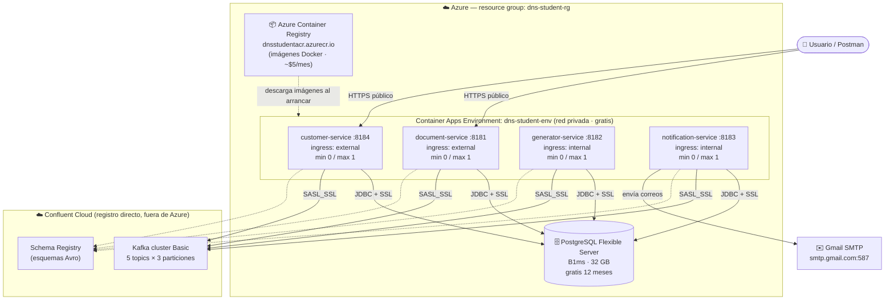
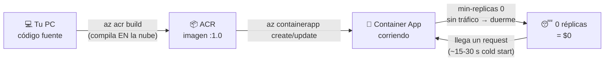
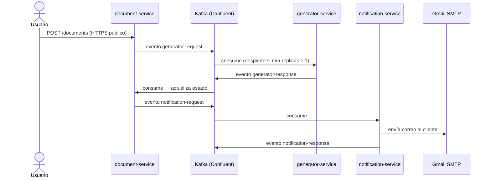

# Despliegue en Azure con cuenta de estudiante — Guía paso a paso desde cero

Esta guía explica cómo desplegar el **Document Notification System** en Azure usando una cuenta **Azure for Students**, gastando lo mínimo posible de crédito. Está escrita asumiendo que **es tu primera vez desplegando algo en la nube**: cada paso explica *qué* estás haciendo y *por qué*, no solo el comando.

> Si ya tienes experiencia y una suscripción de pago, la guía general está en [`AZURE-PASO-A-PASO.md`](AZURE-PASO-A-PASO.md). Esta versión es la variante "modo estudiante / bajo costo".

---

## 0. ¿Qué es Azure for Students y qué incluye?

**Azure for Students** es la oferta gratuita de Microsoft para estudiantes universitarios. A diferencia de la cuenta gratuita normal:

| Característica | Azure for Students |
|---|---|
| Crédito | **US$100** para usar en 12 meses |
| ¿Pide tarjeta de crédito? | **No** (esa es la gran ventaja) |
| Servicios gratuitos adicionales | Sí, +25 servicios con capa gratuita (App Service, Functions, PostgreSQL B1ms 750 h/mes, etc.) |
| Renovación | Cada 12 meses puedes re-verificar tu estatus de estudiante y recibir **otros $100** (el crédito no usado no se acumula) |
| Requisito | Ser estudiante activo (+18 años) y verificarlo con tu **correo institucional** (ej. `@escuelaing.edu.co`) |

**¿Se puede desplegar este proyecto sin gastar (casi) crédito?** Sí, con dos condiciones:

1. **Usar servicios con capa gratuita** y aprovechar el "scale to zero" (los contenedores se apagan solos cuando nadie los usa y no cobran nada mientras duermen).
2. **No dejar nada corriendo 24/7.** El sistema completo encendido todo el mes se comería el crédito en semanas. La estrategia estudiante es: *levantar → demostrar → apagar*.

⚠️ **Limitación importante de la cuenta de estudiante:** el crédito **no se puede usar en compras del Azure Marketplace** (ofertas de terceros). Eso significa que **Confluent Cloud vía Marketplace NO funciona** con esta cuenta. La solución (Paso 5) es registrarse **directamente en confluent.cloud**, que regala créditos de prueba propios, sin pasar por Azure.

### Presupuesto estimado de esta guía

| Recurso | Costo con cuenta estudiante |
|---|---|
| Container Apps (4 microservicios) | **~$0** — la capa gratuita da 180.000 vCPU-segundos + 2M requests/mes; con scale-to-zero y demos de pocas horas no la superas |
| PostgreSQL Flexible Server B1ms | **$0** los primeros 12 meses (750 h/mes gratis = el mes completo) |
| Kafka + Schema Registry (Confluent Cloud directo) | **$0** con los créditos de prueba de Confluent (~$400 el primer mes) |
| Azure Container Registry (Basic) | ~**$0.17/día** (~$5/mes). Se cobra mientras exista, así que bórralo al terminar o usa la alternativa gratuita del Paso 3 |

Total realista para un semestre de demos puntuales: **entre $0 y $10 del crédito de $100**.

> ¿Y si esto no alcanza? Al final de la guía (sección 11) está el **Plan B con servicios normales** (suscripción pay-as-you-go) para cuando se acaben los créditos de prueba de Confluent o necesites el sistema encendido 24/7.

---

## Diagramas de la infraestructura

### Vista general: cómo queda todo desplegado



**Cómo leerlo:** solo `document-service` y `customer-service` tienen URL pública (ingress *external*); `generator` y `notification` viven escondidos en la red privada del environment y solo se comunican por Kafka. Todos comparten la misma base PostgreSQL (cada uno con su schema propio) y el mismo cluster de Kafka en Confluent Cloud, que está **fuera de Azure** porque el crédito de estudiante no cubre Marketplace.

### Flujo de un despliegue (del código a la nube)



### Flujo de negocio sobre esta infraestructura



> ⚠️ Recuerda el matiz del paso 8: si `generator` o `notification` están dormidos (0 réplicas), los eventos esperan en Kafka sin perderse, pero el flujo queda pausado hasta que los despiertes.

---

## 1. Crear la cuenta Azure for Students

1. Entra a <https://azure.microsoft.com/free/students>.
2. Clic en **"Start free"** / **"Empezar gratis"**.
3. Inicia sesión con una cuenta Microsoft (puede ser personal, ej. Outlook/Hotmail).
4. Cuando pida **verificación académica**, usa tu **correo institucional**. Te llega un enlace de confirmación a ese correo.
5. Completa el perfil (nombre, país, teléfono). **No te pedirá tarjeta.**
6. Al terminar entras al **Azure Portal** (<https://portal.azure.com>). Arriba a la derecha, en *Cost Management + Billing*, puedes ver tu saldo de $100.

> **¿Qué acabas de crear?** Una "suscripción" de Azure. Todo lo que despliegues (bases de datos, contenedores...) vive dentro de esa suscripción y descuenta de sus $100 — salvo lo que caiga en capa gratuita.

**Consejo desde el día 1:** crea una alerta de presupuesto para que te avise antes de gastar de más:
Portal → *Cost Management* → *Budgets* → *Add* → monto `50` → alerta al 80%. Así recibes un correo si algo se queda encendido por accidente.

## 2. Instalar Azure CLI e iniciar sesión

El **Azure CLI** (`az`) es la herramienta de línea de comandos para manejar Azure sin usar el portal con el mouse. Todo lo que haremos se puede hacer en el portal, pero con comandos es reproducible (puedes repetir el despliegue exacto).

1. Descarga e instala: <https://learn.microsoft.com/cli/azure/install-azure-cli> (en Windows es un instalador `.msi` normal).
2. Abre una terminal nueva y verifica:

```bash
az version
```

3. Inicia sesión (abre el navegador para autenticarte):

```bash
az login
```

4. Confirma que estás en la suscripción de estudiante:

```bash
az account show --query name -o tsv
# Debe decir: "Azure for Students"
```

## 3. Crear el grupo de recursos y el registro de contenedores

### 3.1 Grupo de recursos

Un **resource group** es una carpeta lógica: agrupa todo lo del proyecto para poder verlo junto y — clave para no gastar — **borrarlo todo con un solo comando** al final.

```bash
az group create --name dns-student-rg --location eastus
```

- `--name`: el nombre de la carpeta (elige el que quieras, aquí `dns-student-rg`).
- `--location`: el datacenter físico. `eastus` suele tener disponibilidad para cuentas de estudiante; si algún recurso te dice "no disponible en tu suscripción", prueba `eastus2` o `westus2`.

### 3.2 Registro de contenedores (¿dónde viven mis imágenes Docker?)

Tus 4 microservicios se empaquetan como **imágenes Docker** (una "foto" del servicio con Java, dependencias y el `.jar` adentro). Azure necesita descargarlas de algún **registro** (un repositorio de imágenes, como GitHub pero para contenedores). Tienes dos opciones:

**Opción A — Azure Container Registry (ACR): más simple, cuesta ~$5/mes**

```bash
az acr create --resource-group dns-student-rg --name dnsstudentacr --sku Basic --admin-enabled true
```

- `--name`: debe ser **único en todo Azure** y solo minúsculas/números (cámbialo si está tomado).
- `--sku Basic`: la versión más barata (~$0.17/día). **Se cobra por existir**, no por uso — bórralo cuando no lo necesites.
- `--admin-enabled true`: habilita usuario/contraseña simples para que Container Apps pueda descargar las imágenes.

La gran ventaja de ACR: el comando `az acr build` **compila la imagen en la nube**, así no necesitas Docker instalado en tu PC ni una máquina potente.

**Opción B — GitHub Container Registry (ghcr.io): $0, un poco más de configuración**

Si tu repo es público, GitHub aloja imágenes gratis. Se publican con GitHub Actions (también gratis en repos públicos) y Container Apps las descarga con un token de GitHub (PAT con permiso `read:packages`). Es la opción "cero gasto absoluto", pero para tu primera vez recomiendo la **Opción A** por simplicidad — $5/mes que además solo pagas los días que exista.

El resto de la guía asume la Opción A.

## 4. Construir y subir las 4 imágenes

Desde la raíz del repo:

```bash
cd document-notification-system

az acr build --registry dnsstudentacr --image document-service:1.0     --file document-service/Dockerfile .
az acr build --registry dnsstudentacr --image customer-service:1.0     --file customer-service/Dockerfile .
az acr build --registry dnsstudentacr --image generator-service:1.0    --file generator-service/Dockerfile .
az acr build --registry dnsstudentacr --image notification-service:1.0 --file notification-service/Dockerfile .
```

**¿Qué hace cada comando?** Comprime tu código, lo sube a Azure, y allá un servidor ejecuta el `Dockerfile` (compila con Maven y empaqueta el `.jar`). Al final la imagen queda guardada en tu registro como `dnsstudentacr.azurecr.io/document-service:1.0`. Cada build tarda varios minutos (es un proyecto Maven multi-módulo).

> El `.` final es el "contexto de build": indica que la compilación puede ver toda la carpeta `document-notification-system` (necesario porque los servicios comparten los módulos `common` e `infraestructure`).

Verifica que las 4 imágenes quedaron subidas:

```bash
az acr repository list --name dnsstudentacr -o table
```

## 5. La base de datos: PostgreSQL gratis por 12 meses

Los microservicios guardan su estado en PostgreSQL. En vez de administrar tú el motor, usarás **Azure Database for PostgreSQL Flexible Server**: Azure lo instala, respalda y parcha por ti.

La capa gratuita de la cuenta de estudiante incluye **750 horas/mes del tamaño B1ms durante 12 meses** — un mes tiene ~730 horas, o sea que **puede quedarse encendida todo el mes gratis**. Solo aplica al tamaño B1ms con hasta 32 GB de disco, por eso los parámetros exactos importan:

```bash
az postgres flexible-server create \
  --resource-group dns-student-rg \
  --name dns-student-pg \
  --admin-user dnsadmin \
  --admin-password '<INVENTA-UNA-CONTRASEÑA-FUERTE>' \
  --sku-name Standard_B1ms --tier Burstable \
  --storage-size 32 \
  --version 15 \
  --public-access 0.0.0.0
```

- `--sku-name Standard_B1ms --tier Burstable`: **exactamente este tamaño** es el gratuito. Otro tamaño = cobra.
- `--storage-size 32`: 32 GB, el máximo cubierto por la capa gratuita.
- `--public-access 0.0.0.0`: regla especial que significa "permitir conexiones desde servicios de Azure" (tus contenedores). Para conectarte tú desde tu PC, añade además tu IP: `az postgres flexible-server firewall-rule create -g dns-student-rg -n dns-student-pg --rule-name mi-pc --start-ip-address <TU-IP> --end-ip-address <TU-IP>`.

> En el portal, al crear el servidor a veces aparece un banner *"Try the free offer"* — si lo ves, úsalo: te preconfigura los límites gratuitos.

**Crear los esquemas.** El proyecto trae un script SQL (el mismo que usa `docker-compose` localmente) que crea los schemas de cada servicio. Se ejecuta **una sola vez** con `psql` (viene con PostgreSQL, o instálalo aparte):

```bash
psql "host=dns-student-pg.postgres.database.azure.com port=5432 dbname=postgres user=dnsadmin sslmode=require" \
  -f infraestructure/docker-compose/init-db.sql
```

Te pedirá la contraseña que inventaste arriba. `sslmode=require` es obligatorio: Azure solo acepta conexiones cifradas.

## 6. Kafka y Schema Registry: Confluent Cloud (directo, NO por Marketplace)

Los microservicios se comunican con **Kafka** (mensajería de eventos) y validan los mensajes Avro contra un **Schema Registry de Confluent**. Montar Kafka tú mismo en contenedores consumiría mucho cómputo (y crédito), así que usamos el servicio gestionado de Confluent.

⚠️ **Aquí está la diferencia clave con la guía normal:** la cuenta de estudiante **no permite compras de Marketplace**, así que no puedes usar "Apache Kafka on Confluent Cloud" desde el portal de Azure. En su lugar:

1. Regístrate **directamente** en <https://confluent.cloud> (con cualquier correo; no pasa por Azure ni pide facturación a tu suscripción). Los registros nuevos reciben **créditos de prueba (~US$400 por 30 días)**, de sobra para esto.
2. Crea un cluster **Basic** — elige nube **Azure** y región **eastus** (la misma de tus contenedores, para reducir latencia).
3. Crea los **5 topics**, cada uno con **3 particiones**: `customer`, `generator-request`, `generator-response`, `notification-request`, `notification-response`.
4. Activa **Schema Registry** (paquete *Essentials*, misma región).
5. Genera dos pares de credenciales:
   - **API key + secret del cluster** (menú *API Keys* del cluster).
   - **API key + secret del Schema Registry** (en la sección Schema Registry).

Anota estos 4 valores — los usarás en el paso 8:

| Dato | Ejemplo de formato |
|---|---|
| Bootstrap server | `pkc-xxxxx.eastus.azure.confluent.cloud:9092` |
| API key/secret del cluster | `ABCDEF...` / `xyz123...` |
| URL del Schema Registry | `https://psrc-xxxxx.eastus.azure.confluent.cloud` |
| Key/secret del Schema Registry | `GHIJKL...` / `abc456...` |

> **Cuando se acaben los créditos de prueba de Confluent:** un cluster Basic sin tráfico cuesta casi nada, pero lo seguro es **borrar el cluster** al terminar tus demos y recrearlo cuando lo necesites (los topics se recrean en 2 minutos). Otra alternativa sin costo es Azure Event Hubs (tiene modo compatible con Kafka), pero su registro de esquemas **no** es compatible con el serializador de Confluent que usa este proyecto, así que requeriría desplegar un contenedor `cp-schema-registry` propio — no lo recomiendo para empezar.

## 7. Crear el entorno de Container Apps

**Azure Container Apps** es el servicio donde correrán tus 4 microservicios. Es "serverless": tú le das la imagen Docker y él se encarga de servidores, red y escalado. Lo elegimos sobre otras opciones (VMs, Kubernetes) por dos razones de estudiante:

- **Capa gratuita mensual por suscripción**: los primeros **180.000 vCPU-segundos, 360.000 GiB-segundos y 2 millones de requests son gratis cada mes** (~50 horas de CPU).
- **Scale to zero**: puede apagar un servicio a 0 réplicas cuando no hay tráfico → **$0 mientras duerme**.

Primero se crea el **environment** (la red privada compartida donde vivirán las 4 apps — gratis, solo pagas por los contenedores):

```bash
az containerapp env create --resource-group dns-student-rg --name dns-student-env --location eastus
```

## 8. Desplegar los 4 microservicios

Cada servicio se despliega con `az containerapp create`. El comando es largo porque incluye toda la configuración; aquí está completo para `customer-service` con la explicación de cada bloque, y luego una tabla con lo que cambia en los otros 3.

**Importante para el primer arranque:** `customer-service` debe ir primero y con `SQL_INIT_MODE=always` (ejecuta `init-schema.sql` + `init-data.sql`, creando tablas y datos semilla). Después del primer arranque exitoso se cambia a `never` para que no re-ejecute los scripts.

```bash
az containerapp create \
  --resource-group dns-student-rg \
  --name customer-service \
  --environment dns-student-env \
  --image dnsstudentacr.azurecr.io/customer-service:1.0 \
  --registry-server dnsstudentacr.azurecr.io \
  --cpu 0.5 --memory 1.0Gi \
  --target-port 8184 --ingress external \
  --min-replicas 0 --max-replicas 1 \
  --secrets pgpass='<TU-PASSWORD-DE-POSTGRES>' \
            kafkajaas='org.apache.kafka.common.security.plain.PlainLoginModule required username="<API_KEY_CLUSTER>" password="<API_SECRET_CLUSTER>";' \
            srauth='<SR_KEY>:<SR_SECRET>' \
  --env-vars \
    DB_HOST=dns-student-pg.postgres.database.azure.com \
    DB_PORT=5432 DB_NAME=postgres \
    'DB_EXTRA_PARAMS=&sslmode=require' \
    POSTGRES_USER=dnsadmin POSTGRES_PASSWORD=secretref:pgpass \
    SQL_INIT_MODE=always \
    KAFKA_BOOTSTRAP_SERVERS='pkc-xxxxx.eastus.azure.confluent.cloud:9092' \
    KAFKA_SECURITY_PROTOCOL=SASL_SSL \
    KAFKA_SASL_MECHANISM=PLAIN \
    KAFKA_SASL_JAAS_CONFIG=secretref:kafkajaas \
    SCHEMA_REGISTRY_URL='https://psrc-xxxxx.eastus.azure.confluent.cloud' \
    SCHEMA_REGISTRY_AUTH_USER_INFO=secretref:srauth \
    APP_LOG_LEVEL=INFO
```

**Explicación bloque por bloque:**

- `--image` / `--registry-server`: de dónde descargar la imagen (tu ACR del paso 4). El CLI configura solo las credenciales del registro porque activaste `--admin-enabled`.
- `--cpu 0.5 --memory 1.0Gi`: recursos por contenedor. Medio núcleo y 1 GB alcanzan para un servicio Spring Boot y **consumen la mitad de capa gratuita** que la configuración por defecto.
- `--target-port 8184`: puerto interno donde escucha el servicio (cada microservicio tiene el suyo, ver tabla abajo).
- `--ingress external`: le da una **URL pública HTTPS** (`https://customer-service.<algo>.eastus.azuracontainerapps.io`). Los servicios que no necesitan ser llamados desde internet van con `internal` (solo visibles dentro del environment) — menos superficie de ataque.
- `--min-replicas 0`: **la clave del ahorro.** Con 0 réplicas mínimas, si nadie llama al servicio en unos minutos, Azure lo apaga y deja de cobrar. Al llegar una petición HTTP lo enciende de nuevo (tarda ~15-30 s la primera vez, es el "cold start" — normal y aceptable para demos).
- `--secrets` + `secretref:`: las contraseñas se guardan como **secretos** (cifrados, no visibles en el portal) y las variables de entorno solo las *referencian*. Nunca pongas contraseñas directamente en `--env-vars`.
- `SQL_INIT_MODE=always`: **solo esta primera vez.** Cuando el servicio arranque bien, cámbialo: `az containerapp update -g dns-student-rg -n customer-service --set-env-vars SQL_INIT_MODE=never`.

**Los otros 3 servicios** usan exactamente el mismo comando cambiando `--name`, `--image`, `--target-port`, `--ingress` (y sin `SQL_INIT_MODE=always`, va directo en `never`):

| Servicio | `--target-port` | `--ingress` | Extras |
|---|---|---|---|
| `customer-service` | 8184 | `external` | `SQL_INIT_MODE=always` solo la primera vez |
| `document-service` | 8181 | `external` | Es el API principal que llamarás desde Postman/curl |
| `generator-service` | 8182 | `internal` | — |
| `notification-service` | 8183 | `internal` | Secreto extra `mailpass` y env vars de correo: `MAIL_FROM`, `MAIL_HOST=smtp.gmail.com`, `MAIL_PORT=587`, `MAIL_USERNAME`, `MAIL_PASSWORD=secretref:mailpass` (el App Password de Gmail, no tu contraseña normal) |

> **Matiz sobre scale-to-zero:** `generator-service` y `notification-service` trabajan consumiendo mensajes de Kafka, no recibiendo HTTP. Si están dormidos (0 réplicas) no procesan mensajes — los mensajes **no se pierden** (quedan en Kafka), pero el flujo queda pausado. Para una demo, despiértalos antes de empezar con `--min-replicas 1` y devuélvelos a 0 al terminar:
>
> ```bash
> # Antes de la demo (encender):
> az containerapp update -g dns-student-rg -n generator-service    --min-replicas 1
> az containerapp update -g dns-student-rg -n notification-service --min-replicas 1
> # Después de la demo (apagar → $0):
> az containerapp update -g dns-student-rg -n generator-service    --min-replicas 0
> az containerapp update -g dns-student-rg -n notification-service --min-replicas 0
> ```

## 9. Verificar que todo funciona

Obtén la URL pública del API principal:

```bash
az containerapp show -g dns-student-rg -n document-service \
  --query properties.configuration.ingress.fqdn -o tsv
```

Prueba el estado de salud (Spring Boot Actuator responde `{"status":"UP"}` cuando el servicio, la BD y Kafka están bien):

```bash
curl https://<fqdn-que-te-dio-el-comando-anterior>/actuator/health
```

La primera llamada puede tardar ~30 s (cold start, el contenedor está despertando). Para ver los logs en vivo mientras pruebas el flujo completo:

```bash
az containerapp logs show -g dns-student-rg -n notification-service --follow
```

Prueba el flujo de negocio igual que en local (crear cliente → crear documento → verificar que llega la notificación por correo), apuntando a las URLs públicas en vez de `localhost`.

## 10. Apagar y limpiar: la disciplina que salva tu crédito

Esta sección es **tan importante como el despliegue**. Reglas:

**Al terminar cada sesión de trabajo/demo:**

```bash
# Dormir todos los servicios (min-replicas 0 hace que se apaguen solos,
# pero los que tienen tráfico Kafka conviene forzarlos):
az containerapp update -g dns-student-rg -n generator-service    --min-replicas 0
az containerapp update -g dns-student-rg -n notification-service --min-replicas 0

# Pausar la base de datos (aunque B1ms es gratis 12 meses, pausar no cuesta nada
# y protege tus 750 h/mes; se reactiva en ~1 min con "start"):
az postgres flexible-server stop -g dns-student-rg -n dns-student-pg
```

Y para volver a trabajar: `az postgres flexible-server start -g dns-student-rg -n dns-student-pg` (nota: Azure reenciende automáticamente los servidores pausados después de 7 días).

**Al terminar el proyecto/semestre — borrar TODO de un golpe:**

```bash
az group delete --name dns-student-rg --yes
```

Esto elimina registry, base de datos, environment y las 4 apps. Es la garantía absoluta de $0. Recuerda borrar también el cluster en confluent.cloud (es aparte de Azure).

**Vigilancia continua:**
- Revisa el saldo: Portal → *Cost Management* → *Cost analysis*.
- La alerta de presupuesto del Paso 1 te avisa por correo si algo quedó encendido.

## 11. Plan B: ¿y si la cuenta de estudiante no alcanza?

Con la cuenta de estudiante **sí se puede desplegar todo el sistema**, pero tiene dos límites reales:

1. **Kafka a largo plazo.** Los créditos de prueba de Confluent Cloud duran ~30 días. Después, un cluster Basic con poco tráfico cuesta poco pero ya no es $0, y no puedes pagarlo con el crédito de Azure (bloqueo de Marketplace).
2. **Disponibilidad 24/7.** Si necesitas el sistema siempre encendido (no solo para demos), el cómputo supera la capa gratuita de Container Apps y los $100 se agotan en pocas semanas.

Si llegas a cualquiera de esos dos puntos, el camino es una **suscripción normal (pay-as-you-go)**: pide tarjeta de crédito y cobra por uso real, sin las restricciones de la cuenta de estudiante. La arquitectura es **exactamente la misma** — solo cambian dos cosas:

- Confluent Cloud se puede contratar **vía Azure Marketplace** (se factura junto con Azure, más cómodo).
- Puedes subir `--min-replicas` a 1+ para disponibilidad continua y escalar hasta 3 réplicas los consumidores de Kafka.

La guía completa para ese escenario, con su propia arquitectura y estimación de costos, está en [`AZURE-DESPLIEGUE-CLOUD.md`](AZURE-DESPLIEGUE-CLOUD.md). Todo lo que aprendiste aquí (resource groups, ACR, Container Apps, secretos) aplica igual.

## Resumen del flujo completo

```
Cuenta estudiante ($100, sin tarjeta)
        │
        ▼
Resource group (carpeta) ──► ACR (imágenes Docker, ~$5/mes mientras exista)
        │                         ▲
        │                    az acr build (x4, compila en la nube)
        ▼
PostgreSQL B1ms (gratis 12 meses) + Confluent Cloud directo (créditos de prueba)
        │
        ▼
Container Apps environment (red compartida, gratis)
        │
        ▼
4 microservicios con min-replicas 0 (duermen gratis, despiertan al usarlos)
        │
        ▼
Demo → apagar → (fin de semestre) az group delete
```

## Checklist final

- [ ] Cuenta creada con correo institucional, saldo de $100 visible.
- [ ] Alerta de presupuesto configurada (Paso 1).
- [ ] PostgreSQL exactamente en `Standard_B1ms / Burstable / 32 GB` (lo que cubre la capa gratuita).
- [ ] Confluent Cloud registrado **directo** (no por Marketplace).
- [ ] `SQL_INIT_MODE=never` en todos los servicios después de la primera inicialización.
- [ ] Contraseñas siempre como secretos (`secretref:`), nunca en texto plano en `--env-vars`.
- [ ] `min-replicas 0` en todos los servicios cuando no estés haciendo demos.
- [ ] Base de datos pausada (`flexible-server stop`) entre sesiones.
- [ ] Al final del semestre: `az group delete` + borrar cluster de Confluent.
