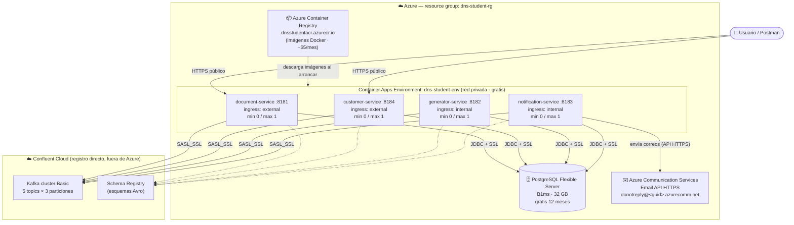
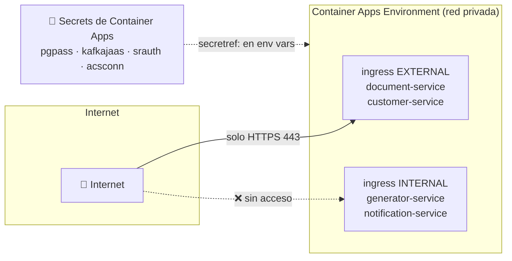
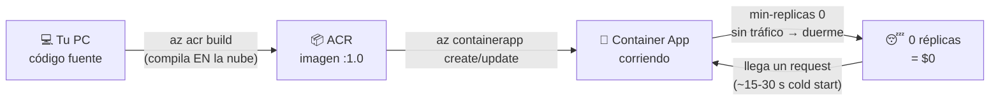
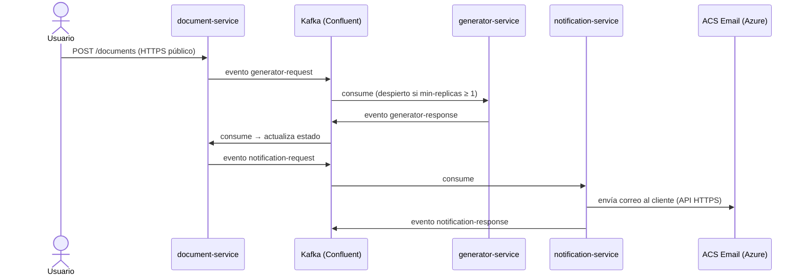
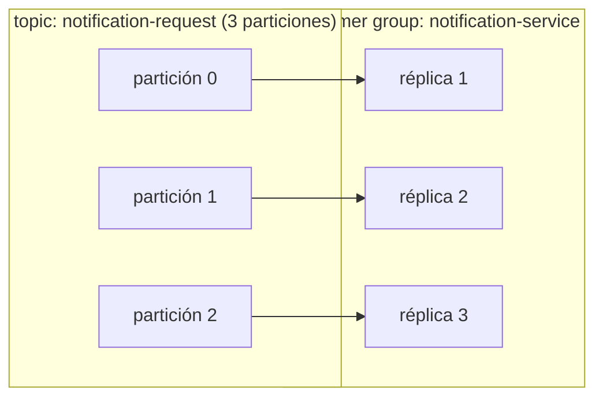

# Despliegue en Azure con cuenta de estudiante — Guía única

Esta es la **guía única de Azure** del proyecto: cubre el despliegue completo del **Document Notification System** con una cuenta **Azure for Students**, el **envío de correos por Azure Communication Services** (el proveedor por defecto de la aplicación), las **variables de entorno** necesarias y el **escalado** de los servicios (manual y automático). Está escrita asumiendo que es tu primera vez desplegando en la nube: cada paso explica *qué* estás haciendo y *por qué*.

> **Referencia de variables:** todas las variables de entorno del sistema (con sus defaults y descripción) están en [`DEPLOYMENT.md`](DEPLOYMENT.md). Esta guía usa las que aplican a Azure; consulta aquella cuando necesites el detalle completo.

---

## Índice

1. [Qué es Azure for Students y presupuesto](#0-qué-es-azure-for-students-y-qué-incluye)
2. [Diagramas de la infraestructura](#diagramas-de-la-infraestructura)
3. [Pasos 1–9: despliegue completo](#1-crear-la-cuenta-azure-for-students)
4. [Variables de entorno para la nube (resumen)](#variables-de-entorno-para-la-nube-resumen)
5. [Escalado: múltiples instancias, manual y automático](#escalado-múltiples-instancias-manual-y-automático)
6. [Apagar y limpiar](#apagar-y-limpiar-la-disciplina-que-salva-tu-crédito)
7. [Plan B: suscripción de pago](#plan-b-y-si-la-cuenta-de-estudiante-no-alcanza)

---

## 0. ¿Qué es Azure for Students y qué incluye?

**Azure for Students** es la oferta gratuita de Microsoft para estudiantes universitarios. A diferencia de la cuenta gratuita normal:

| Característica | Azure for Students |
|---|---|
| Crédito | **US$100** para usar en 12 meses |
| ¿Pide tarjeta de crédito? | **No** (esa es la gran ventaja) |
| Servicios gratuitos adicionales | Sí, +25 servicios con capa gratuita (App Service, Functions, PostgreSQL B1ms 750 h/mes, etc.) |
| Renovación | Cada 12 meses puedes re-verificar tu estatus de estudiante y recibir **otros $100** (el crédito no usado no se acumula) |
| Requisito | Ser estudiante activo (+18 años) y verificarlo con tu **correo institucional** (ej. `@escuelaing.edu.co`) |

**¿Se puede desplegar este proyecto sin gastar (casi) crédito?** Sí, con dos condiciones:

1. **Usar servicios con capa gratuita** y aprovechar el "scale to zero" (los contenedores se apagan solos cuando nadie los usa y no cobran nada mientras duermen).
2. **No dejar nada corriendo 24/7.** El sistema completo encendido todo el mes se comería el crédito en semanas. La estrategia estudiante es: *levantar → demostrar → apagar*.

⚠️ **Limitación importante de la cuenta de estudiante:** el crédito **no se puede usar en compras del Azure Marketplace** (ofertas de terceros). Eso significa que **Confluent Cloud vía Marketplace NO funciona** con esta cuenta. La solución (Paso 5) es registrarse **directamente en confluent.cloud**, que regala créditos de prueba propios, sin pasar por Azure. En cambio, **Azure Communication Services (el correo) sí es un servicio nativo de Azure** y se paga con el crédito sin problema.

### Presupuesto estimado de esta guía

| Recurso | Costo con cuenta estudiante |
|---|---|
| Container Apps (4 microservicios) | **~$0** — la capa gratuita da 180.000 vCPU-segundos + 2M requests/mes; con scale-to-zero y demos de pocas horas no la superas |
| PostgreSQL Flexible Server B1ms | **$0** los primeros 12 meses (750 h/mes gratis = el mes completo) |
| Kafka + Schema Registry (Confluent Cloud directo) | **$0** con los créditos de prueba de Confluent (~$400 el primer mes) |
| Azure Communication Services Email | ~**$0.00025 por correo** (10.000 correos ≈ $2.50) — se paga con el crédito |
| Azure Container Registry (Basic) | ~**$0.17/día** (~$5/mes). Se cobra mientras exista, así que bórralo al terminar |

Total realista para un semestre de demos puntuales: **entre $0 y $10 del crédito de $100**.

---

## Diagramas de la infraestructura

### Vista general: cómo queda todo desplegado



**Cómo leerlo:** solo `document-service` y `customer-service` tienen URL pública (ingress *external*); `generator` y `notification` viven escondidos en la red privada del environment y solo se comunican por Kafka. Todos comparten la misma base PostgreSQL (cada uno con su schema propio) y el mismo cluster de Kafka en Confluent Cloud, que está **fuera de Azure** porque el crédito de estudiante no cubre Marketplace. El correo sale por **Azure Communication Services** (API HTTPS, sin SMTP), que sí es nativo de Azure.

### Topología de red y seguridad



- Solo los dos servicios con API pública son accesibles desde internet; los consumidores de Kafka quedan en la red interna.
- Toda credencial (BD, Kafka, Schema Registry, correo) vive como **secret** y las variables de entorno solo la referencian (`secretref:`).
- Todas las conexiones salientes van cifradas: JDBC con `sslmode=require`, Kafka con `SASL_SSL`, ACS por HTTPS.

### Flujo de un despliegue (del código a la nube)



### Flujo de negocio sobre esta infraestructura



> ⚠️ Recuerda el matiz del paso 8: si `generator` o `notification` están dormidos (0 réplicas), los eventos esperan en Kafka sin perderse, pero el flujo queda pausado hasta que los despiertes.

---

## 1. Crear la cuenta Azure for Students

1. Entra a <https://azure.microsoft.com/free/students>.
2. Clic en **"Start free"** / **"Empezar gratis"**.
3. Inicia sesión con una cuenta Microsoft (puede ser personal, ej. Outlook/Hotmail).
4. Cuando pida **verificación académica**, usa tu **correo institucional**. Te llega un enlace de confirmación a ese correo.
5. Completa el perfil (nombre, país, teléfono). **No te pedirá tarjeta.**
6. Al terminar entras al **Azure Portal** (<https://portal.azure.com>). Arriba a la derecha, en *Cost Management + Billing*, puedes ver tu saldo de $100.

> **¿Qué acabas de crear?** Una "suscripción" de Azure. Todo lo que despliegues (bases de datos, contenedores...) vive dentro de esa suscripción y descuenta de sus $100 — salvo lo que caiga en capa gratuita.

**Consejo desde el día 1:** crea una alerta de presupuesto para que te avise antes de gastar de más:
Portal → *Cost Management* → *Budgets* → *Add* → monto `50` → alerta al 80%. Así recibes un correo si algo se queda encendido por accidente.

## 2. Instalar Azure CLI e iniciar sesión

El **Azure CLI** (`az`) es la herramienta de línea de comandos para manejar Azure sin usar el portal con el mouse. Todo lo que haremos se puede hacer en el portal, pero con comandos es reproducible (puedes repetir el despliegue exacto).

1. Descarga e instala: <https://learn.microsoft.com/cli/azure/install-azure-cli> (en Windows es un instalador `.msi` normal).
2. Abre una terminal nueva y verifica:

```bash
az version
```

3. Inicia sesión (abre el navegador para autenticarte):

```bash
az login
```

4. Confirma que estás en la suscripción de estudiante:

```bash
az account show --query name -o tsv
# Debe decir: "Azure for Students"
```

## 3. Crear el grupo de recursos y el registro de contenedores

### 3.1 Grupo de recursos

Un **resource group** es una carpeta lógica: agrupa todo lo del proyecto para poder verlo junto y — clave para no gastar — **borrarlo todo con un solo comando** al final.

```bash
az group create --name dns-student-rg --location eastus
```

- `--name`: el nombre de la carpeta (elige el que quieras, aquí `dns-student-rg`).
- `--location`: el datacenter físico. `eastus` suele tener disponibilidad para cuentas de estudiante; si algún recurso te dice "no disponible en tu suscripción", prueba `eastus2` o `westus2`.

### 3.2 Registro de contenedores (¿dónde viven mis imágenes Docker?)

Tus 4 microservicios se empaquetan como **imágenes Docker** (una "foto" del servicio con Java, dependencias y el `.jar` adentro). Azure necesita descargarlas de algún **registro** (un repositorio de imágenes, como GitHub pero para contenedores).

```bash
az acr create --resource-group dns-student-rg --name dnsstudentacr --sku Basic --admin-enabled true
```

- `--name`: debe ser **único en todo Azure** y solo minúsculas/números (cámbialo si está tomado).
- `--sku Basic`: la versión más barata (~$0.17/día). **Se cobra por existir**, no por uso — bórralo cuando no lo necesites.
- `--admin-enabled true`: habilita usuario/contraseña simples para que Container Apps pueda descargar las imágenes.

La gran ventaja de ACR: el comando `az acr build` **compila la imagen en la nube**, así no necesitas Docker instalado en tu PC ni una máquina potente.

> **Alternativa $0:** si tu repo es público, GitHub Container Registry (ghcr.io) aloja imágenes gratis (se publican con GitHub Actions y Container Apps las descarga con un PAT con permiso `read:packages`). Para tu primera vez recomiendo ACR por simplicidad.

## 4. Construir y subir las 4 imágenes

Desde la raíz del repo:

```bash
cd document-notification-system

az acr build --registry dnsstudentacr --image document-service:1.0     --file document-service/Dockerfile .
az acr build --registry dnsstudentacr --image customer-service:1.0     --file customer-service/Dockerfile .
az acr build --registry dnsstudentacr --image generator-service:1.0    --file generator-service/Dockerfile .
az acr build --registry dnsstudentacr --image notification-service:1.0 --file notification-service/Dockerfile .
```

**¿Qué hace cada comando?** Comprime tu código, lo sube a Azure, y allá un servidor ejecuta el `Dockerfile` (compila con Maven y empaqueta el `.jar`). Al final la imagen queda guardada en tu registro como `dnsstudentacr.azurecr.io/document-service:1.0`. Cada build tarda varios minutos (es un proyecto Maven multi-módulo).

> El `.` final es el "contexto de build": indica que la compilación puede ver toda la carpeta `document-notification-system` (necesario porque los servicios comparten los módulos `common` e `infraestructure`).

Verifica que las 4 imágenes quedaron subidas:

```bash
az acr repository list --name dnsstudentacr -o table
```

## 5. La base de datos: PostgreSQL gratis por 12 meses

Los microservicios guardan su estado en PostgreSQL. En vez de administrar tú el motor, usarás **Azure Database for PostgreSQL Flexible Server**: Azure lo instala, respalda y parcha por ti.

La capa gratuita de la cuenta de estudiante incluye **750 horas/mes del tamaño B1ms durante 12 meses** — un mes tiene ~730 horas, o sea que **puede quedarse encendida todo el mes gratis**. Solo aplica al tamaño B1ms con hasta 32 GB de disco, por eso los parámetros exactos importan:

```bash
az postgres flexible-server create \
  --resource-group dns-student-rg \
  --name dns-student-pg \
  --admin-user dnsadmin \
  --admin-password '<INVENTA-UNA-CONTRASEÑA-FUERTE>' \
  --sku-name Standard_B1ms --tier Burstable \
  --storage-size 32 \
  --version 15 \
  --public-access 0.0.0.0
```

- `--sku-name Standard_B1ms --tier Burstable`: **exactamente este tamaño** es el gratuito. Otro tamaño = cobra.
- `--storage-size 32`: 32 GB, el máximo cubierto por la capa gratuita.
- `--public-access 0.0.0.0`: regla especial que significa "permitir conexiones desde servicios de Azure" (tus contenedores). Para conectarte tú desde tu PC, añade además tu IP: `az postgres flexible-server firewall-rule create -g dns-student-rg -n dns-student-pg --rule-name mi-pc --start-ip-address <TU-IP> --end-ip-address <TU-IP>`.

> En el portal, al crear el servidor a veces aparece un banner *"Try the free offer"* — si lo ves, úsalo: te preconfigura los límites gratuitos.

**Crear los esquemas.** El proyecto trae un script SQL (el mismo que usa `docker-compose` localmente) que crea los schemas de cada servicio. Se ejecuta **una sola vez** con `psql` (viene con PostgreSQL, o instálalo aparte):

```bash
psql "host=dns-student-pg.postgres.database.azure.com port=5432 dbname=postgres user=dnsadmin sslmode=require" \
  -f infraestructure/docker-compose/init-db.sql
```

Te pedirá la contraseña que inventaste arriba. `sslmode=require` es obligatorio: Azure solo acepta conexiones cifradas.

## 6. Kafka y Schema Registry: Confluent Cloud (directo, NO por Marketplace)

Los microservicios se comunican con **Kafka** (mensajería de eventos) y validan los mensajes **Avro** contra un **Schema Registry de Confluent**. Montar Kafka tú mismo en contenedores consumiría mucho cómputo (y crédito), así que usamos el servicio gestionado de Confluent.

⚠️ La cuenta de estudiante **no permite compras de Marketplace**, así que no puedes usar "Apache Kafka on Confluent Cloud" desde el portal de Azure. Te registras directamente en confluent.cloud — no pasa por Azure ni toca tu suscripción.

**Lo que este proyecto necesita de Confluent (el porqué de cada paso):**

| Requisito | Valor | De dónde sale |
|---|---|---|
| Tipo de cluster | **Basic** | El más barato; replicación 3 incluida (coincide con `KAFKA_REPLICATION_FACTOR:3` del `application.yml`) |
| Nube / región | **Azure / eastus** | La misma región de tus Container Apps → menor latencia |
| Topics (5) | `customer`, `generator-request`, `generator-response`, `notification-request`, `notification-response` | Nombres por defecto en los `application.yml` de los servicios |
| Particiones por topic | **3** | Coincide con `KAFKA_NUM_PARTITIONS:3` y `KAFKA_CONSUMER_CONCURRENCY:3`; define el tope de 3 réplicas por consumidor |
| Schema Registry | paquete **Essentials** | Los serializadores Avro de Confluent lo consultan en cada publish/consume |
| Credenciales | 2 pares (cluster + Schema Registry) | Son servicios distintos, cada uno con su propia API key |

### 6.1 Crear la cuenta

1. Entra a <https://confluent.cloud/signup> y regístrate (sirve cualquier correo; no pide tarjeta para empezar).
2. Confirma el correo de verificación y entra a la consola.
3. Los registros nuevos reciben **créditos de prueba (~US$400 por 30 días)** — de sobra para todo el semestre de demos. El banner del saldo se ve en *Billing & payment*.
4. Si te pregunta por un caso de uso / experiencia, elige lo básico ("Learning" / "Developer") — no cambia nada técnico.

### 6.2 Crear el cluster

1. En la consola: **Environments** → **Create environment** → nómbralo `dns-student` (el environment agrupa cluster, Schema Registry y credenciales del proyecto; usar el `default` también funciona, pero con nombre propio queda claro qué se borra al final del semestre) → **Add cluster**.
2. Tipo: **Basic** (el gratuito de la izquierda; los Standard/Dedicated cobran por hora aunque no los uses).
3. Proveedor y región: **Azure** → **East US (eastus)** — la misma región del paso 3 de esta guía. *Single zone* es suficiente.
4. Nombre: por ejemplo `dns-cluster` → **Launch cluster**. Queda listo en segundos.
5. Copia ya el **bootstrap server**: menú del cluster → **Cluster settings** → *Bootstrap server* (formato `pkc-xxxxx.eastus.azure.confluent.cloud:9092`). Este valor va en `KAFKA_BOOTSTRAP_SERVERS`.

### 6.3 Crear los 5 topics (3 particiones cada uno)

En el menú del cluster → **Topics** → **Create topic**. Para **cada uno** de los 5:

1. **Topic name**: exactamente como aparece abajo (los servicios los buscan por estos nombres; un typo = el servicio arranca pero no fluyen eventos).
2. **Partitions**: cambia el default (6) a **3**.
3. **Create with defaults** — no actives *infinite retention* ni ajustes extra.
4. Si al crear ofrece "Define a data contract / schema", **sáltalo** (*Skip*): los esquemas Avro los registran los propios servicios al publicar el primer mensaje.

| # | Topic | Quién publica → quién consume |
|---|---|---|
| 1 | `customer` | customer-service → generator/document (datos de clientes) |
| 2 | `generator-request` | document-service → generator-service |
| 3 | `generator-response` | generator-service → document-service |
| 4 | `notification-request` | document-service → notification-service |
| 5 | `notification-response` | notification-service → document-service |

> Los **consumer groups** (`generator-topic-consumer`, `notification-topic-consumer`, `customer-topic-consumer`) **no se crean aquí**: Kafka los registra solo cuando cada servicio se conecta. Los verás aparecer en *Clients → Consumer groups* cuando el sistema arranque — y ahí mismo se monitorea el *lag* durante las pruebas de carga.

### 6.4 Activar el Schema Registry

1. En el menú lateral izquierdo del **environment** (no del cluster): **Schema Registry** → **Enable** (si no venía activado).
2. Paquete **Essentials**, proveedor **Azure**, región **eastus** (misma región otra vez).
3. Copia el **endpoint público** (formato `https://psrc-xxxxx.eastus.azure.confluent.cloud`). Este valor va en `SCHEMA_REGISTRY_URL`.

> No hay que registrar ningún esquema a mano: los serializadores de los servicios publican los `.avsc` automáticamente la primera vez que envían cada tipo de evento (verás aparecer subjects como `generator-request-value` tras la primera petición).

### 6.5 Generar las 2 credenciales

**a) API key del cluster** (autentica la conexión Kafka):

1. Menú del cluster → **API Keys** → **Create key** → *Global access* (para simplificar; *Granular* es mejor práctica pero exige configurar ACLs por topic).
2. Descarga o copia **Key** y **Secret** — el secret **solo se muestra una vez**.
3. Estos 2 valores van dentro de la cadena JAAS (secreto `kafkajaas` del paso 8):
   ```
   org.apache.kafka.common.security.plain.PlainLoginModule required username="<KEY>" password="<SECRET>";
   ```

**b) API key del Schema Registry** (es un servicio aparte, con llaves propias):

1. Página del **Schema Registry** (menú del environment) → **API Keys** → **Create key**.
2. Copia **Key** y **Secret**. Van juntos, separados por dos puntos, en el secreto `srauth` del paso 8: `<SR_KEY>:<SR_SECRET>` (variable `SCHEMA_REGISTRY_AUTH_USER_INFO`).

⚠️ Error clásico: usar la key del **cluster** para el **Schema Registry** (o al revés). Síntoma: el servicio conecta a Kafka pero falla al serializar con `401 Unauthorized` del registry.

### 6.6 Checklist de salida del paso 6

Al terminar debes tener anotados **exactamente estos 4 valores** (los usarás en el paso 8):

| Dato | Formato | Variable destino |
|---|---|---|
| Bootstrap server | `pkc-xxxxx.eastus.azure.confluent.cloud:9092` | `KAFKA_BOOTSTRAP_SERVERS` |
| API key/secret del **cluster** | par key/secret | dentro del JAAS → secreto `kafkajaas` |
| URL del **Schema Registry** | `https://psrc-xxxxx.eastus.azure.confluent.cloud` | `SCHEMA_REGISTRY_URL` |
| API key/secret del **Schema Registry** | `key:secret` | secreto `srauth` → `SCHEMA_REGISTRY_AUTH_USER_INFO` |

Y verificado en la consola:

- [ ] Cluster **Basic** en **Azure / eastus**, estado *Running*.
- [ ] Los **5 topics** listados, cada uno con **3 particiones**.
- [ ] Schema Registry habilitado en la misma región.
- [ ] Las 2 API keys guardadas (el secret no se puede volver a consultar — si lo pierdes, se genera una key nueva y se borra la vieja).

> **Cuando se acaben los créditos de prueba de Confluent:** un cluster Basic sin tráfico cuesta casi nada, pero lo seguro es **borrar el cluster** al terminar tus demos y recrearlo cuando lo necesites (con esta sección, los topics se recrean en 2 minutos). Otra alternativa sin costo es Azure Event Hubs (tiene modo compatible con Kafka), pero su registro de esquemas **no** es compatible con el serializador de Confluent que usa este proyecto, así que requeriría desplegar un contenedor `cp-schema-registry` propio — no lo recomiendo para empezar.

## 7. El correo: Azure Communication Services Email (el proveedor del sistema)

`notification-service` envía los correos por **Azure Communication Services (ACS) Email**, el proveedor **por defecto** de la aplicación (`MAIL_PROVIDER=azure`). Es un servicio **nativo de Azure** (no Marketplace, así que **sí se paga con el crédito de estudiante**): ~$0.00025 por correo (10.000 correos ≈ $2.50), diseñado para envío en volumen, y va por API HTTPS — no hay SMTP ni contraseñas de Gmail de por medio.

**Crear el recurso ACS (una sola vez; la CLI instala la extensión `communication` la primera vez):**

```bash
# Recurso de comunicación + servicio de email con dominio gestionado por Azure:
az communication create -g dns-student-rg -n dns-comm --location global --data-location UnitedStates
az communication email create -g dns-student-rg -n dns-email --location global --data-location UnitedStates
az communication email domain create -g dns-student-rg --email-service-name dns-email \
  --name AzureManagedDomain --location global --domain-management AzureManaged

# Vincular el dominio al recurso de comunicación:
DOMAIN_ID=$(az communication email domain show -g dns-student-rg --email-service-name dns-email \
  --name AzureManagedDomain --query id -o tsv)
az communication update -g dns-student-rg -n dns-comm --linked-domains $DOMAIN_ID

# Datos que necesitas para el paso 8:
az communication list-key -g dns-student-rg -n dns-comm --query primaryConnectionString -o tsv   # connection string
az communication email domain show -g dns-student-rg --email-service-name dns-email \
  --name AzureManagedDomain --query "properties.fromSenderDomain" -o tsv                          # dominio del remitente
# (si el query devuelve vacío, ejecútalo sin --query y busca el campo fromSenderDomain en el JSON)
```

El remitente con dominio gestionado tiene la forma `donotreply@<guid>.azurecomm.net`. (Con un dominio propio verificado puedes usar tu dirección y obtener límites más altos; el dominio gestionado trae límites iniciales que se amplían con una solicitud de cuota.)

**Anota estos 2 valores:** la *connection string* (irá como secreto `acsconn`) y el *dominio del remitente* (irá en `MAIL_FROM`).

> **Alternativas al ACS** (ambas soportadas sin recompilar, cambiando `MAIL_PROVIDER=smtp`): **Gmail** para demos pequeñas (App Password, ~500 correos/día, se bloquea con ráfagas) y **Mailpit** para pruebas de carga sin enviar correos reales (ver la [sección de escalado](#pruebas-de-carga-mailpit-en-vez-de-correos-reales)). Las variables SMTP están en [`DEPLOYMENT.md`](DEPLOYMENT.md).

## 8. Crear el entorno y desplegar los 4 microservicios

**Azure Container Apps** es el servicio donde correrán tus 4 microservicios. Es "serverless": tú le das la imagen Docker y él se encarga de servidores, red y escalado. Lo elegimos por dos razones de estudiante:

- **Capa gratuita mensual por suscripción**: los primeros **180.000 vCPU-segundos, 360.000 GiB-segundos y 2 millones de requests son gratis cada mes** (~50 horas de CPU).
- **Scale to zero**: puede apagar un servicio a 0 réplicas cuando no hay tráfico → **$0 mientras duerme**.

Primero el **environment** (la red privada compartida donde vivirán las 4 apps — gratis, solo pagas por los contenedores):

```bash
az containerapp env create --resource-group dns-student-rg --name dns-student-env --location eastus
```

Cada servicio se despliega con `az containerapp create`. El comando es largo porque incluye toda la configuración; aquí está completo para `customer-service` con la explicación de cada bloque, y luego una tabla con lo que cambia en los otros 3.

**Importante para el primer arranque:** `customer-service` debe ir primero y con `SQL_INIT_MODE=always` (ejecuta `init-schema.sql` + `init-data.sql`, creando tablas y datos semilla). Después del primer arranque exitoso se cambia a `never` para que no re-ejecute los scripts.

```bash
az containerapp create \
  --resource-group dns-student-rg \
  --name customer-service \
  --environment dns-student-env \
  --image dnsstudentacr.azurecr.io/customer-service:1.0 \
  --registry-server dnsstudentacr.azurecr.io \
  --cpu 0.5 --memory 1.0Gi \
  --target-port 8184 --ingress external \
  --min-replicas 0 --max-replicas 1 \
  --secrets pgpass='<TU-PASSWORD-DE-POSTGRES>' \
            kafkajaas='org.apache.kafka.common.security.plain.PlainLoginModule required username="<API_KEY_CLUSTER>" password="<API_SECRET_CLUSTER>";' \
            srauth='<SR_KEY>:<SR_SECRET>' \
  --env-vars \
    DB_HOST=dns-student-pg.postgres.database.azure.com \
    DB_PORT=5432 DB_NAME=postgres \
    'DB_EXTRA_PARAMS=&sslmode=require' \
    POSTGRES_USER=dnsadmin POSTGRES_PASSWORD=secretref:pgpass \
    SQL_INIT_MODE=always \
    KAFKA_BOOTSTRAP_SERVERS='pkc-xxxxx.eastus.azure.confluent.cloud:9092' \
    KAFKA_SECURITY_PROTOCOL=SASL_SSL \
    KAFKA_SASL_MECHANISM=PLAIN \
    KAFKA_SASL_JAAS_CONFIG=secretref:kafkajaas \
    SCHEMA_REGISTRY_URL='https://psrc-xxxxx.eastus.azure.confluent.cloud' \
    SCHEMA_REGISTRY_AUTH_USER_INFO=secretref:srauth \
    APP_LOG_LEVEL=INFO
```

**Explicación bloque por bloque:**

- `--image` / `--registry-server`: de dónde descargar la imagen (tu ACR del paso 4). El CLI configura solo las credenciales del registro porque activaste `--admin-enabled`.
- `--cpu 0.5 --memory 1.0Gi`: recursos por contenedor. Medio núcleo y 1 GB alcanzan para un servicio Spring Boot y **consumen la mitad de capa gratuita** que la configuración por defecto.
- `--target-port 8184`: puerto interno donde escucha el servicio (cada microservicio tiene el suyo, ver tabla abajo).
- `--ingress external`: le da una **URL pública HTTPS**. Los servicios que no necesitan ser llamados desde internet van con `internal` (solo visibles dentro del environment) — menos superficie de ataque.
- `--min-replicas 0`: **la clave del ahorro.** Con 0 réplicas mínimas, si nadie llama al servicio en unos minutos, Azure lo apaga y deja de cobrar. Al llegar una petición HTTP lo enciende de nuevo (tarda ~15-30 s, el "cold start" — normal y aceptable para demos).
- `--secrets` + `secretref:`: las contraseñas se guardan como **secretos** (cifrados, no visibles en el portal) y las variables de entorno solo las *referencian*. Nunca pongas contraseñas directamente en `--env-vars`.
- `SQL_INIT_MODE=always`: **solo esta primera vez.** Cuando el servicio arranque bien, cámbialo: `az containerapp update -g dns-student-rg -n customer-service --set-env-vars SQL_INIT_MODE=never`.

**Los otros 3 servicios** usan el mismo comando cambiando lo de esta tabla (y sin `SQL_INIT_MODE=always`, van directo con `never`):

| Servicio | `--target-port` | `--ingress` | Extras |
|---|---|---|---|
| `customer-service` | 8184 | `external` | `SQL_INIT_MODE=always` solo la primera vez |
| `document-service` | 8181 | `external` | Es el API principal que llamarás desde Postman/curl |
| `generator-service` | 8182 | `internal` | — |
| `notification-service` | 8183 | `internal` | Variables de correo del paso 7: añadir a `--secrets` el valor `acsconn='<CONNECTION-STRING-DE-ACS>'` y a `--env-vars`: `ACS_CONNECTION_STRING=secretref:acsconn` y `MAIL_FROM=donotreply@<guid>.azurecomm.net` |

Para `notification-service`, el bloque de correo completo dentro del `az containerapp create` queda así:

```bash
  --secrets pgpass='...' kafkajaas='...' srauth='...' \
            acsconn='<CONNECTION-STRING-DE-ACS>' \
  --env-vars \
    ... (las mismas de BD y Kafka) ... \
    ACS_CONNECTION_STRING=secretref:acsconn \
    MAIL_FROM='donotreply@<guid>.azurecomm.net' \
    MAIL_RATE_LIMIT_TOKENS=20 MAIL_RATE_LIMIT_REFILL_MS=1000
```

- `MAIL_PROVIDER` puede omitirse: `azure` es el valor por defecto de la aplicación.
- `ACS_CONNECTION_STRING` es **obligatoria** con este proveedor: sin ella el servicio no arranca (el error lo dice claramente).
- `MAIL_RATE_LIMIT_TOKENS`/`MAIL_RATE_LIMIT_REFILL_MS`: rate limiter interno. El default (`5`/`20000` ≈ 15 correos/min) está pensado para proteger cuentas Gmail; con ACS puedes subirlo a tu cuota (ej. `20`/`1000`).
- Si ya desplegaste sin correo y quieres añadirlo después, son **dos comandos** (`update` no gestiona secretos):

```bash
az containerapp secret set -g dns-student-rg -n notification-service --secrets acsconn='<CONNECTION-STRING>'
az containerapp update -g dns-student-rg -n notification-service \
  --set-env-vars ACS_CONNECTION_STRING=secretref:acsconn MAIL_FROM='donotreply@<guid>.azurecomm.net'
```

> **Matiz sobre scale-to-zero:** `generator-service` y `notification-service` trabajan consumiendo mensajes de Kafka, no recibiendo HTTP. Si están dormidos (0 réplicas) no procesan mensajes — los mensajes **no se pierden** (quedan en Kafka), pero el flujo queda pausado. Para una demo, despiértalos antes con `--min-replicas 1` y devuélvelos a 0 al terminar (comandos en la sección de escalado).

## 9. Verificar que todo funciona

Obtén la URL pública del API principal:

```bash
az containerapp show -g dns-student-rg -n document-service \
  --query properties.configuration.ingress.fqdn -o tsv
```

Prueba el estado de salud (Spring Boot Actuator responde `{"status":"UP"}` cuando el servicio, la BD y Kafka están bien):

```bash
curl https://<fqdn-que-te-dio-el-comando-anterior>/actuator/health
```

La primera llamada puede tardar ~30 s (cold start). Health probes opcionales (portal → Container App → *Containers* → *Health probes*): **Readiness** HTTP GET `/actuator/health/readiness`, **Liveness** HTTP GET `/actuator/health/liveness`.

Para ver los logs en vivo mientras pruebas el flujo completo:

```bash
az containerapp logs show -g dns-student-rg -n notification-service --follow
# busca "Email sent successfully to: ... | MessageId: ..."
```

Prueba el flujo de negocio igual que en local (crear cliente → crear documento → verificar que llega la notificación por correo), apuntando a las URLs públicas en vez de `localhost`.

---

## Variables de entorno para la nube (resumen)

La referencia completa (todas las variables, defaults y descripción) está en [`DEPLOYMENT.md`](DEPLOYMENT.md). Este es el resumen de **lo que SÍ o SÍ debes configurar en Azure**, agrupado por categoría:

| Categoría | Variable | Valor en Azure | Notas |
|---|---|---|---|
| **Base de datos** | `DB_HOST` | `<server>.postgres.database.azure.com` | Host del Flexible Server |
| | `DB_PORT` / `DB_NAME` | `5432` / `postgres` | |
| | `POSTGRES_USER` / `POSTGRES_PASSWORD` | admin del paso 5 / `secretref:pgpass` | Contraseña **siempre** como secreto |
| | `DB_EXTRA_PARAMS` | `&sslmode=require` | Azure solo acepta conexiones cifradas |
| | `SQL_INIT_MODE` | `never` (tras el primer arranque de `customer-service` con `always`) | Con réplicas > 1 **debe** ser `never` |
| **Kafka** | `KAFKA_BOOTSTRAP_SERVERS` | `pkc-xxxxx...confluent.cloud:9092` | Del paso 6 |
| | `KAFKA_SECURITY_PROTOCOL` | `SASL_SSL` | Kafka gestionado siempre cifrado |
| | `KAFKA_SASL_MECHANISM` | `PLAIN` | |
| | `KAFKA_SASL_JAAS_CONFIG` | `secretref:kafkajaas` | Cadena JAAS con API key/secret del cluster |
| **Schema Registry** | `SCHEMA_REGISTRY_URL` | `https://psrc-xxxxx...confluent.cloud` | |
| | `SCHEMA_REGISTRY_AUTH_USER_INFO` | `secretref:srauth` (`key:secret`) | |
| **Correo** (solo `notification-service`) | `MAIL_PROVIDER` | `azure` (default, puede omitirse) | `smtp` solo para Gmail/Mailpit |
| | `ACS_CONNECTION_STRING` | `secretref:acsconn` | **Obligatoria** con el proveedor `azure` |
| | `MAIL_FROM` | `donotreply@<guid>.azurecomm.net` | El dominio verificado de ACS del paso 7 |
| | `MAIL_RATE_LIMIT_TOKENS` / `MAIL_RATE_LIMIT_REFILL_MS` | ej. `20` / `1000` | Ajústalo a tu cuota de ACS |
| **Operación** | `APP_LOG_LEVEL` | `INFO` (`WARN` en pruebas de carga) | |
| | `JPA_SHOW_SQL` | `false` | En `true` imprime cada SQL: lento y ruidoso |
| **Escalado** | `NOTIFICATION_INSTANCE_ID` | único por instancia | Solo si creas varias *apps* de notification (ver escalado); el outbox lo usa para locking |
| | `SPRING_DATASOURCE_HIKARI_MAXIMUMPOOLSIZE` | ej. `5` | Solo si escalas réplicas con la BD B1ms (~35 conexiones máx.) |

Reglas transversales (aplican a los 4 servicios):

- **Credenciales siempre como secretos** (`--secrets` + `secretref:`), nunca en texto plano en `--env-vars`.
- **TLS en todo**: `sslmode=require` a la BD, `SASL_SSL` a Kafka, HTTPS a ACS.
- `SPRING_PROFILES_ACTIVE` se deja **vacío** en la nube: toda la configuración entra por variables (el perfil `docker` es solo para docker-compose local).

---

## Escalado: múltiples instancias, manual y automático

La configuración base de esta guía (max 1 réplica, BD B1ms) está pensada para costo mínimo. Cuando necesites más capacidad — una demo con carga, una prueba masiva — hay dos caminos: **manual** (tú fijas cuántas instancias) y **automático** (Azure crea y destruye réplicas según la carga, con reglas KEDA). Sube capacidad **solo durante la ventana de prueba** y revierte al terminar.

### Antes de escalar: 3 requisitos

1. **`SQL_INIT_MODE=never` en TODOS los servicios.** Con `always`, cada réplica nueva re-ejecuta los scripts SQL al arrancar (carreras y datos duplicados):

   ```bash
   for s in document-service customer-service generator-service notification-service; do
     az containerapp update -g dns-student-rg -n $s --set-env-vars SQL_INIT_MODE=never
   done
   ```

2. **La BD es el límite silencioso.** El B1ms gratuito tiene ~**35 conexiones máximas** y cada réplica abre un pool de 10 (HikariCP). Con 4 servicios × 1 réplica ya estás al límite. Al escalar, elige: **(a)** subir la BD temporalmente (recomendado para pruebas — `Standard_D2s_v3` ≈ $0.16/hora, ~850 conexiones) o **(b)** reducir los pools (`SPRING_DATASOURCE_HIKARI_MAXIMUMPOOLSIZE=5` en cada servicio, manteniendo `Σ réplicas × pool ≤ 30`):

   ```bash
   # (a) Antes de la prueba — subir (reinicia el servidor, ~5 min):
   az postgres flexible-server update -g dns-student-rg -n dns-student-pg \
     --sku-name Standard_D2s_v3 --tier GeneralPurpose
   # (a) Después de la prueba — VOLVER AL TAMAÑO GRATUITO (¡no lo olvides! fuera de B1ms se cobra ~$115/mes):
   az postgres flexible-server update -g dns-student-rg -n dns-student-pg \
     --sku-name Standard_B1ms --tier Burstable
   ```

3. **Logs en modo carga**: `APP_LOG_LEVEL=WARN` y `JPA_SHOW_SQL=false` — con miles de requests, el logging se vuelve un cuello de botella artificial.

### La regla de oro de los consumidores Kafka

Los topics tienen **3 particiones**, así que **máximo 3 réplicas útiles** por consumidor (`generator-service`, `notification-service`): Kafka reparte las particiones entre las réplicas del mismo consumer group y las réplicas de más quedan ociosas. El patrón outbox con locking optimista ya tolera múltiples instancias — no hay que tocar código.



> ¿Necesitas más de 3 consumidores? Primero habría que aumentar las particiones en Confluent (nunca se pueden reducir después). Con este stack (0.5 vCPU, BD B1ms) es casi seguro que el cuello de botella esté en otra parte — agota primero la BD y las réplicas HTTP.

### Escalado MANUAL: fijar réplicas

Es lo más simple y predecible. Un solo comando por servicio:

```bash
# Encender los consumidores con capacidad fija para la prueba:
az containerapp update -g dns-student-rg -n generator-service    --min-replicas 2 --max-replicas 3
az containerapp update -g dns-student-rg -n notification-service --min-replicas 2 --max-replicas 3

# API HTTP con más capacidad fija:
az containerapp update -g dns-student-rg -n document-service --min-replicas 2 --max-replicas 3

# Y para volver al modo ahorro:
for s in document-service customer-service generator-service notification-service; do
  az containerapp update -g dns-student-rg -n $s --min-replicas 0 --max-replicas 1
done
```

- `--min-replicas ≥ 1` durante la prueba elimina el cold start (con 0, las primeras peticiones medirían el arranque del contenedor, no el rendimiento).
- **Escalado vertical** (opcional): si una réplica se satura de CPU, sube el tamaño en vez de solo añadir réplicas: `az containerapp update -g dns-student-rg -n document-service --cpu 1.0 --memory 2.0Gi` (duplica el consumo de capa gratuita por réplica).

### Escalado AUTOMÁTICO: reglas KEDA

Container Apps trae [KEDA](https://keda.sh) integrado: defines una regla y Azure crea/destruye réplicas solo, entre `min-replicas` y `max-replicas`.

**a) Servicios HTTP (`document`, `customer`) — regla de concurrencia:** "si hay más de N requests simultáneos por réplica, crea otra réplica":

```bash
az containerapp update -g dns-student-rg -n document-service \
  --min-replicas 1 --max-replicas 3 \
  --scale-rule-name http-load \
  --scale-rule-type http \
  --scale-rule-http-concurrency 50

az containerapp update -g dns-student-rg -n customer-service \
  --min-replicas 1 --max-replicas 2 \
  --scale-rule-name http-load \
  --scale-rule-type http \
  --scale-rule-http-concurrency 50
```

- `--scale-rule-http-concurrency 50`: valor razonable para Spring Boot con 0.5 vCPU. Si escala demasiado tarde (latencias altas antes de crear réplicas), bájalo a 20-30.
- `--max-replicas 3`: tope alineado con las 3 particiones de Kafka y el límite de conexiones de la BD.

**b) Consumidores Kafka (`generator`, `notification`) — regla por lag:** crea réplicas cuando los mensajes pendientes (lag) superan un umbral. Combina scale-to-zero con reacción automática a ráfagas:

```bash
# Los secretos que referencia la regla se crean primero (update no acepta --secrets):
az containerapp secret set -g dns-student-rg -n generator-service \
  --secrets kafka-user='<API_KEY_CLUSTER>' kafka-pass='<API_SECRET_CLUSTER>'

az containerapp update -g dns-student-rg -n generator-service \
  --min-replicas 0 --max-replicas 3 \
  --scale-rule-name kafka-lag \
  --scale-rule-type kafka \
  --scale-rule-metadata \
      bootstrapServers='pkc-xxxxx.eastus.azure.confluent.cloud:9092' \
      consumerGroup='generator-topic-consumer' \
      topic='generator-request' \
      lagThreshold='100' \
      sasl='plaintext' \
      tls='enable' \
  --scale-rule-auth username=kafka-user password=kafka-pass
```

- `lagThreshold=100`: una réplica nueva por cada ~100 mensajes pendientes, hasta `max-replicas`.
- El `consumerGroup` de cada servicio está en su `application.yml` (`kafka-consumer-config`); para `notification-service` repite el comando con `consumerGroup='notification-topic-consumer'` y `topic='notification-request'`.
- **Manual vs automático:** para una primera prueba, réplicas fijas es más simple y los resultados son más fáciles de interpretar; la regla KEDA brilla para dejar el sistema desatendido reaccionando a ráfagas.

### Pruebas de carga: Mailpit en vez de correos reales

Para una prueba masiva **no uses el correo real**: usa **Mailpit**, un servidor SMTP falso en un contenedor que acepta cualquier correo, no entrega ninguno, y los muestra en una interfaz web (para contarlos y verificar el flujo de punta a punta). El manifiesto ya está en el repo: [`document-notification-system/azure/mailpit.yaml`](../document-notification-system/azure/mailpit.yaml).

```bash
# 1. Poner el ID del environment en el yaml y desplegar:
az containerapp env show -g dns-student-rg -n dns-student-env --query id -o tsv
#    → cópialo en <ENVIRONMENT_ID> de azure/mailpit.yaml
az containerapp create -g dns-student-rg -n mailpit --yaml document-notification-system/azure/mailpit.yaml

# 2. Apuntar notification-service a Mailpit y liberar el rate limiter:
az containerapp update -g dns-student-rg -n notification-service \
  --set-env-vars MAIL_PROVIDER=smtp MAIL_HOST=mailpit MAIL_PORT=1025 \
    MAIL_SMTP_AUTH=false MAIL_SMTP_STARTTLS_ENABLE=false MAIL_SMTP_STARTTLS_REQUIRED=false \
    MAIL_RATE_LIMIT_TOKENS=100 MAIL_RATE_LIMIT_REFILL_MS=1000

# 3. UI web para ver los correos capturados:
az containerapp show -g dns-student-rg -n mailpit --query properties.configuration.ingress.fqdn -o tsv

# 4. Al terminar: volver a ACS y borrar Mailpit:
az containerapp update -g dns-student-rg -n notification-service \
  --set-env-vars MAIL_PROVIDER=azure MAIL_FROM='donotreply@<guid>.azurecomm.net' \
    MAIL_RATE_LIMIT_TOKENS=20 MAIL_RATE_LIMIT_REFILL_MS=1000
az containerapp delete -g dns-student-rg -n mailpit --yes
```

Verificación de punta a punta: si creaste 500 documentos y la bandeja de Mailpit muestra 500 correos, el flujo completo (API → Kafka → generator → Kafka → notification → SMTP) funcionó sin pérdidas. La carga se genera con k6 o JMeter contra la URL pública de `document-service`, desde tu PC (no desde el mismo environment).

### Cuánto crédito consume una sesión de prueba

Referencia con contenedores de 0.5 vCPU (capa gratuita: 180.000 vCPU-segundos/mes):

| Escenario | vCPU-segundos | % de la capa gratuita |
|---|---|---|
| 4 servicios × 1 réplica × 1 hora | 7.200 | ~4% |
| 4 servicios × 3 réplicas × 1 hora | 21.600 | ~12% |
| 4 servicios × 3 réplicas × 8 horas | 172.800 | **~96%** |

Una sesión de prueba de 3 horas (réplicas + BD escalada + Mailpit) cuesta **≈ $1-2 del crédito** — siempre que reviertas al terminar. Olvidar la BD en `D2s_v3` cuesta ~$115/mes: el error más caro posible con esta cuenta.

**Checklist de reversión (el mismo día, sin excepción):**

- [ ] Todos los servicios de vuelta a `--min-replicas 0 --max-replicas 1`.
- [ ] BD de vuelta a `Standard_B1ms --tier Burstable` (confírmalo en el portal).
- [ ] `MAIL_PROVIDER=azure` restaurado y app `mailpit` borrada.
- [ ] `APP_LOG_LEVEL=INFO` si lo cambiaste.
- [ ] *Cost analysis* al día siguiente para confirmar que nada quedó escalado.

---

## Apagar y limpiar: la disciplina que salva tu crédito

Esta sección es **tan importante como el despliegue**.

**Al terminar cada sesión de trabajo/demo:**

```bash
# Dormir todos los servicios:
az containerapp update -g dns-student-rg -n generator-service    --min-replicas 0
az containerapp update -g dns-student-rg -n notification-service --min-replicas 0

# Pausar la base de datos (se reactiva en ~1 min con "start"; Azure la
# reenciende automáticamente después de 7 días):
az postgres flexible-server stop -g dns-student-rg -n dns-student-pg
```

Para volver a trabajar: `az postgres flexible-server start -g dns-student-rg -n dns-student-pg`.

**Al terminar el proyecto/semestre — borrar TODO de un golpe:**

```bash
az group delete --name dns-student-rg --yes
```

Esto elimina registry, base de datos, ACS, environment y las apps. Es la garantía absoluta de $0. Recuerda borrar también el cluster en confluent.cloud (es aparte de Azure).

**Vigilancia continua:** revisa el saldo en Portal → *Cost Management* → *Cost analysis*; la alerta de presupuesto del Paso 1 te avisa por correo si algo quedó encendido.

---

## Plan B: ¿y si la cuenta de estudiante no alcanza?

La cuenta de estudiante tiene dos límites reales: **(1)** los créditos de prueba de Confluent duran ~30 días (después, un cluster Basic con poco tráfico cuesta poco, pero no es $0 y no se paga con crédito de Azure), y **(2)** la **disponibilidad 24/7** supera la capa gratuita de Container Apps y agota los $100 en semanas.

Si llegas ahí, el camino es una **suscripción pay-as-you-go** (pide tarjeta, cobra por uso real). La arquitectura es **exactamente la misma** — solo cambian tres cosas:

- Confluent Cloud se puede contratar **vía Azure Marketplace** (se factura junto con Azure).
- `--min-replicas 1` en los 4 servicios para disponibilidad continua (sin cold starts). Costo de referencia 24/7: ~$55-85/mes (4 apps + BD + ACR + Confluent).
- El "estado de reposo" al que vuelves tras escalar es `min-replicas 1`, no 0.

Todo lo demás de esta guía (comandos, variables, secretos, escalado) aplica igual.

> **Alternativa AKS (Kubernetes):** las mismas imágenes funcionan en un cluster AKS (`az aks create ... --attach-acr` y deployments con las variables de [`DEPLOYMENT.md`](DEPLOYMENT.md)), pero AKS cobra por los nodos (VMs) 24/7 — notablemente más caro que Container Apps para esta escala; con cuenta de estudiante no lo recomiendo.

---

## Checklist final

- [ ] Cuenta creada con correo institucional, saldo de $100 visible.
- [ ] Alerta de presupuesto configurada (Paso 1).
- [ ] PostgreSQL exactamente en `Standard_B1ms / Burstable / 32 GB` (lo que cubre la capa gratuita).
- [ ] Confluent Cloud registrado **directo** (no por Marketplace).
- [ ] Recurso ACS creado y `notification-service` con `ACS_CONNECTION_STRING` (secreto) y `MAIL_FROM` del dominio verificado.
- [ ] `SQL_INIT_MODE=never` en todos los servicios después de la primera inicialización.
- [ ] Contraseñas siempre como secretos (`secretref:`), nunca en texto plano en `--env-vars`.
- [ ] `min-replicas 0` en todos los servicios cuando no estés haciendo demos.
- [ ] Base de datos pausada (`flexible-server stop`) entre sesiones.
- [ ] Tras cualquier sesión de escalado: checklist de reversión ejecutado.
- [ ] Al final del semestre: `az group delete` + borrar cluster de Confluent.
