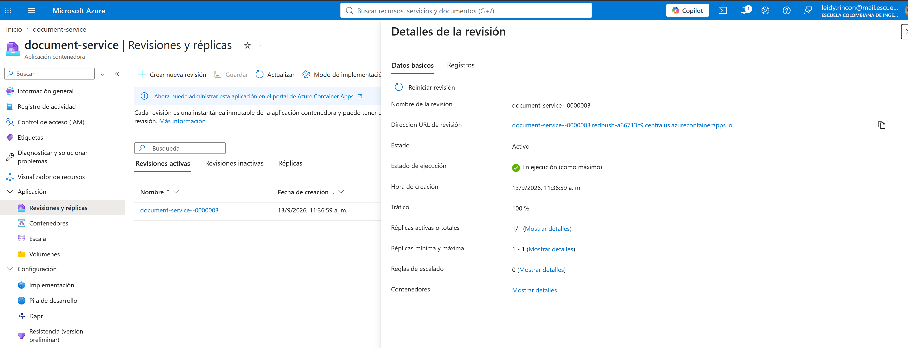
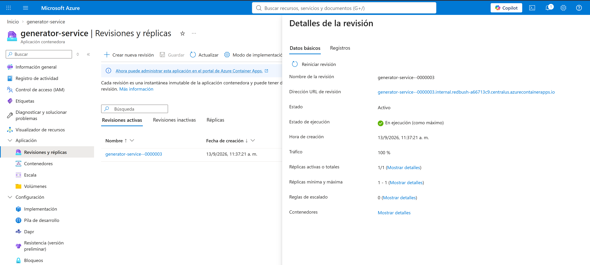
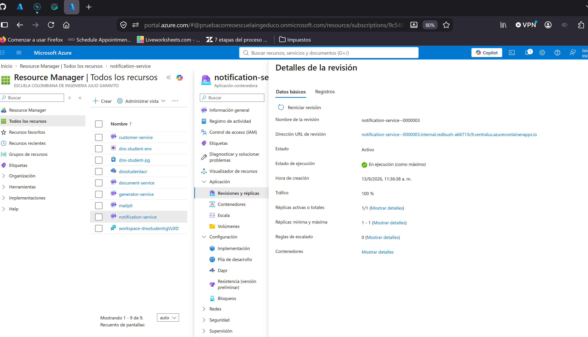
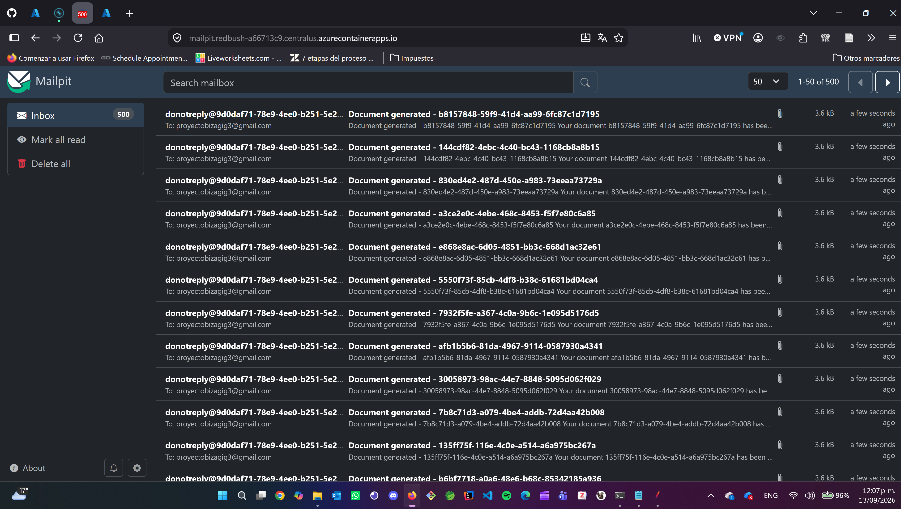

# Topología 1-1-1: una instancia por servicio

Corrida del 13 de septiembre de 2026 con el fix *claim-then-send* de notification-service
(imagen `notification-service:1.2`, rama `feature/fix-duplicity`). Es la línea base de la escalera:
mide el techo de una sola réplica por servicio y la velocidad del pipeline con un solo consumidor por topic.

## Configuración

| Servicio | Réplicas | Imagen | Pool Hikari | Otras variables |
|---|---|---|---|---|
| document-service | 1 fija (`min=max=1`) | `document-service:1.0` | 5 | `OUTBOX_SCHEDULER_FIXED_RATE=30000` |
| generator-service | 1 fija | `generator-service:1.1` | 5 | `OUTBOX_SCHEDULER_FIXED_RATE=30000` |
| notification-service | 1 fija | `notification-service:1.2` | 5 | `MAIL_PROVIDER=smtp` → Mailpit, rate limiter 100/s, `KAFKAPRODUCERCONFIG_BATCHSIZEBOOSTFACTOR=1`, compresión `lz4`, log `WARN` |
| customer-service | 1 fija | `customer-service:1.0` | 5 | |
| PostgreSQL | `Standard_B4ms` | | | subida desde `B1ms` justo antes de la corrida |
| Mailpit | 1 | `axllent/mailpit` | | `MP_MAX_MESSAGES=30000` |

Kafka en Confluent Cloud; `notification-request` tiene 6 particiones y cada réplica de notification levanta
3 hilos consumidores, así que con una réplica la mitad de las particiones se atienden en serie.

| document | generator | notification | Mailpit |
|---|---|---|---|
|  |  |  |  |

## Resultados

JMeter 5.6.3 en modo CLI desde un PC en Wi-Fi contra `document-service` en Central US. Percentiles
calculados sobre el CSV de cada corrida (`elapsed` de las muestras `POST /documents`).

| Escalón | threads × loops | Duración API | Throughput | Mediana | p90 | p95 | p99 | Máx | Errores | Correos en Mailpit | Drenaje tras JMeter | Total escalón |
|---|---|---|---|---|---|---|---|---|---|---|---|---|
| **500** | 10 × 50 | 30,5 s | 16,4 req/s | 224 ms | 371 ms | 428 ms | 740 ms | 1.062 ms | 0 | **500 / 500** | 78 s | **1 min 53 s** |
| 2000 | 20 × 100 | 89,6 s | 22,3 req/s | 482 ms | 902 ms | 1.094 ms | 1.532 ms | 2.155 ms | 0 | 1.998 / 2.000 | 1.998 en 112 s; 2 nunca llegaron | detenida a los 18 min |
| **5000** | 25 × 200 | 103 s | 48,6 req/s | 119 ms | 219 ms | 270 ms | 588 ms | 1.443 ms | 0 | **5000 / 5000** | 113 s | **3 min 52 s** |
| 20000, intento 1 | 40 × 500 | 557 s | — | 122 ms | — | 279 ms | 480 ms | 1.529 ms | 7.718 (38,6 %) | 12.293 / 12.282 llegadas | — | inválido (red del cliente) |
| 20000, intento 2 | 40 × 500 | 219 s | **91,3 req/s** | 132 ms | 242 ms | 305 ms | 534 ms | 2.026 ms | **0** | 8.318 / 20.000 al detenerla | detenida a los 12 min | API válido, pipeline bloqueado |

### Tiempos por tamaño

Medidos por `run-escalon.sh` con una instancia por servicio. *JMeter* es el tiempo de pared del cliente (incluye
arranque de la JVM y generación del reporte, por eso supera a la "duración API" entre primera y última muestra);
*drenaje* es lo que tarda el pipeline Kafka → generator → notification → Mailpit en entregar el último correo
después de que JMeter termina; *total* es la suma, del primer `POST` al último correo.

| Tamaño | JMeter | Drenaje | Total | Correos por segundo durante el drenaje |
|---|---|---|---|---|
| 500 | 35 s | 78 s | **113 s** (1 min 53 s) | ~6 /s |
| 2000 | 110 s | 112 s hasta 1.998; los 2 restantes nunca llegaron | 222 s (3 min 42 s) hasta 1.998 | ~18 /s |
| 5000 | 119 s | 113 s | **232 s** (3 min 52 s) | ~38 /s |
| 20000, intento 1 | 557 s (inválido, red del cliente) | — | — | — |
| 20000, intento 2 | 225 s | detenido a 537 s con 8.318 correos | — | ~40 /s a ráfagas, 0 en las pausas |

El drenaje no crece linealmente con el tamaño porque mientras JMeter sigue enviando, el pipeline ya está
procesando: en el escalón de 5.000, Mailpit tenía 733 correos cuando JMeter terminó. La cifra de correos por
segundo del escalón de 500 está dominada por el tick de 30 s de los schedulers de outbox, no por la capacidad.
Archivos por escalón, dentro de su carpeta `<total>/`: `<num>-<total>-1-1-1-<fecha>.csv` (una fila por petición, abrir en Excel),
`report/index.html` (reporte de JMeter), `results.jtl` y las capturas de esa corrida.

### Lecturas

- **Sin correos duplicados.** 500 correos para 500 peticiones y 5.000 para 5.000, `SMTPRejected` en 0. En la
  corrida del 9 de septiembre, sin el fix, el escalón de 9.000 ya dejaba 49 correos de más. El claim previo al
  envío (fila de outbox en `NOTIFICATION_PENDING` protegida por el índice único) está haciendo su trabajo.
- **El API no satura con una réplica** a estos tamaños. Igual que en septiembre, la latencia baja al subir de
  10 a 25 hilos porque los contenedores ya están calientes: p95 de 428 a 270 ms. A 40 hilos las muestras que sí
  llegaron al servidor mantuvieron p95 de 279 ms.
- **El pipeline con un solo consumidor drena a unas 40 notificaciones por segundo.** Con 5.000 peticiones,
  Mailpit ya tenía 733 correos al terminar JMeter y completó los 5.000 en 113 s más. Ese número es el que
  debe bajar en las topologías 2-2-2 y 3-6-6; el throughput del API no.
- **El health inicial devolvía 500** porque el Header Manager global del plan manda
  `Accept: application/vnd.api.v1+json`, que Actuator no produce. Los planes de la escalera llevan un
  `Accept: application/json` propio en ese sampler; a partir del escalón de 5.000 responde 200.

### 2.000 tras el reinicio: 1.998 correos, dos sagas perdidas en document-service

Corrido a las 13:10, justo después de reiniciar las revisiones de los cuatro servicios (sin cambiar nada) y
de vaciar a mano las tablas de la base. **API**: 2.000 de 2.000 en 200, 22,3 req/s, pero con la latencia más
alta de la escalera (p95 de 1.094 ms, máximo 2,2 s): las JVM llevaban un minuto arriba y el JIT y los pools
estaban fríos. No es comparable con 500 y 5.000, que corrieron con contenedores calientes.

**Pipeline**: Mailpit llegó a 1.998 en 112 s y ahí se quedó. Los otros dos correos no van a llegar, y esta vez
la causa no es Kafka ni el cliente sino un hueco de document-service que la carga destapó. Sus logs muestran
exactamente dos líneas, una por documento perdido:

```
18:11:20 ERROR GenerationResponseKafkaListener : Caught optimistic locking exception ... document id: c50b819d-...
18:12:04 ERROR GenerationResponseKafkaListener : Caught optimistic locking exception ... document id: c3eb8b7b-...
```

Qué pasó: a las 18:12 el productor de document-service volvió a perder brokers de Confluent
(`Disconnecting from node 10/11 due to socket connection setup timeout`), el ack de algunas solicitudes de
generación tardó más que el tick de 30 s y el scheduler las republicó (generator-service las rechazó con
`23505`, como debe). El callback de Kafka que marca esas filas de `generation_outbox` como `COMPLETED`
corrió **al mismo tiempo** que `DocumentGenerationSaga.execute` procesaba la respuesta del generador y
actualizaba la misma fila. La segunda escritura chocó con el `@Version` y lanzó
`ObjectOptimisticLockingFailureException`. El listener la captura como "otro hilo ya terminó el trabajo",
hace log y **commitea el offset**:

```java
} catch (OptimisticLockingFailureException e) {
    //NO-OP for optimistic lock. This means another thread finished the work, do not throw error ...
    log.error("Caught optimisticlocking exception in GenerationResponseKafkaListener ...");
}
```

Ese supuesto es falso aquí: el otro hilo era el scheduler, que solo cambió `outbox_status`; la saga hizo
rollback completo y nunca escribió la fila de `notification_outbox`. El documento quedó en `GENERATING`
para siempre, sin correo y sin compensación. El generador no lo reintenta porque su outbox ya está
`COMPLETED`. Son dos sagas perdidas de 2.000, el 0,1 %, y aparecen exactamente cuando Kafka está inestable.

Lecturas:

- **No es duplicado, es pérdida.** El claim-then-send de notification-service no interviene: esas dos sagas
  nunca llegaron a `notification-request`.
- **El lock optimista detecta la colisión pero el manejo la convierte en pérdida silenciosa.** Es el mismo
  patrón del `23505` tragado que producía los correos duplicados, ahora en el sentido contrario. Fix
  pendiente en document-service: ante `OptimisticLockingFailureException` relanzar para que Kafka reentregue
  el mensaje (la guarda de saga lo hará idempotente), o reintentar la saga en el mismo hilo; y como fix de
  fondo, que el scheduler del outbox no republique filas pendientes de ack (estado "en vuelo").
- **Detección**: `SELECT count(*) FROM "document".notification_outbox` frente a documentos en `GENERATING`
  con `generation_outbox.outbox_status = 'COMPLETED'` más antiguos que unos minutos.

Archivos en `2000/`, incluida la captura de Mailpit en 1.998 (`04-prueba-mailpit.png`).

### Intento 2 de 20.000: API en 91 req/s, pipeline bloqueado en Kafka, prueba detenida

Repetida a las 12:49 con la red del cliente estable. **El API respondió perfecto**: 20.000 de 20.000 en 200,
91,3 req/s sostenidos con 40 hilos, p95 de 305 ms, máximo 2 s. Es el mejor throughput medido hasta ahora en
el proyecto, con una sola réplica de document-service, y confirma que el API no es el cuello.

**El pipeline no drenó.** Mailpit subió a ráfagas (4.414 a los 33 s, 6.233 a los 5 min, 8.318 a los 8 min) y
luego se quedó quieto. A los 12 minutos del fin de JMeter, con 8.318 de 20.000 correos y sin avance en cuatro
minutos, se detuvo la prueba a mano. Los logs señalan la salida de document-service hacia Kafka:

```
Disconnecting from node 5 due to socket connection setup timeout. The timeout value is 20969 ms.
Node 4 disconnected.
Expiring 37 record(s) for notification-request-5: 130931 ms has passed since batch creation
```

document-service no lograba conectar con varios brokers de Confluent y expiraba lotes enteros de
`notification-request`; notification-service estaba ocioso (solo telemetría en sus logs, sin mensajes que
consumir) y generator-service rechazaba con `23505` las solicitudes de generación que el scheduler del outbox
de document-service republicaba cada 30 s sin recibir ack. Es el caso 6 de la guía de Azure (pérdida de
conectividad hacia brokers concretos desde Container Apps, presión SNAT o throttling tras reconexiones
masivas), agravado por la tormenta del productor con 20.000 filas `STARTED` reenviadas en cada tick. Ese
mismo día se habían hecho cinco `containerapp update` encadenados antes de la prueba.

Lecturas:

- **Sin duplicados en lo que sí llegó**: 8.318 correos para 8.318 sagas completadas. El fix no interviene en
  este fallo.
- **El cuello de una instancia no es CPU ni BD, es la conexión productor → Kafka** bajo un backlog grande.
  Con una réplica de document-service y 20.000 filas pendientes, cada tick del outbox intenta reenviar todo
  lo que no tiene ack, y cuando un broker no responde el buffer del productor se llena y expira.
- **Las ~11.700 sagas restantes no se perdieron**: siguen en `STARTED` en `notification_outbox` y el scheduler
  las publicará cuando vuelva la conectividad. Eso significa que **Mailpit seguirá recibiendo correos de esta
  prueba más tarde**; antes de la siguiente corrida hay que esperar a que ese backlog drene (o vaciarlo) y
  volver a limpiar la bandeja, o el conteo del siguiente escalón saldrá contaminado.
- Mitigación documentada para repetir el escalón: reiniciar la revisión de document-service para forzar
  conexiones TCP nuevas (`az containerapp revision restart`), no encadenar rollouts antes de la prueba, y
  como fix real un estado "en vuelo" en el scheduler del outbox para no reenviar lo pendiente de ack.

Archivos en `20000/`: CSV con sufijo `intento2-kafka-bloqueado`, `report/`, `results.jtl` y la captura de Mailpit
detenido en 8.318 (`04-prueba-mailpit-llego-8318.png`).

### Intento 1 de 20.000: inválido por la red del cliente

El PC que corría JMeter perdió la red entre el segundo 60 y el 450 de la prueba: durante seis minutos y medio
no salió ni una muestra, y al volver la conexión 7.705 peticiones fallaron con `UnknownHostException` (DNS)
y 13 con `Connection reset`. Solo 12.282 peticiones recibieron 200. Mailpit terminó en 12.293: las 12.282
exitosas más 11 de las 13 que el servidor sí procesó aunque el cliente viera el reset. No hay duplicados,
pero el escalón no mide el sistema, así que se repitió. Los archivos de este intento se descartaron; solo queda
la fila en la tabla y en `../escalera.csv`.

## Cómo se corrió

```bash
export PATH="/c/apache-jmeter-5.6.3/apache-jmeter-5.6.3/bin:$PATH"
cd docs/jmeter/escalera
./run-escalon.sh 1-1-1 01-500-create-document.jmx
./run-escalon.sh 1-1-1 02-2000-create-document.jmx   # tras reiniciar las revisiones; 1.998/2.000, ver abajo
./run-escalon.sh 1-1-1 03-5000-create-document.jmx
./run-escalon.sh 1-1-1 04-20000-create-document.jmx   # dos intentos, ninguno completo; ver arriba
```

El resumen de todos los escalones de todas las topologías está en [`../escalera.csv`](../escalera.csv).
