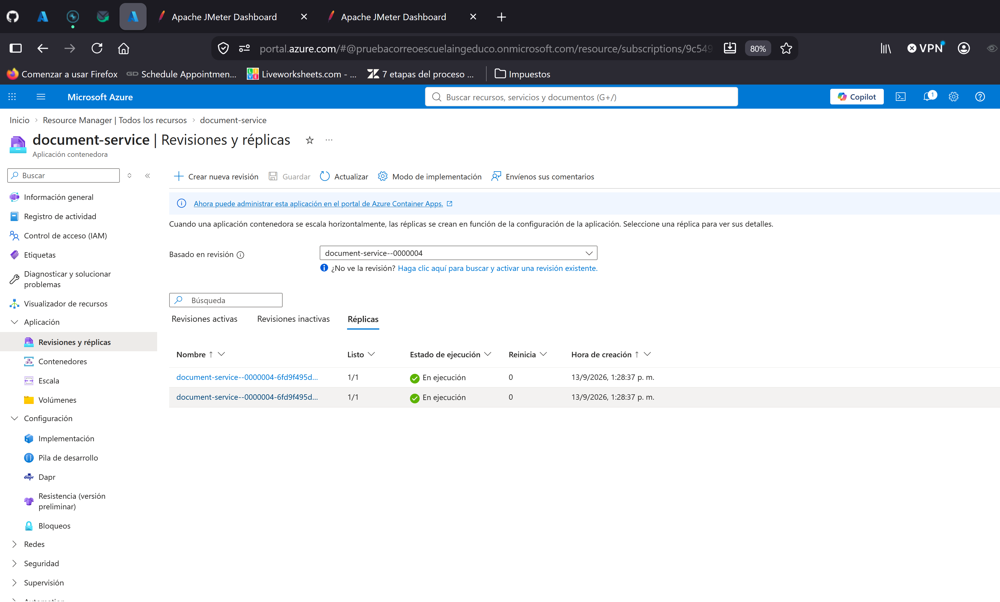
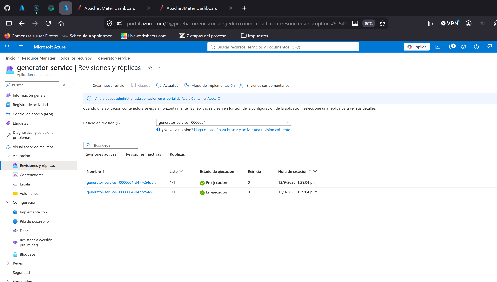
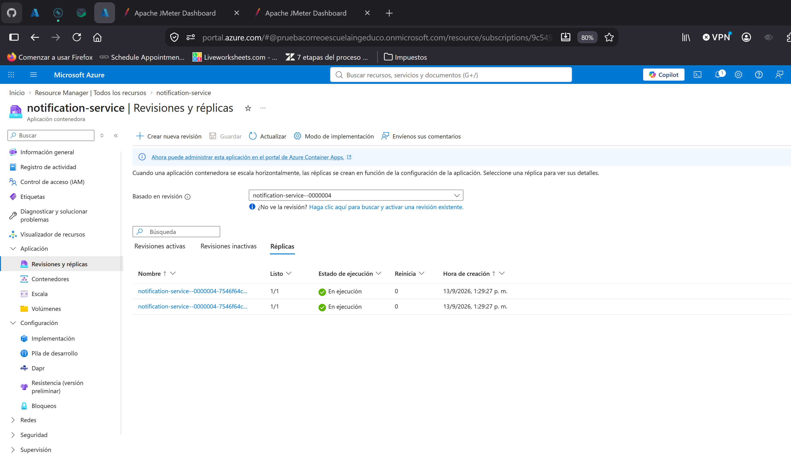

# Topología 2-2-2: dos instancias por servicio

Corrida del 13 de septiembre de 2026 con el fix *claim-then-send* de notification-service
(imagen `notification-service:1.2`, rama `feature/fix-duplicity`), a continuación de la topología
[1-1-1](../1-1-1/README.md). Dobla los consumidores: con `notification-request` en 6 particiones y 3 hilos
por réplica, 2 réplicas de notification = 6 hilos = las 6 particiones, el punto de escalado natural del
servicio. Lo que debe cambiar frente a 1-1-1 es el tiempo de drenaje del pipeline, no el throughput del API.

## Configuración

| Servicio | Réplicas | Imagen | Pool Hikari | Otras variables |
|---|---|---|---|---|
| document-service | 2 fijas (`min=max=2`) | `document-service:1.0` | 5 | `OUTBOX_SCHEDULER_FIXED_RATE=30000` |
| generator-service | 2 fijas | `generator-service:1.1` | 5 | `OUTBOX_SCHEDULER_FIXED_RATE=30000` |
| notification-service | 2 fijas | `notification-service:1.2` | 5 | `MAIL_PROVIDER=smtp` → Mailpit, rate limiter 100/s, `KAFKAPRODUCERCONFIG_BATCHSIZEBOOSTFACTOR=1`, compresión `lz4`, log `WARN` |
| customer-service | 1 fija | `customer-service:1.0` | 5 | |
| PostgreSQL | `Standard_B4ms` | | | 35 conexiones en uso (2×5 + 2×5 + 2×5 + 5) |
| Mailpit | 1 | `axllent/mailpit` | | `MP_MAX_MESSAGES=30000` |

Escalado con `az containerapp update --min-replicas 2 --max-replicas 2` sobre las revisiones `--0000003`, sin
cambiar imagen ni variables; quedó una única revisión activa `--0000004` por servicio. Una réplica de
notification tomó las particiones 0, 2 y 5; la otra, 1, 3 y 4.

| document | generator | notification |
|---|---|---|
|  |  |  |

## Resultados

JMeter 5.6.3 en modo CLI desde un PC en Wi-Fi contra `document-service` en Central US. Percentiles
calculados sobre el CSV de cada corrida (`elapsed` de las muestras `POST /documents`).

| Escalón | threads × loops | Duración API | Throughput | Mediana | p90 | p95 | p99 | Máx | Errores | Correos en Mailpit | Drenaje tras JMeter | Total escalón |
|---|---|---|---|---|---|---|---|---|---|---|---|---|
| **500** | 10 × 50 | 31,6 s | 15,8 req/s | 140 ms | 360 ms | 458 ms | 793 ms | 1.320 ms | 0 | **500 / 500** | 48 s | **1 min 28 s** |

### Tiempos por tamaño

Misma definición que en 1-1-1: *JMeter* es el tiempo de pared del cliente, *drenaje* lo que tarda el pipeline
en entregar el último correo después de que JMeter termina, *total* la suma.

| Tamaño | JMeter | Drenaje | Total | Mismo tamaño en 1-1-1 |
|---|---|---|---|---|
| 500 | 40 s | 48 s | **88 s** (1 min 28 s) | 35 s + 78 s = 113 s |

Archivos por escalón, dentro de su carpeta `<total>/`: `<num>-<total>-2-2-2-<fecha>.csv` (una fila por petición, abrir en Excel),
`report/index.html` (reporte de JMeter), `results.jtl` y las capturas de esa corrida.

### Lecturas

- **Sin correos duplicados ni perdidos.** 500 correos para 500 peticiones, `SMTPRejected` en 0, health en 200.
  Con dos réplicas de notification compitiendo por el mismo topic, la carrera entre consumidores que el
  claim-then-send cierra es más probable que con una; el conteo exacto es la evidencia de que funciona.
- **El API rinde igual que con una réplica**: 15,8 req/s frente a 16,4, p95 de 458 frente a 428 ms. Con 10 hilos
  el cuello es el cliente; la segunda réplica de document-service no tiene nada que aportar a este tamaño.
- **El drenaje bajó de 78 a 48 s**, un 38 % menos, con el mismo tamaño y el mismo tick de 30 s en los
  schedulers. Es el efecto esperado de duplicar consumidores: los correos empezaron a salir en el segundo
  tick y el pipeline vació 500 en dos ticks en vez de tres. A 500 el drenaje sigue dominado por el intervalo
  del scheduler; la diferencia real se verá en 5000 y 20000.

## Cómo se corrió

```bash
export PATH="/c/apache-jmeter-5.6.3/apache-jmeter-5.6.3/bin:$PATH"
cd docs/jmeter/escalera
./run-escalon.sh 2-2-2 01-500-create-document.jmx
```

El resumen de todos los escalones de todas las topologías está en [`../escalera.csv`](../escalera.csv).
