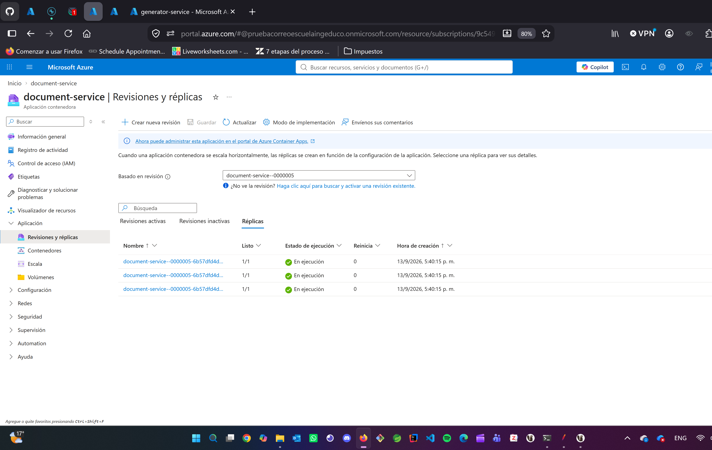
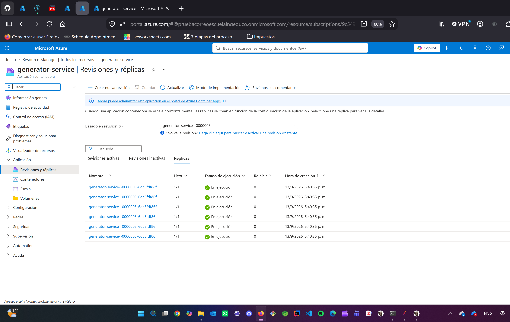
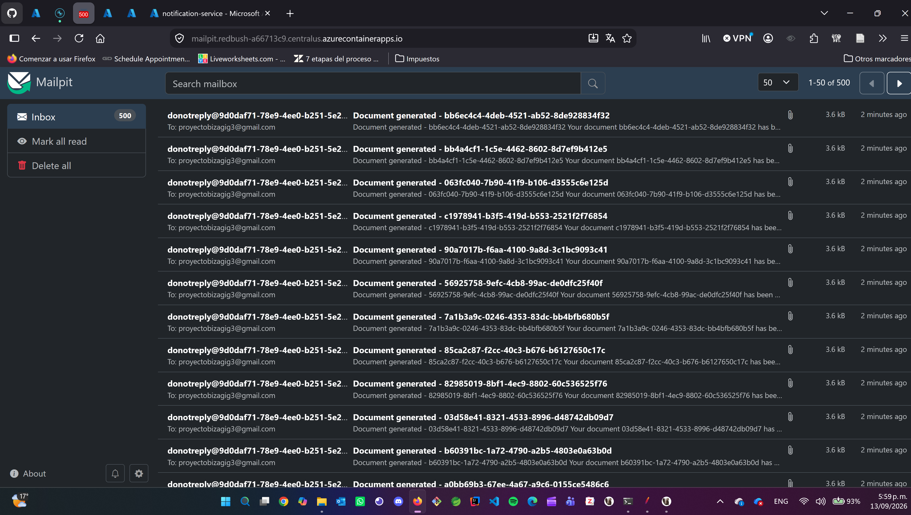
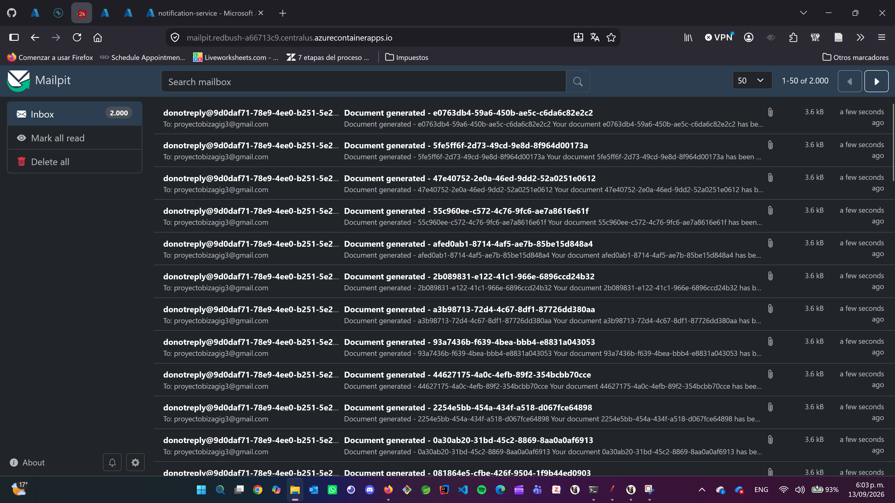
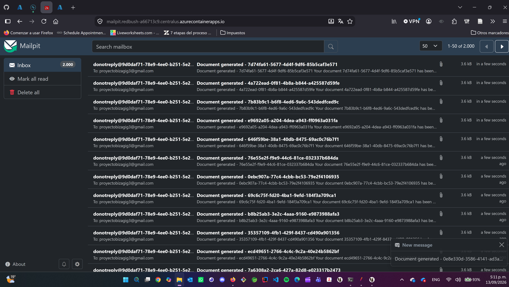
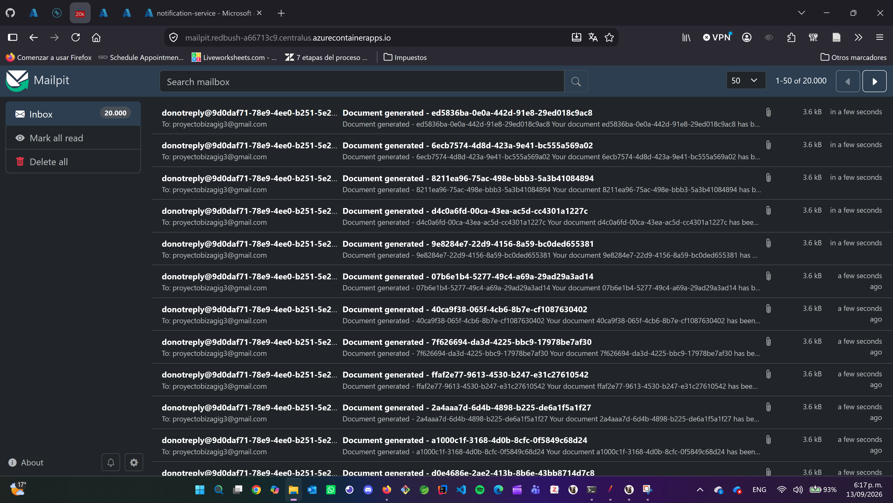

# Topología 3-6-6: document 3 · generator 6 · notification 6

Corrida del 13 de septiembre de 2026 con el fix *claim-then-send* de notification-service
(imagen `notification-service:1.2`, rama `feature/fix-duplicity`), a continuación de
[1-1-1](../1-1-1/README.md) y [2-2-2](../2-2-2/README.md). Es la **misma topología de la corrida del 9 de
septiembre**, la que dio 22.278 correos para 20.000 peticiones sin el fix, y la BD está en el mismo SKU
(`Standard_B4ms`). El escalón de 20000 aquí es la comparación directa: el conteo de Mailpit debe ser 20.000.

Con 6 réplicas de notification hay 18 hilos para las 6 particiones de `notification-request`: 12 quedan
ociosos, así que el drenaje no debería mejorar frente a 2-2-2. Lo que se mide aquí es document-service con
3 réplicas a 40 hilos y el generador con 6.

## Configuración

| Servicio | Réplicas | Imagen | Pool Hikari | Otras variables |
|---|---|---|---|---|
| document-service | 3 fijas (`min=max=3`) | `document-service:1.0` | 5 | `OUTBOX_SCHEDULER_FIXED_RATE=30000` |
| generator-service | 6 fijas | `generator-service:1.1` | 5 | `OUTBOX_SCHEDULER_FIXED_RATE=30000` |
| notification-service | 6 fijas | `notification-service:1.2` | 5 | `MAIL_PROVIDER=smtp` → Mailpit, rate limiter 100/s, `KAFKAPRODUCERCONFIG_BATCHSIZEBOOSTFACTOR=1`, compresión `lz4`, log `WARN` |
| customer-service | 1 fija | `customer-service:1.0` | 5 | |
| PostgreSQL | `Standard_B4ms` | | | 80 conexiones en uso (3×5 + 6×5 + 6×5 + 5) |
| Mailpit | 1 | `axllent/mailpit` | | `MP_MAX_MESSAGES=30000` |

Escalado con `az containerapp update --min-replicas N --max-replicas N` sobre las revisiones `--0000004`, sin
cambiar imagen ni variables; quedó una única revisión activa `--0000005` por servicio con todas sus réplicas
en Running. Durante el rebalance de arranque el generador rechazó 278 solicitudes duplicadas con `23505`,
ruido esperado de la guarda de idempotencia.

| document | generator | notification | Mailpit |
|---|---|---|---|
|  |  |  |  |

## Resultados

JMeter 5.6.3 en modo CLI desde un PC en Wi-Fi contra `document-service` en Central US. Percentiles
calculados sobre el CSV de cada corrida (`elapsed` de las muestras `POST /documents`).

| Escalón | threads × loops | Duración API | Throughput | Mediana | p90 | p95 | p99 | Máx | Errores | Correos en Mailpit | Drenaje tras JMeter | Total escalón |
|---|---|---|---|---|---|---|---|---|---|---|---|---|
| **500** | 10 × 50 | 29,0 s | 17,2 req/s | 123 ms | 221 ms | 293 ms | 790 ms | 2.115 ms | 0 | **500 / 500** | 80 s | **2 min 4 s** |
| **2000** | 20 × 100 | 58,6 s | 34,2 req/s | 120 ms | 240 ms | 317 ms | 559 ms | 2.082 ms | 0 | **2000 / 2000** | 64 s | **2 min 8 s** |
| **5000** | 25 × 200 | 96,3 s | 51,9 req/s | 116 ms | 194 ms | 323 ms | 576 ms | 1.972 ms | 0 | **5000 / 5000** | 49 s | **2 min 31 s** |
| **20000** | 40 × 500 | 209,8 s | **95,3 req/s** | 110 ms | 180 ms | 238 ms | 477 ms | 1.148 ms | 0 | **20000 / 20000** | 175 s | **6 min 31 s** |

### Tiempos por tamaño

Misma definición que en las otras topologías: *JMeter* es el tiempo de pared del cliente, *drenaje* lo que
tarda el pipeline en entregar el último correo después de que JMeter termina, *total* la suma.

| Tamaño | JMeter | Drenaje | Total | 1-1-1 | 2-2-2 |
|---|---|---|---|---|---|
| 500 | 44 s | 80 s | **124 s** (2 min 4 s) | 35 + 78 = 113 s | 40 + 48 = 88 s |
| 2000 | 64 s | 64 s | **128 s** (2 min 8 s) | 110 + 112 = 222 s (1.998 correos) | 72 + 81 = 153 s |
| 5000 | 102 s | 49 s | **151 s** (2 min 31 s) | 119 + 113 = 232 s | 111 + 64 = 175 s |
| 20000 | 216 s | 175 s | **391 s** (6 min 31 s) | bloqueado en 8.318 | 218 + 161 = 379 s (19.998 correos) |

Archivos por escalón, dentro de su carpeta `<total>/`: `<num>-<total>-3-6-6-<fecha>.csv` (una fila por petición, abrir en Excel),
`report/index.html` (reporte de JMeter), `results.jtl` y las capturas de esa corrida.

### Lecturas

- **500 correos exactos**, `SMTPRejected` en 0, health en 200. Con 6 réplicas de notification compitiendo
  por 6 particiones, el conteo exacto sigue siendo la evidencia de que el claim previo al envío funciona.
- **El API mejora ligeramente**: 17,2 req/s y p95 de 293 ms, el mejor 500 de la escalera (428 ms en 1-1-1,
  458 en 2-2-2). Con 10 hilos el límite sigue siendo el cliente; la diferencia es que tres réplicas reparten
  las 10 conexiones en vuelo. El máximo de 2,1 s es una muestra aislada: las 15 JVM nuevas llevaban tres
  minutos arriba y estaban frías.
- **El drenaje no mejora y de hecho empeora frente a 2-2-2: 80 s contra 48.** No es capacidad: el primer
  correo tardó 17 s en salir y el grueso (401) llegó de golpe a los 48 s, es decir, en el segundo tick de los
  schedulers. A 500 peticiones el drenaje lo dicta el intervalo de 30 s del outbox y la alineación con el
  arranque, no el número de consumidores. Los 12 hilos ociosos de notification tampoco aportan. La
  comparación útil de esta topología es a 5000 y 20000.
- **2000: el mejor total de la escalera a este tamaño.** 2.000 correos exactos, 34,2 req/s (35,5 en 2-2-2,
  misma latencia dentro del ruido: p95 317 frente a 260 ms) y drenaje de **64 s frente a 81 en 2-2-2 y 112 en
  1-1-1**. Al terminar JMeter ya había 422 correos entregados, contra 30 en 2-2-2: con 6 réplicas de
  generator el paso de generación deja de acumular cola, y notification recibe las solicitudes antes. El
  total del escalón baja a 2 min 8 s, un 16 % menos que 2-2-2. El máximo de 2 s vuelve a ser una muestra
  aislada.

  
- **5000: el drenaje sigue bajando: 49 s frente a 64 en 2-2-2 y 113 en 1-1-1.** 5.000 correos exactos, 51,9 req/s
  (52,1 en 2-2-2: el API está en su techo con 25 hilos) y p95 de 323 ms. Al terminar JMeter ya había 1.833
  correos entregados (1.508 en 2-2-2, 733 en 1-1-1) y el drenaje sostuvo ~65 correos/s. El total del escalón
  baja a 2 min 31 s, un 14 % menos que 2-2-2 y un 35 % menos que 1-1-1. La ganancia respecto a 2-2-2 es más
  pequeña que la de 2-2-2 respecto a 1-1-1: notification ya tenía las 6 particiones cubiertas, así que lo que
  aporta esta topología es el generador con 6 réplicas y document con 3.

  
- **20000: 20.000 correos exactos.** Es el único escalón de 20000 de la escalera que cierra completo: 20.000
  de 20.000 en 200, **95,3 req/s** con 40 hilos, p95 de 238 ms y máximo de 1,1 s, los mejores números del
  API en toda la escalera. Al terminar JMeter ya había 8.860 correos entregados y el drenaje sostuvo ~64
  correos/s durante 175 s. Comparado con la misma topología el 9 de septiembre, sin el fix, ver la sección
  siguiente.

### 20000: comparación con la corrida del 9 de septiembre

Misma topología (document 3 · generator 6 · notification 6), misma BD (`Standard_B4ms`), mismo plan (40 hilos
× 500 loops), mismo destino (Mailpit). La única diferencia es la imagen de notification-service: `1.0` sin el
fix el 9 de septiembre, `1.2` con *claim-then-send* hoy.

| | 9 de septiembre (sin fix) | 13 de septiembre (con fix) |
|---|---|---|
| Peticiones OK | 20.000 / 20.000 | 20.000 / 20.000 |
| Throughput API | 97 req/s | 95,3 req/s |
| Mediana / p95 / p99 / máx | 113 / 312 / 664 / 2.252 ms | 110 / 238 / 477 / 1.148 ms |
| **Correos en Mailpit** | **22.278** (2.278 de más, 11,4 %) | **20.000** exactos |
| `SMTPRejected` | 0 | 0 |

El API se comporta igual; la diferencia está toda en el pipeline: los 2.278 correos duplicados desaparecen
con el mismo tráfico, la misma contención y las mismas réplicas compitiendo por las particiones. El conteo
de la bandeja vuelve a servir como medida de éxito, que era el criterio de aceptación pendiente desde la
corrida anterior.

Los dos documentos que quedaron sin correo en el 20000 de 2-2-2 por el bloqueo optimista de document-service
no se repitieron aquí; ese defecto sigue abierto y depende de que Kafka parpadee con backlog grande, no de
la topología.



## Cómo se corrió

```bash
export PATH="/c/apache-jmeter-5.6.3/apache-jmeter-5.6.3/bin:$PATH"
cd docs/jmeter/escalera
./run-escalon.sh 3-6-6 01-500-create-document.jmx
./run-escalon.sh 3-6-6 02-2000-create-document.jmx
./run-escalon.sh 3-6-6 03-5000-create-document.jmx
./run-escalon.sh 3-6-6 04-20000-create-document.jmx
```

El resumen de todos los escalones de todas las topologías está en [`../escalera.csv`](../escalera.csv).
